# Screens

Every screen of the hlabs prototype (115). Desktop screens show the Dock (D-054); phone screens show the tab bar. Each has an image in `screens/<Name>.webp` (rendered from the canvas with fallback fonts; the product uses Plus Jakarta Sans) and the text it shows. Stories reference screens by name.

Where a screen and a story's acceptance criteria disagree, the story wins. Some screens still show things later removed from scope (for example email/SMTP settings, importing Umbrel or Runtipi stores, `hlabs.service`); see [12-decisions](../prd/12-decisions.md) D-040 and the design follow-ups in [13-risks-open-questions](../prd/13-risks-open-questions.md).

## Install & menu-bar app

### MacInstall — Mac installer (.dmg)

**Priority:** P2 · **Phase:** 6 · **Stories:** US-INST-03, US-INST-04

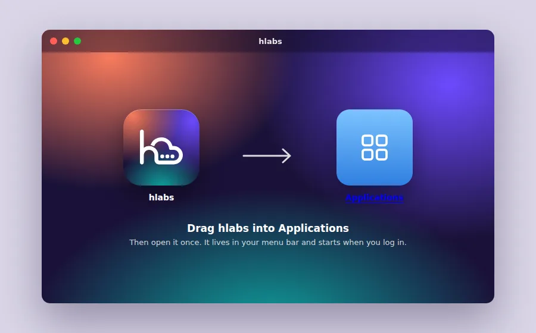

Links to: `TrayStates`

Shows: Mac installer window · [Installer window: drag hlabs into the Applications folder] · hlabs · hlabs · Applications · Drag hlabs into Applications · Then open it once. It lives in your menu bar and starts when you log in.

### LinuxInstall — Linux server install script

**Priority:** P3 · **Phase:** 6 · **Stories:** US-INST-23, US-INST-24, US-INST-25, US-SITE-05

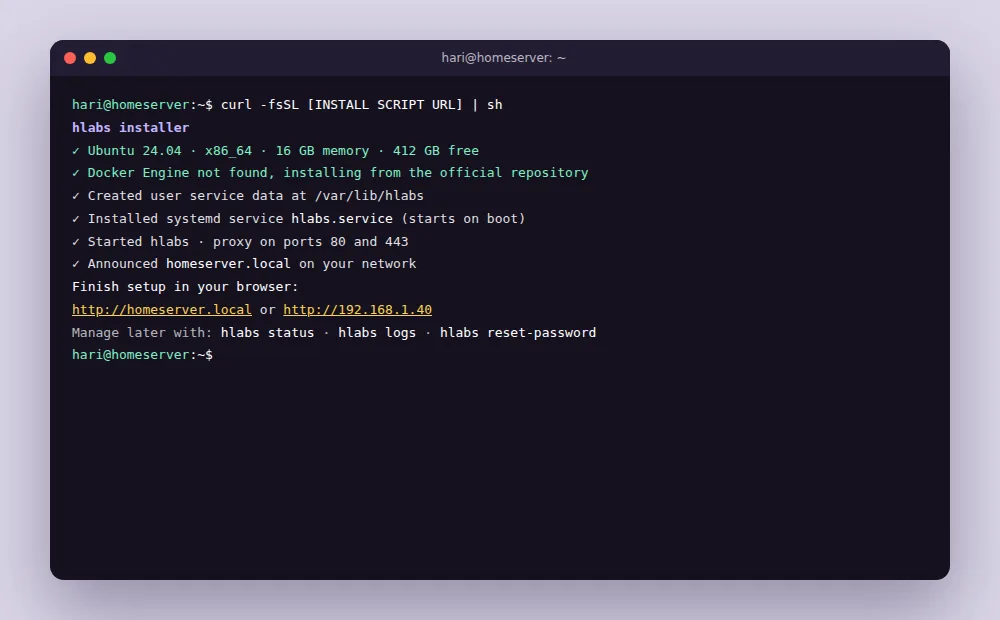

Links to: `OnbWelcome`

Shows: Linux server install · [Terminal showing the hlabs install script finishing on a Linux server] · hari@homeserver: ~ · hari@homeserver · :~$ curl -fsSL [INSTALL SCRIPT URL] · sh · hlabs installer · ✓ Ubuntu 24.04 · x86_64 · 16 GB memory · 412 GB free · ✓ Docker Engine not found, installing from the official repository · ✓ Created user service data at /var/lib/hlabs · ✓ Installed systemd service · hlabs.service · (starts on boot) · ✓ Started hlabs · proxy on ports 80 and 443 · ✓ Announced · homeserver.local · on your network · Finish setup in your browser: · http://homeserver.local · or · http://192.168.1.40 · Manage later with: · hlabs status · · · hlabs logs · · · hlabs reset-password · hari@homeserver · :~$

### TrayMenu — Menu-bar app

**Priority:** P1 · **Phase:** 4 · **Stories:** US-INST-05, US-INST-06, US-INST-07, US-INST-08, US-INST-09, US-INST-10, US-INST-13, US-INST-14, US-INST-15, US-INST-16, US-INST-19

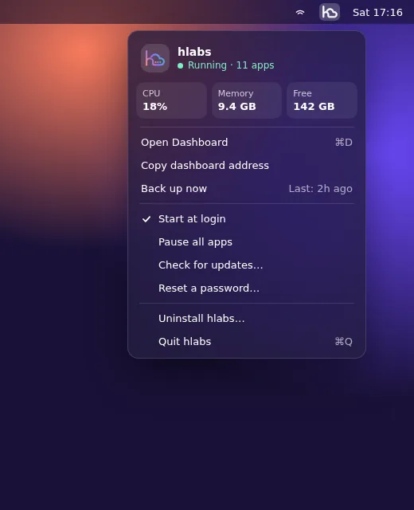

Links to: `Main`, `SysDaemonDown`, `TrayResetPassword`, `TrayUninstall`

Shows: Menu bar app · Sat 17:16 · [hlabs] · hlabs · Running · 11 apps · CPU · 18% · Memory · 9.4 GB · Free · 142 GB · Open Dashboard · ⌘D · Copy dashboard address · Back up now · Last: 2h ago · Start at login · Pause all apps · Check for updates… · Reset a password… · Uninstall hlabs… · Quit hlabs · ⌘Q

### TrayStates — Menu-bar app · states

**Priority:** P1 · **Phase:** 4 · **Stories:** US-INST-01, US-INST-02, US-INST-08, US-INST-10, US-INST-11, US-INST-12, US-INST-14, US-INST-19, US-INST-20

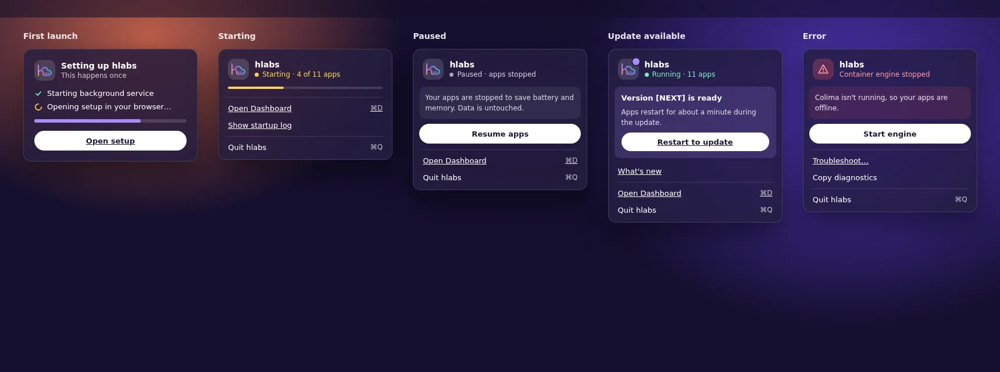

Links to: `AppLogs`, `Main`, `OnbWelcome`, `SettingsUpdates`, `SysEngineStopped`, `SysUpdating`

Shows: Menu bar app — states · First launch · Setting up hlabs · This happens once · Starting background service · Opening setup in your browser… · Open setup · Starting · hlabs · Starting · 4 of 11 apps · Open Dashboard · ⌘D · Show startup log · Quit hlabs · ⌘Q · Paused · hlabs · Paused · apps stopped · Your apps are stopped to save battery and memory. Data is untouched. · Resume apps · Open Dashboard · ⌘D · Quit hlabs · ⌘Q · Update available · hlabs · Running · 11 apps · Version [NEXT] is ready · Apps restart for about a minute during the update. · Restart to update · What's new · Open Dashboard · ⌘D · Quit hlabs · ⌘Q · Error · hlabs · Container engine stopped · Colima isn't running, so your apps are offline. · Start engine · Troubleshoot… · Copy diagnostics · Quit hlabs · ⌘Q

### TrayResetPassword — Menu-bar app · reset a password

**Priority:** P1 · **Phase:** 4 · **Stories:** US-INST-17, US-INST-18

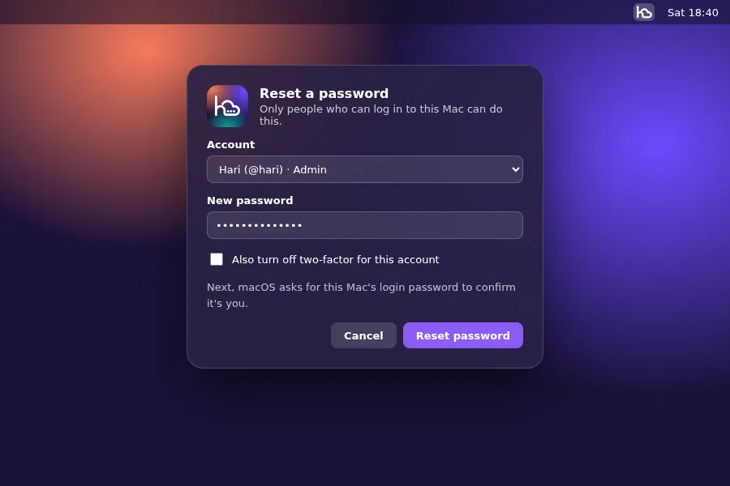

Links to: `TrayMenu`

Shows: Menu bar app — reset a password · Sat 18:40 · Reset a password · Only people who can log in to this Mac can do this. · Account · Hari (@hari) · Admin · [Member] · New password · Also turn off two-factor for this account · Next, macOS asks for this Mac's login password to confirm it's you. · Cancel · Reset password

### TrayUninstall — Menu-bar app · uninstall hlabs

**Priority:** Polish · **Phase:** 6 · **Stories:** US-INST-21, US-INST-22

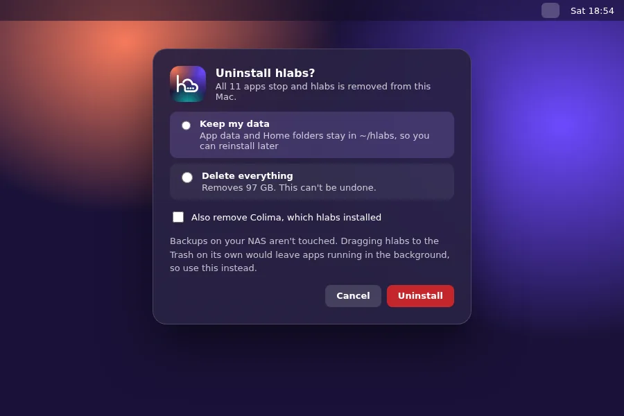

Links to: `TrayMenu`

Shows: Menu bar app — uninstall hlabs · Sat 18:54 · Uninstall hlabs? · All 11 apps stop and hlabs is removed from this Mac. · [What to keep] · Keep my data · App data and Home folders stay in ~/hlabs, so you can reinstall later · Delete everything · Removes 97 GB. This can't be undone. · Also remove Colima, which hlabs installed · Backups on your NAS aren't touched. Dragging hlabs to the Trash on its own would leave apps running in the background, so use this instead. · Cancel · Uninstall

### LinuxTray — Linux desktop tray menus

**Priority:** Polish · **Phase:** 6 · **Stories:** US-INST-26, US-INST-27

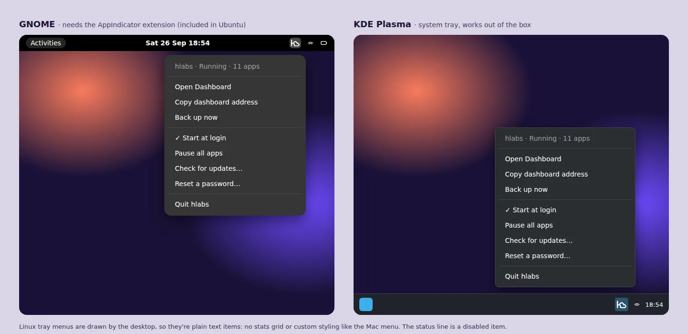

Links to: `Main`

Shows: Linux desktop tray menus · [GNOME] · GNOME · · needs the AppIndicator extension (included in Ubuntu) · Activities · Sat 26 Sep  18:54 · [hlabs] · hlabs · Running · 11 apps · Open Dashboard · Copy dashboard address · Back up now · ✓  Start at login · Pause all apps · Check for updates… · Reset a password… · Quit hlabs · [KDE Plasma] · KDE Plasma · · system tray, works out of the box · [hlabs] · hlabs · Running · 11 apps · Open Dashboard · Copy dashboard address · Back up now · ✓  Start at login · Pause all apps · Check for updates… · Reset a password… · Quit hlabs · 18:54 · Linux tray menus are drawn by the desktop, so they're plain text items: no stats grid or custom styling like the Mac menu. The status line is a disabled item.

## Onboarding

### OnbWelcome — Welcome

**Priority:** P1 · **Phase:** 1 · **Stories:** US-INST-24, US-ONB-01, US-ONB-02, US-ONB-03

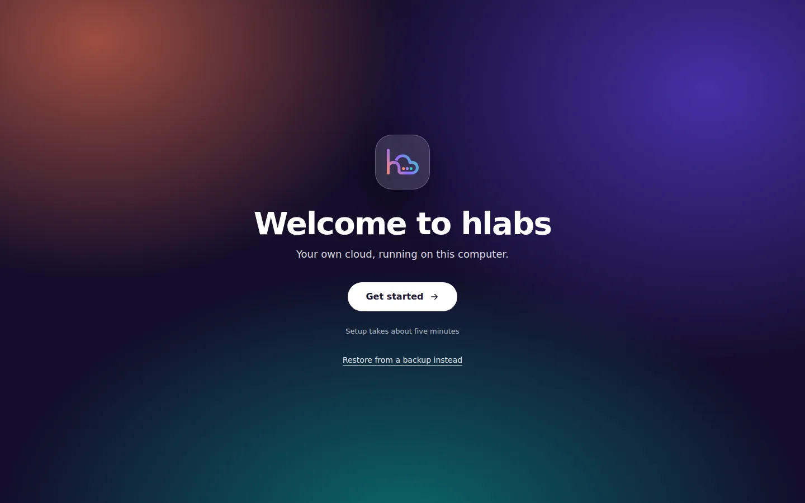

Links to: `OnbRestore`, `OnbSystem`

Shows: Onboarding — Welcome · Welcome to hlabs · Your own cloud, running on this computer. · Get started · Setup takes about five minutes · Restore from a backup instead

### OnbRestore — Restore from a backup

**Priority:** P3 · **Phase:** 8 · **Stories:** US-ONB-23, US-ONB-24

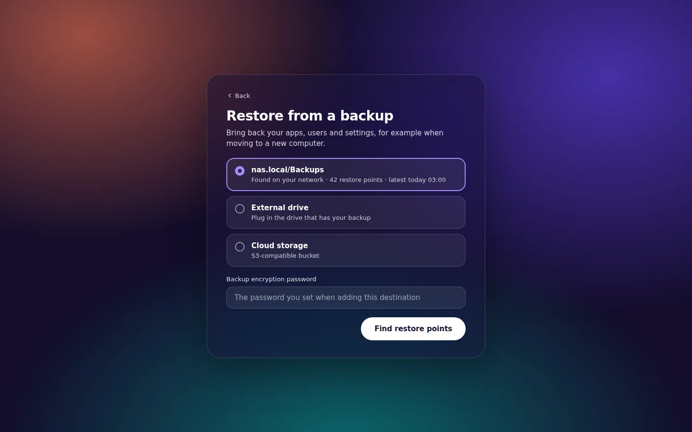

Links to: `OnbWelcome`, `RestoreFlow`

Shows: Onboarding — Restore from a backup · Back · Restore from a backup · Bring back your apps, users and settings, for example when moving to a new computer. · [Where is the backup] · nas.local/Backups · Found on your network · 42 restore points · latest today 03:00 · External drive · Plug in the drive that has your backup · Cloud storage · S3-compatible bucket · Backup encryption password · [The password you set when adding this destination] · Find restore points

### OnbSystem — System check

**Priority:** P1 · **Phase:** 1 · **Stories:** US-ONB-04, US-ONB-05, US-ONB-07

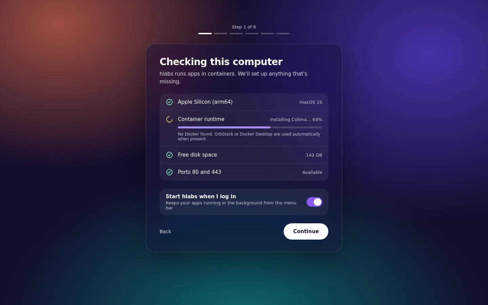

Links to: `OnbAccount`, `OnbSystemFail`, `OnbWelcome`

Shows: Onboarding — System check · Step 1 of 6 · Checking this computer · hlabs runs apps in containers. We'll set up anything that's missing. · Apple Silicon (arm64) · macOS 15 · Container runtime · Installing Colima… 64% · No Docker found. OrbStack or Docker Desktop are used automatically when present. · Free disk space · 142 GB · Ports 80 and 443 · Available · Start hlabs when I log in · Keeps your apps running in the background from the menu bar · Back · Continue

### OnbSystemFail — System check · failed

**Priority:** P1 · **Phase:** 1 · **Stories:** US-ONB-06, US-ONB-07

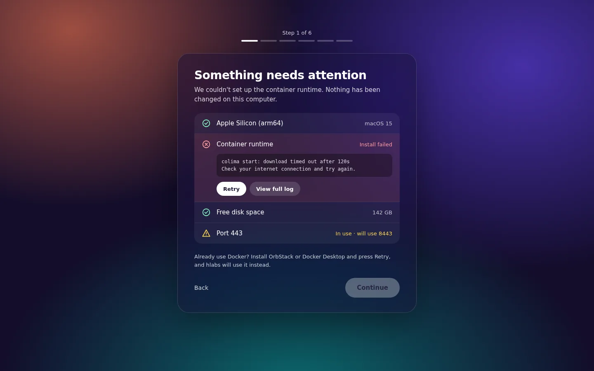

Links to: `OnbWelcome`

Shows: Onboarding — System check failed · Step 1 of 6 · Something needs attention · We couldn't set up the container runtime. Nothing has been changed on this computer. · Apple Silicon (arm64) · macOS 15 · Container runtime · Install failed · colima start: download timed out after 120s · Check your internet connection and try again. · Retry · View full log · Free disk space · 142 GB · Port 443 · In use · will use 8443 · Already use Docker? Install OrbStack or Docker Desktop and press Retry, and hlabs will use it instead. · Back · Continue

### OnbAccount — Admin account

**Priority:** P1 · **Phase:** 1 · **Stories:** US-ONB-08, US-ONB-10

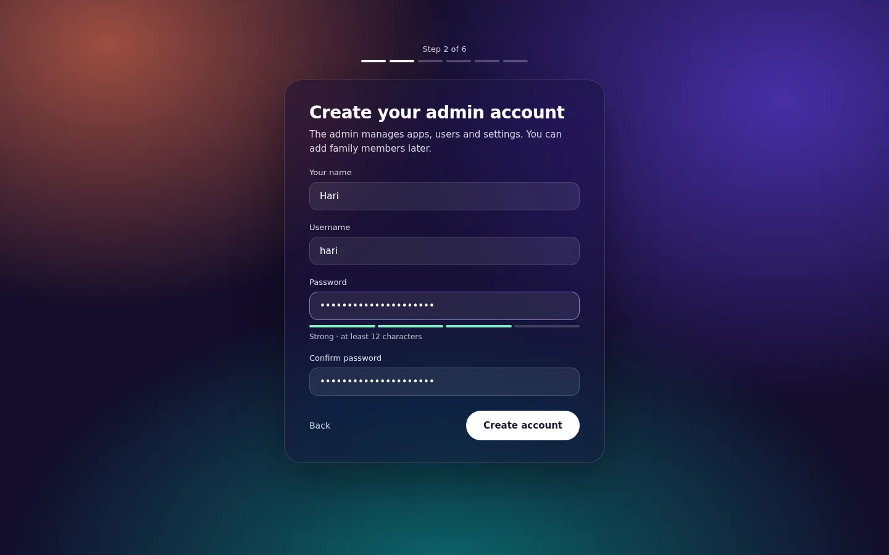

Links to: `OnbAccountErrors`, `OnbSystem`, `OnbTwoFactor`

Shows: Onboarding — Admin account · Step 2 of 6 · Create your admin account · The admin manages apps, users and settings. You can add family members later. · Your name · Username · Password · Strong · at least 12 characters · Confirm password · Back · Create account

### OnbAccountErrors — Admin account · errors

**Priority:** P2 · **Phase:** 1 · **Stories:** US-ONB-09

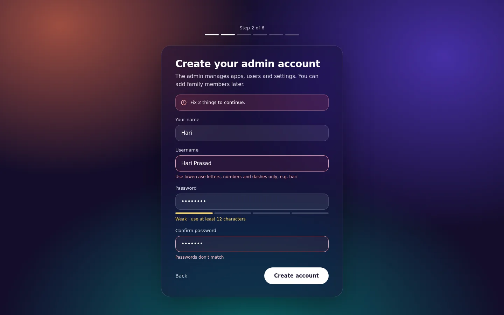

Links to: `OnbAccount`, `OnbSystem`

Shows: Onboarding — Admin account with errors · Step 2 of 6 · Create your admin account · The admin manages apps, users and settings. You can add family members later. · Fix 2 things to continue. · Your name · Username · Use lowercase letters, numbers and dashes only, e.g. hari · Password · Weak · use at least 12 characters · Confirm password · Passwords don't match · Back · Create account

### OnbTwoFactor — Two-factor

**Priority:** P1 · **Phase:** 1 · **Stories:** US-ONB-11, US-ONB-12, US-ONB-13

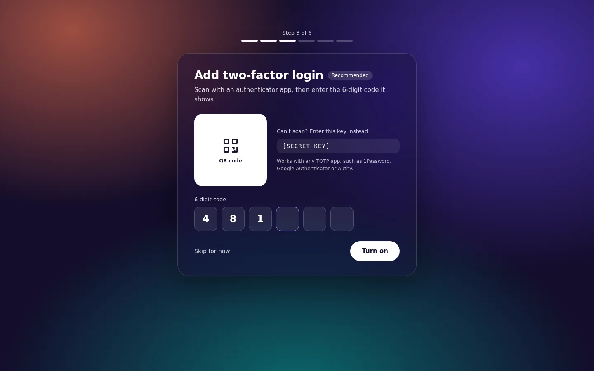

Links to: `OnbStorage`

Shows: Onboarding — Two-factor · Step 3 of 6 · Add two-factor login · Recommended · Scan with an authenticator app, then enter the 6-digit code it shows. · QR code · Can't scan? Enter this key instead · [SECRET KEY] · Works with any TOTP app, such as 1Password, Google Authenticator or Authy. · 6-digit code · [Digit 1] · [Digit 2] · [Digit 3] · [Digit 4] · [Digit 5] · [Digit 6] · Skip for now · Turn on

### OnbStorage — Storage

**Priority:** P1 · **Phase:** 1 · **Stories:** US-ONB-14, US-ONB-15, US-ONB-16

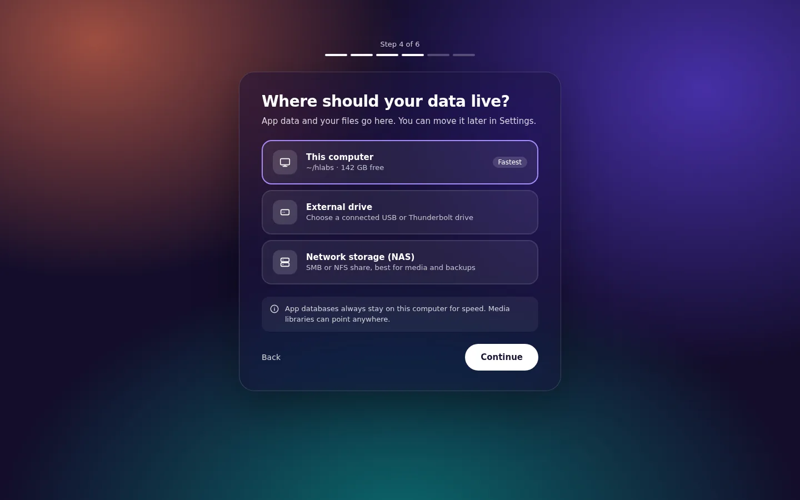

Links to: `OnbRemote`, `OnbTwoFactor`

Shows: Onboarding — Storage · Step 4 of 6 · Where should your data live? · App data and your files go here. You can move it later in Settings. · [Storage location] · This computer · ~/hlabs · 142 GB free · Fastest · External drive · Choose a connected USB or Thunderbolt drive · Network storage (NAS) · SMB or NFS share, best for media and backups · App databases always stay on this computer for speed. Media libraries can point anywhere. · Back · Continue

### OnbRemote — Remote access

**Priority:** P1 · **Phase:** 3 · **Stories:** US-ONB-17, US-ONB-18

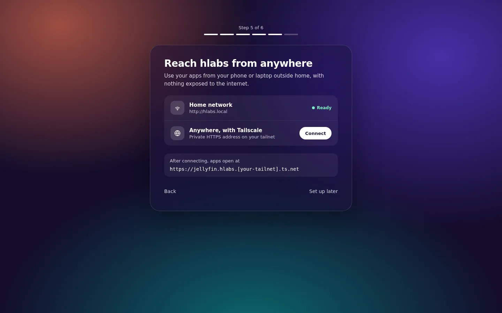

Links to: `OnbApps`, `OnbStorage`

Shows: Onboarding — Remote access · Step 5 of 6 · Reach hlabs from anywhere · Use your apps from your phone or laptop outside home, with nothing exposed to the internet. · Home network · http://hlabs.local · Ready · Anywhere, with Tailscale · Private HTTPS address on your tailnet · Connect · After connecting, apps open at · https://jellyfin.hlabs.[your-tailnet].ts.net · Back · Set up later

### OnbApps — Starter apps

**Priority:** P1 · **Phase:** 2 · **Stories:** US-ONB-19, US-ONB-20

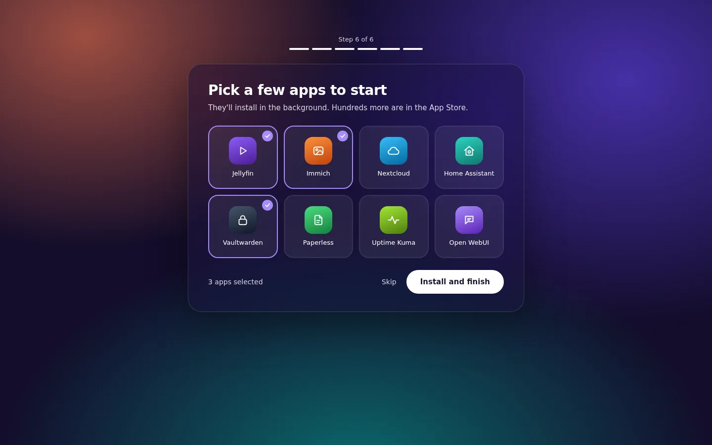

Links to: `HomeEmpty`, `OnbDone`

Shows: Onboarding — Starter apps · Step 6 of 6 · Pick a few apps to start · They'll install in the background. Hundreds more are in the App Store. · Jellyfin · Immich · Nextcloud · Home Assistant · Vaultwarden · Paperless · Uptime Kuma · Open WebUI · Skip · Install and finish

### OnbDone — All set

**Priority:** P1 · **Phase:** 1 · **Stories:** US-ONB-21, US-ONB-22

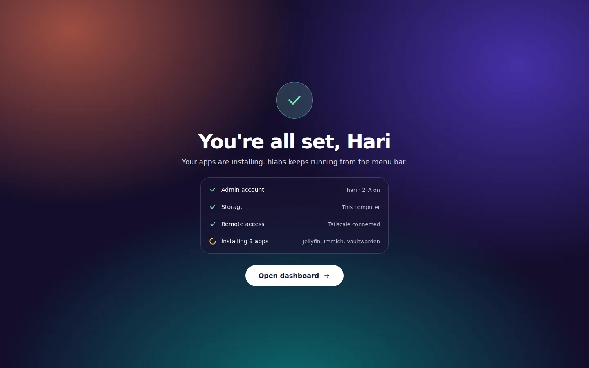

Links to: `Main`

Shows: Onboarding — All set · You're all set, Hari · Your apps are installing. hlabs keeps running from the menu bar. · Admin account · hari · 2FA on · Storage · This computer · Remote access · Tailscale connected · Installing 3 apps · Jellyfin, Immich, Vaultwarden · Open dashboard

## Sign in

### LoginUsers — Choose user

**Priority:** P1 · **Phase:** 1 · **Stories:** US-AUTH-01, US-AUTH-02, US-AUTH-05, US-AUTH-07

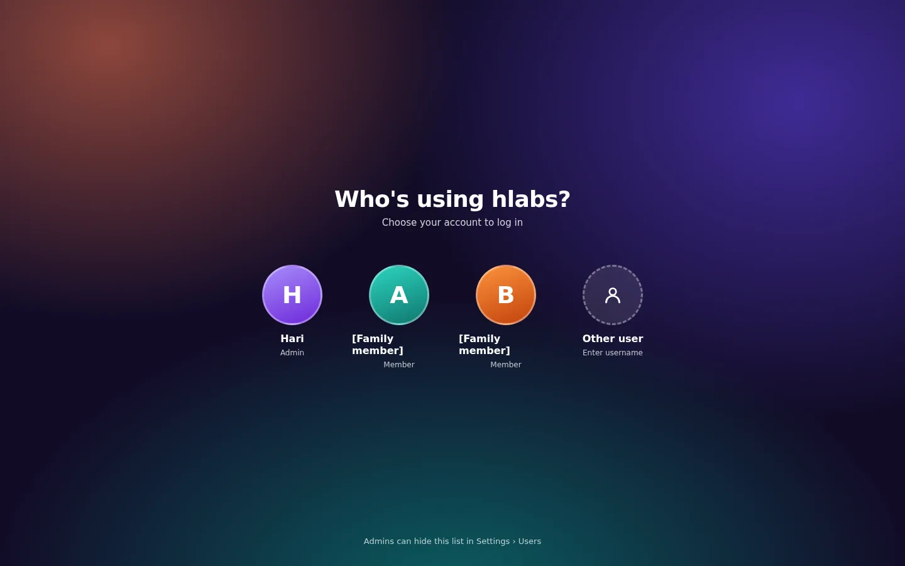

Links to: `Login`, `LoginUsername`

Shows: Log in — Choose user · Who's using hlabs? · Choose your account to log in · [Accounts] · H · Hari · Admin · A · [Family member] · Member · B · [Family member] · Member · Other user · Enter username · Admins can hide this list in Settings › Users

### LoginUsername — Username & password

**Priority:** P1 · **Phase:** 1 · **Stories:** US-AUTH-02, US-AUTH-03, US-AUTH-04, US-AUTH-05, US-AUTH-07, US-AUTH-10, US-AUTH-14, US-AUTH-17, US-AUTH-18

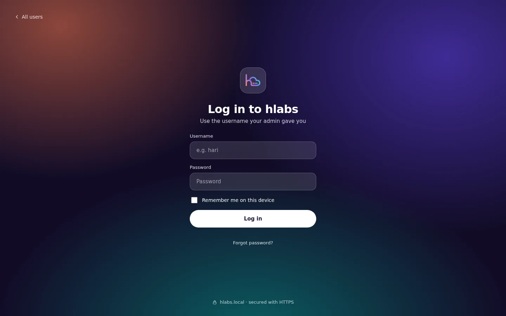

Links to: `ForgotPassword`, `Login2FA`, `LoginUsers`

Shows: Log in — Username and password · All users · Log in to hlabs · Use the username your admin gave you · Username · [e.g. hari] · Password · [Password] · Remember me on this device · Log in · Forgot password? · hlabs.local · secured with HTTPS

### Login — Remembered user

**Priority:** P1 · **Phase:** 1 · **Stories:** US-AUTH-05, US-AUTH-06, US-AUTH-07, US-AUTH-14, US-AUTH-15, US-AUTH-16, US-AUTH-17, US-AUTH-18

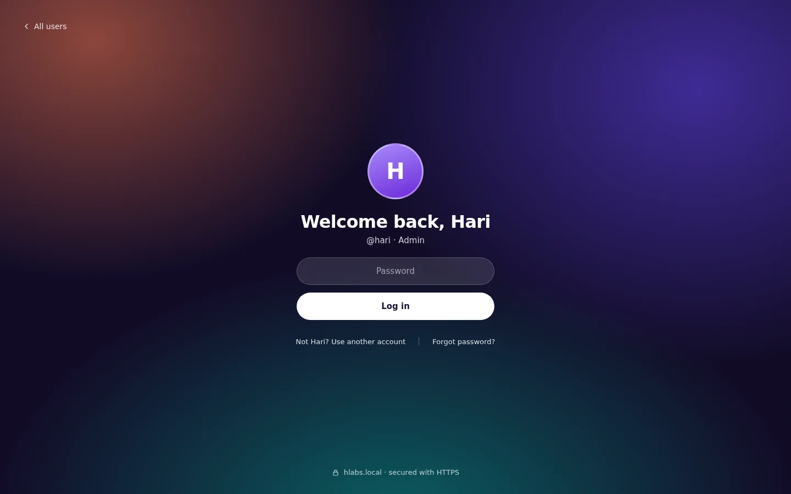

Links to: `ForgotPassword`, `Login2FA`, `LoginUsername`, `LoginUsers`

Shows: Log in · All users · H · Welcome back, Hari · @hari · Admin · Password · [Password] · Log in · Not Hari? Use another account · Forgot password? · hlabs.local · secured with HTTPS

### Login2FA — Two-factor code

**Priority:** P1 · **Phase:** 1 · **Stories:** US-AUTH-08, US-AUTH-09, US-AUTH-10, US-AUTH-11, US-AUTH-18, US-AUTH-21

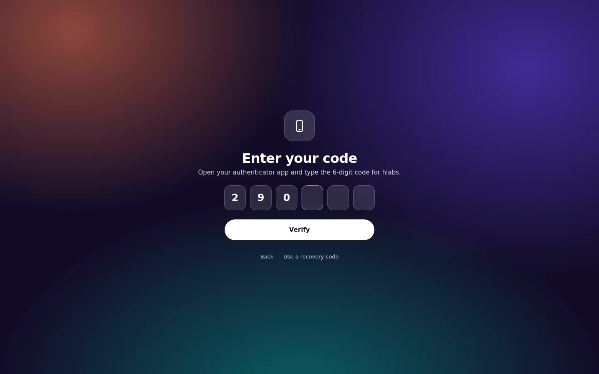

Links to: `ForgotPassword`, `Login`, `Main`

Shows: Log in — Two-factor code · Enter your code · Open your authenticator app and type the 6-digit code for hlabs. · 6-digit code · [Digit 1] · [Digit 2] · [Digit 3] · [Digit 4] · [Digit 5] · [Digit 6] · Verify · Back · Use a recovery code

### LoginLocked — Too many attempts

**Priority:** P2 · **Phase:** 1 · **Stories:** US-AUTH-12, US-AUTH-13

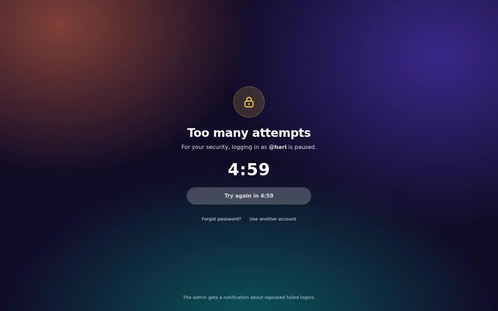

Links to: `ForgotPassword`, `LoginUsers`

Shows: Log in — Too many attempts · Too many attempts · For your security, logging in as · @hari · is paused. · 4:59 · Try again in 4:59 · Forgot password? · Use another account · The admin gets a notification about repeated failed logins.

### ForgotPassword — Forgot password

**Priority:** P2 · **Phase:** 4 · **Stories:** US-AUTH-20, US-AUTH-21, US-AUTH-22

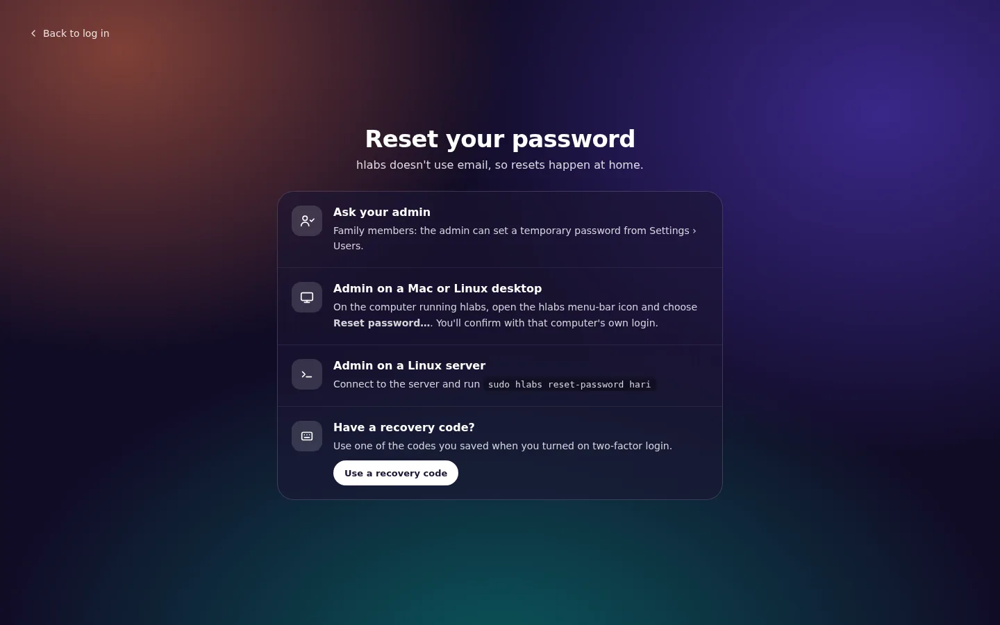

Links to: `Login`, `LoginUsername`

Shows: Log in — Forgot password · Back to log in · Reset your password · hlabs doesn't use email, so resets happen at home. · Ask your admin · Family members: the admin can set a temporary password from Settings › Users. · Admin on a Mac or Linux desktop · On the computer running hlabs, open the hlabs menu-bar icon and choose · Reset password… · . You'll confirm with that computer's own login. · Admin on a Linux server · Connect to the server and run · sudo hlabs reset-password hari · Have a recovery code? · Use one of the codes you saved when you turned on two-factor login. · Use a recovery code

### AcceptInvite — Accept invite

**Priority:** P2 · **Phase:** 3 · **Stories:** US-AUTH-23, US-AUTH-24

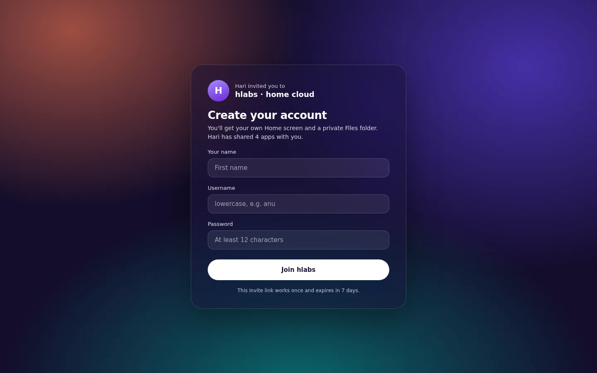

Links to: `MemberHome`

Shows: Accept invite · H · Hari invited you to · hlabs · home cloud · Create your account · You'll get your own Home screen and a private Files folder. Hari has shared 4 apps with you. · Your name · [First name] · Username · [lowercase, e.g. anu] · Password · [At least 12 characters] · Join hlabs · This invite link works once and expires in 7 days.

### ResetLink — Reset-link password

**Priority:** P2 · **Phase:** 4 · **Stories:** US-AUTH-22

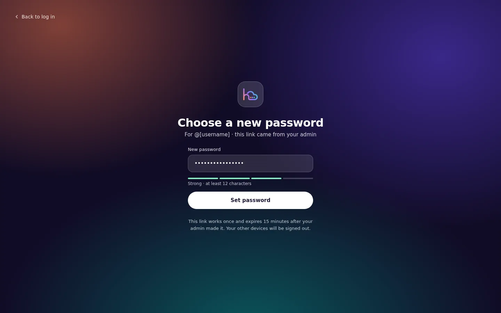

Links to: `Login`, `Main`

Shows: Choose a new password · Back to log in · Choose a new password · For @[username] · this link came from your admin · New password · Strong · at least 12 characters · Set password · This link works once and expires 15 minutes after your admin made it. Your other devices will be signed out.

## Home

### Main — Home

**Priority:** P1 · **Phase:** 1 · **Stories:** US-HOME-01, US-HOME-02, US-HOME-03, US-HOME-04, US-HOME-05, US-HOME-09

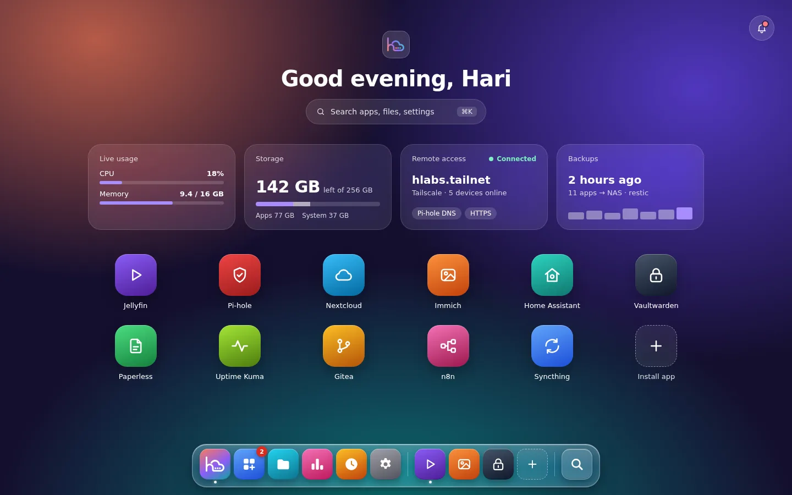

Links to: `AppStore`, `AppWindow`, `BackupsOverview`, `FilesBrowser`, `HomeNotifications`, `LiveUsage`, `SettingsAccount`, `Spotlight`

Shows: hlabs — Home · Good evening, Hari · Search apps, files, settings · ⌘K · Live usage · CPU · 18% · Memory · 9.4 / 16 GB · Storage · 142 GB · left of 256 GB · Apps 77 GB · System 37 GB · Remote access · Connected · hlabs.tailnet · Tailscale · 5 devices online · Pi-hole DNS · HTTPS · Backups · 2 hours ago · 11 apps → NAS · restic · Jellyfin · Pi-hole · Nextcloud · Immich · Home Assistant · Vaultwarden · Paperless · Uptime Kuma · Gitea · n8n · Syncthing · Install app · [Notifications, 3 new] · [Dock] · Home · App Store, 2 updates · Files · Usage · Backups · Settings · Jellyfin, open · Immich · Vaultwarden · Add to Dock · Search

### HomeStates — App states & right-click menu

**Priority:** P1 · **Phase:** 2 · **Stories:** US-HOME-06, US-HOME-07, US-HOME-08

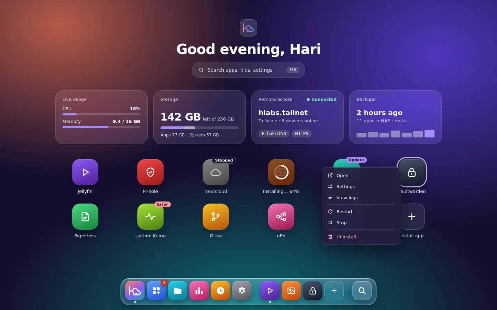

Links to: `AppLogs`, `AppSettings`, `AppStore`, `AppWindow`, `BackupsOverview`, `FilesBrowser`, `LiveUsage`, `Main`, `SettingsAccount`, `Spotlight`, `UninstallConfirm`

Shows: hlabs — Home · app states · Good evening, Hari · Search apps, files, settings · ⌘K · Live usage · CPU · 18% · Memory · 9.4 / 16 GB · Storage · 142 GB · left of 256 GB · Apps 77 GB · System 37 GB · Remote access · Connected · hlabs.tailnet · Tailscale · 5 devices online · Pi-hole DNS · HTTPS · Backups · 2 hours ago · 11 apps → NAS · restic · Jellyfin · Pi-hole · Stopped · Nextcloud · Installing… 64% · Update · Home Assistant · Vaultwarden · [Vaultwarden] · Open · Settings · View logs · Restart · Stop · Uninstall… · Paperless · Error · Uptime Kuma · Gitea · n8n · Syncthing · Install app · [Dock] · Home · App Store, 2 updates · Files · Usage · Backups · Settings · Jellyfin, open · Immich · Vaultwarden · Add to Dock · Search

### Spotlight — Search (⌘K)

**Priority:** P1 · **Phase:** 2 · **Stories:** US-HOME-09, US-HOME-10

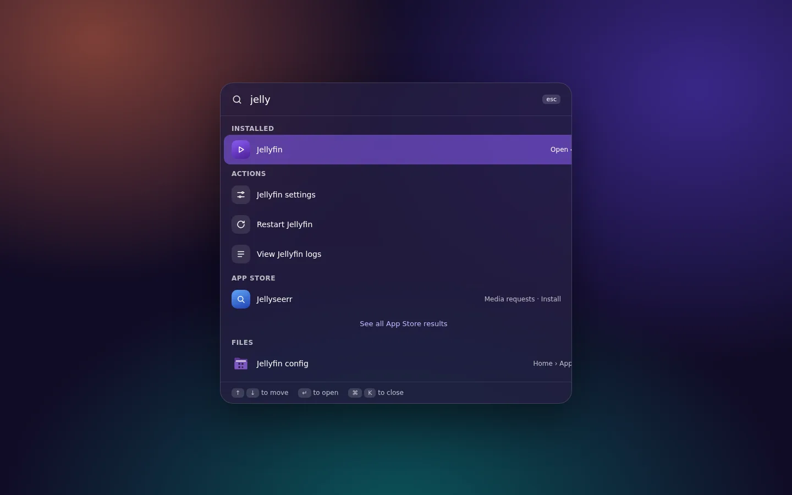

Links to: `AppDetails`, `AppLogs`, `AppSettings`, `AppWindow`, `FilesBrowser`, `StoreSearch`

Shows: Search (⌘K) · [Search] · Search · esc · Installed · Jellyfin · Open ↵ · Actions · Jellyfin settings · Restart Jellyfin · View Jellyfin logs · App Store · Jellyseerr · Media requests · Install · See all App Store results · Files · Jellyfin config · Home › Apps · ↑ · ↓ · to move · ↵ · to open · ⌘ · K · to close

### HomeNotifications — Notifications

**Priority:** P2 · **Phase:** 7 · **Stories:** US-HOME-13, US-HOME-14

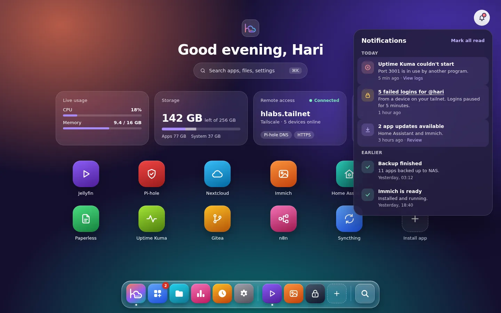

Links to: `AppLogs`, `AppStore`, `BackupsOverview`, `FilesBrowser`, `LiveUsage`, `LoginLocked`, `Main`, `SettingsAccount`, `SettingsUpdates`, `Spotlight`

Shows: hlabs — Notifications · Good evening, Hari · Search apps, files, settings · ⌘K · Live usage · CPU · 18% · Memory · 9.4 / 16 GB · Storage · 142 GB · left of 256 GB · Apps 77 GB · System 37 GB · Remote access · Connected · hlabs.tailnet · Tailscale · 5 devices online · Pi-hole DNS · HTTPS · Backups · 2 hours ago · 11 apps → NAS · restic · Jellyfin · Pi-hole · Nextcloud · Immich · Home Assistant · Vaultwarden · Paperless · Uptime Kuma · Gitea · n8n · Syncthing · Install app · [Notifications, 3 new] · [Notifications] · Notifications · Mark all read · Today · Uptime Kuma couldn't start · Port 3001 is in use by another program. · 5 min ago · · View logs · 5 failed logins for @hari · From a device on your tailnet. Logins paused for 5 minutes. · 1 hour ago · 2 app updates available · Home Assistant and Immich. · 3 hours ago · · Review · Earlier · Backup finished · 11 apps backed up to NAS. · Yesterday, 03:12 · Immich is ready · Installed and running. · Yesterday, 18:40 · [Dock] · Home · App Store, 2 updates · Files · Usage · Backups · Settings · Jellyfin, open · Immich · Vaultwarden · Add to Dock · Search

### HomeEmpty — Empty home

**Priority:** P2 · **Phase:** 7 · **Stories:** US-HOME-15

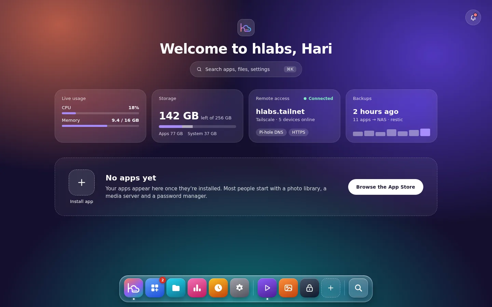

Links to: `AppStore`, `BackupsOverview`, `FilesBrowser`, `HomeNotifications`, `LiveUsage`, `Main`, `SettingsAccount`, `Spotlight`

Shows: hlabs — Home · empty · Welcome to hlabs, Hari · Search apps, files, settings · ⌘K · Live usage · CPU · 18% · Memory · 9.4 / 16 GB · Storage · 142 GB · left of 256 GB · Apps 77 GB · System 37 GB · Remote access · Connected · hlabs.tailnet · Tailscale · 5 devices online · Pi-hole DNS · HTTPS · Backups · 2 hours ago · 11 apps → NAS · restic · Install app · No apps yet · Your apps appear here once they're installed. Most people start with a photo library, a media server and a password manager. · Browse the App Store · [Notifications, 3 new] · [Dock] · Home · App Store, 2 updates · Files · Usage · Backups · Settings · Jellyfin, open · Immich · Vaultwarden · Add to Dock · Search

### HomeEdit — Edit mode

**Priority:** P2 · **Phase:** 7 · **Stories:** US-HOME-16, US-HOME-17, US-HOME-18

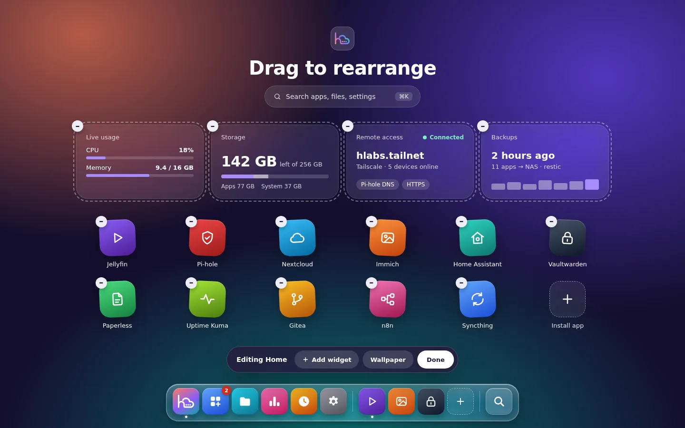

Links to: `AppStore`, `BackupsOverview`, `FilesBrowser`, `LiveUsage`, `Main`, `SettingsAccount`, `SettingsAppearance`, `Spotlight`, `WidgetPicker`

Shows: hlabs — Home · edit mode · Drag to rearrange · Search apps, files, settings · ⌘K · [Remove widget] · – · Live usage · CPU · 18% · Memory · 9.4 / 16 GB · [Remove widget] · – · Storage · 142 GB · left of 256 GB · Apps 77 GB · System 37 GB · [Remove widget] · – · Remote access · Connected · hlabs.tailnet · Tailscale · 5 devices online · Pi-hole DNS · HTTPS · [Remove widget] · – · Backups · 2 hours ago · 11 apps → NAS · restic · Jellyfin · Pi-hole · Nextcloud · Immich · Home Assistant · Vaultwarden · Paperless · Uptime Kuma · Gitea · n8n · Syncthing · Install app · [Editing Home] · Editing Home · Add widget · Wallpaper · Done · [Dock] · Home · App Store, 2 updates · Files · Usage · Backups · Settings · Jellyfin, open · Immich · Vaultwarden · Add to Dock · Search

### WidgetPicker — Add a widget

**Priority:** P2 · **Phase:** 7 · **Stories:** US-HOME-19, US-HOME-20

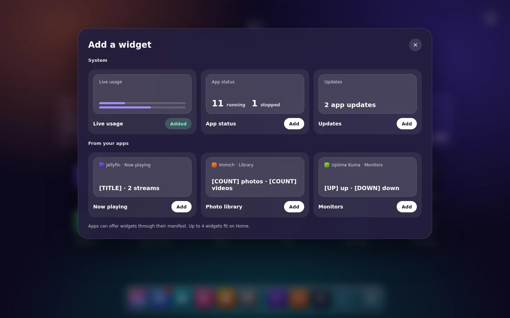

Links to: `AppStore`, `BackupsOverview`, `FilesBrowser`, `HomeEdit`, `HomeNotifications`, `LiveUsage`, `Main`, `SettingsAccount`, `Spotlight`

Shows: hlabs — Add a widget · Good evening, Hari · Search apps, files, settings · ⌘K · Live usage · CPU · 18% · Memory · 9.4 / 16 GB · Storage · 142 GB · left of 256 GB · Apps 77 GB · System 37 GB · Remote access · Connected · hlabs.tailnet · Tailscale · 5 devices online · Pi-hole DNS · HTTPS · Backups · 2 hours ago · 11 apps → NAS · restic · Jellyfin · Pi-hole · Nextcloud · Immich · Home Assistant · Vaultwarden · Paperless · Uptime Kuma · Gitea · n8n · Syncthing · Install app · [Notifications, 3 new] · Add a widget · [Close] · System · Live usage · Live usage · Added · App status · 11 · running · 1 · stopped · App status · Add · Updates · 2 app updates · Updates · Add · From your apps · Jellyfin · Now playing · [TITLE] · 2 streams · Now playing · Add · Immich · Library · [COUNT] photos · [COUNT] videos · Photo library · Add · Uptime Kuma · Monitors · [UP] up · [DOWN] down · Monitors · Add · Apps can offer widgets through their manifest. Up to 4 widgets fit on Home. · [Dock] · Home · App Store, 2 updates · Files · Usage · Backups · Settings · Jellyfin, open · Immich · Vaultwarden · Add to Dock · Search

### MemberHome — Family member's Home

**Priority:** P1 · **Phase:** 3 · **Stories:** US-HOME-05, US-HOME-11, US-HOME-12

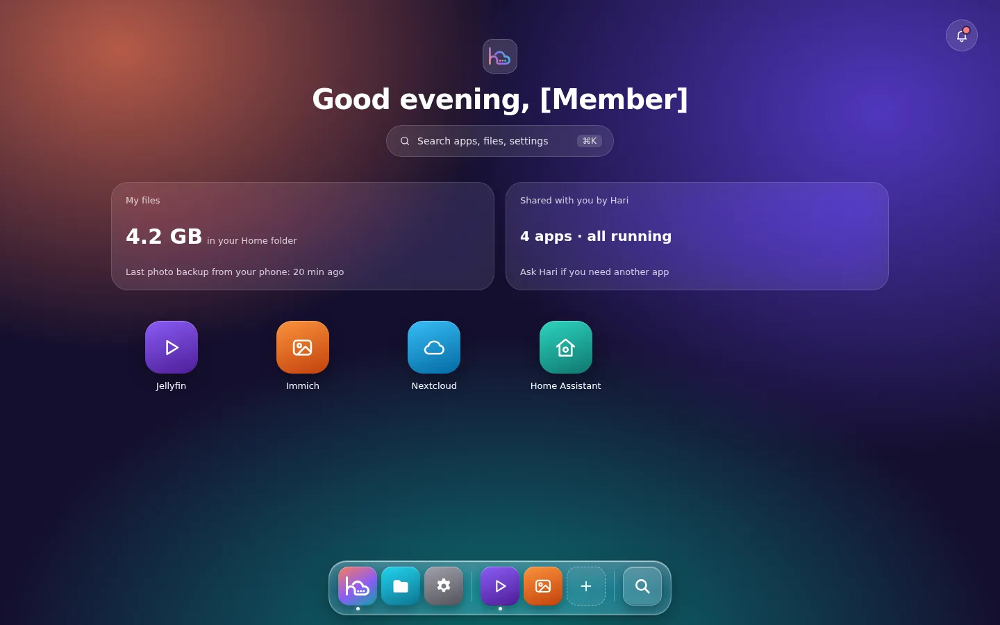

Links to: `AppWindow`, `FilesBrowser`, `HomeNotifications`, `Main`, `MemberSettings`, `Spotlight`

Shows: hlabs — Home · family member · Good evening, [Member] · Search apps, files, settings · ⌘K · My files · 4.2 GB · in your Home folder · Last photo backup from your phone: 20 min ago · Shared with you by Hari · 4 apps · all running · Ask Hari if you need another app · Jellyfin · Immich · Nextcloud · Home Assistant · [Notifications, 3 new] · [Dock] · Home · Files · Settings · Jellyfin, open · Immich · Add to Dock · Search

### DockHome — Dock on Home (interactive)

**Priority:** P1 · **Phase:** 1 · **Stories:** US-HOME-04, US-HOME-05, US-HOME-23

Links to: `Main`, `AppStore`, `FilesBrowser`, `LiveUsage`, `BackupsOverview`, `SettingsAccount`, `AppWindow`, `Spotlight`

Shows: the Home screen with the Dock: six area tiles (Home current, App Store with 2 updates), divider, pinned Jellyfin (open), Immich, Vaultwarden, the + tile, divider, Search. Hover a tile in the prototype to see magnification and its name.

### DockStates — Dock states and spec

**Priority:** P1 · **Phase:** 1 · **Stories:** US-HOME-04, US-HOME-05, US-HOME-22, US-HOME-23

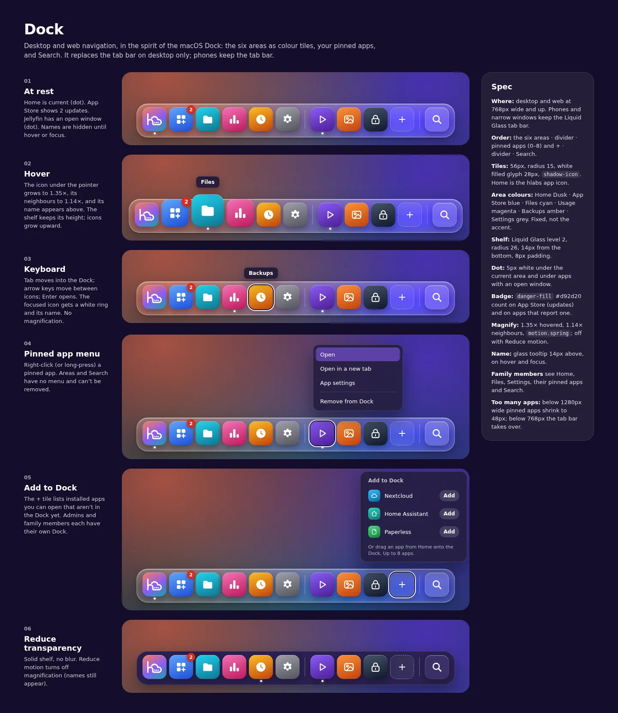

Shows: Dock · 01 At rest · 02 Hover (Files at 1.35×, neighbours 1.14×, name above) · 03 Keyboard (focus ring and name, arrow keys) · 04 Pinned app menu: Open · Open in a new tab · App settings · Remove from Dock · 05 Add to Dock: Nextcloud · Home Assistant · Paperless · Add · Or drag an app from Home onto the Dock. Up to 8 apps. · 06 Reduce transparency (solid shelf) · Spec: where (768px and up), order, tiles, area colours, shelf, dot, badge, magnify, name, family members, too many apps.

### MainSolid — Reduce transparency

**Priority:** Polish · **Phase:** 9 · **Stories:** US-HOME-21

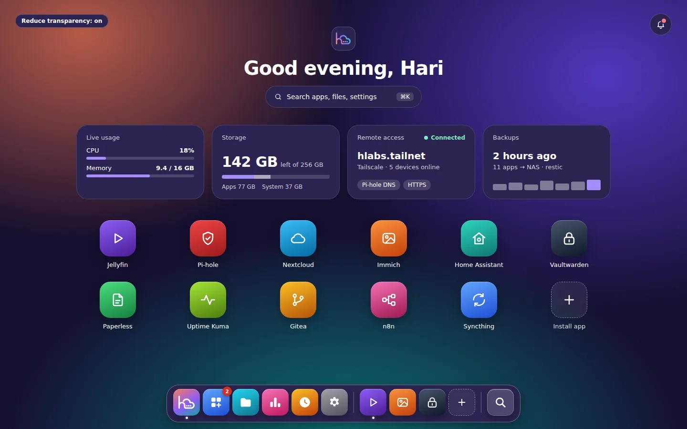

Links to: `AppStore`, `AppWindow`, `BackupsOverview`, `FilesBrowser`, `HomeNotifications`, `LiveUsage`, `Main`, `SettingsAccount`, `Spotlight`

Shows: hlabs — Home · reduce transparency · Reduce transparency: on · Good evening, Hari · Search apps, files, settings · ⌘K · Live usage · CPU · 18% · Memory · 9.4 / 16 GB · Storage · 142 GB · left of 256 GB · Apps 77 GB · System 37 GB · Remote access · Connected · hlabs.tailnet · Tailscale · 5 devices online · Pi-hole DNS · HTTPS · Backups · 2 hours ago · 11 apps → NAS · restic · Jellyfin · Pi-hole · Nextcloud · Immich · Home Assistant · Vaultwarden · Paperless · Uptime Kuma · Gitea · n8n · Syncthing · Install app · [Notifications, 3 new] · [Dock] · Home · App Store, 2 updates · Files · Usage · Backups · Settings · Jellyfin, open · Immich · Vaultwarden · Add to Dock · Search

## App Store & installing

### AppStore — App Store

**Priority:** P1 · **Phase:** 2 · **Stories:** US-STORE-01, US-STORE-02, US-STORE-03

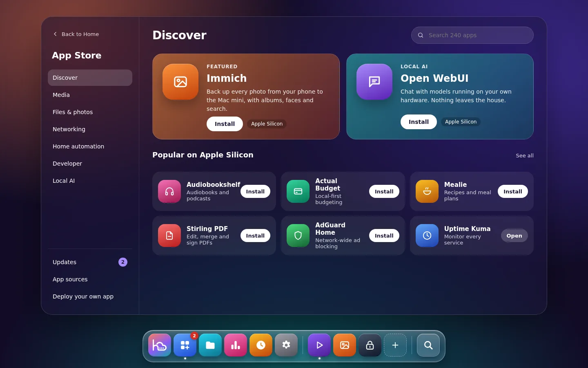

Links to: `BackupsOverview`, `DeployCustom`, `FilesBrowser`, `LiveUsage`, `Main`, `SettingsAccount`, `Spotlight`, `StoreCategory`, `StoreSources`, `StoreUpdates`

Shows: hlabs — App Store · [App Store] · Back to Home · App Store · [Categories] · [Manage apps] · Updates · 2 · App sources · Deploy your own app · Search apps · [Search 240 apps] · Featured · Immich · Back up every photo from your phone to the Mac mini, with albums, faces and search. · Apple Silicon · Local AI · Open WebUI · Chat with models running on your own hardware. Nothing leaves the house. · Apple Silicon · Popular on Apple Silicon · See all · Audiobookshelf · Audiobooks and podcasts · Actual Budget · Local-first budgeting · Mealie · Recipes and meal plans · Stirling PDF · Edit, merge and sign PDFs · AdGuard Home · Network-wide ad blocking · Uptime Kuma · Monitor every service · [Dock] · Home · App Store, 2 updates · Files · Usage · Backups · Settings · Jellyfin, open · Immich · Vaultwarden · Add to Dock · Search

### StoreCategory — Category

**Priority:** P2 · **Phase:** 7 · **Stories:** US-STORE-04

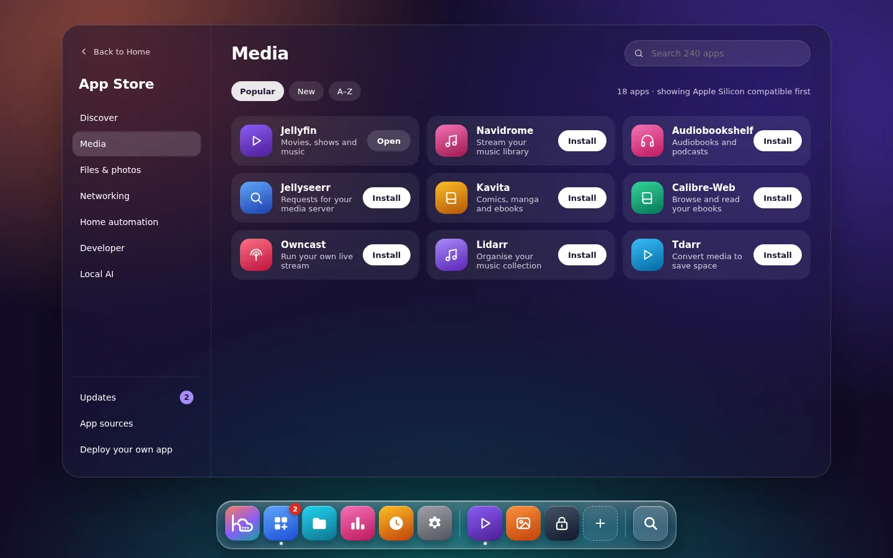

Links to: `AppDetails`, `AppSettings`, `AppStore`, `BackupsOverview`, `DeployCustom`, `FilesBrowser`, `LiveUsage`, `Main`, `SettingsAccount`, `Spotlight`, `StoreSources`, `StoreUpdates`

Shows: hlabs — App Store · Media · [App Store] · Back to Home · App Store · [Categories] · [Manage apps] · Updates · 2 · App sources · Deploy your own app · Media · Search apps · [Search 240 apps] · Popular · New · A–Z · 18 apps · showing Apple Silicon compatible first · Jellyfin · Movies, shows and music · Open · Navidrome · Stream your music library · Install · Audiobookshelf · Audiobooks and podcasts · Install · Jellyseerr · Requests for your media server · Install · Kavita · Comics, manga and ebooks · Install · Calibre-Web · Browse and read your ebooks · Install · Owncast · Run your own live stream · Install · Lidarr · Organise your music collection · Install · Tdarr · Convert media to save space · Install · [Dock] · Home · App Store, 2 updates · Files · Usage · Backups · Settings · Jellyfin, open · Immich · Vaultwarden · Add to Dock · Search

### StoreSearch — Search results

**Priority:** P2 · **Phase:** 7 · **Stories:** US-STORE-05, US-STORE-19

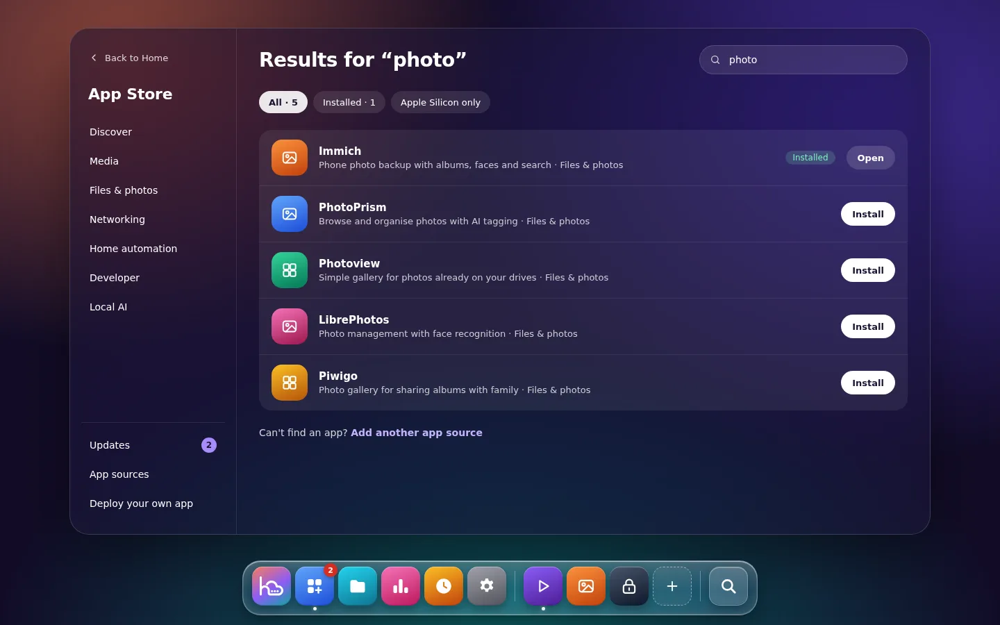

Links to: `AppDetails`, `AppSettings`, `AppStore`, `BackupsOverview`, `DeployCustom`, `FilesBrowser`, `LiveUsage`, `Main`, `SettingsAccount`, `Spotlight`, `StoreSources`, `StoreUpdates`

Shows: hlabs — App Store · Search · [App Store] · Back to Home · App Store · [Categories] · [Manage apps] · Updates · 2 · App sources · Deploy your own app · Results for “photo” · Search apps · [Search 240 apps] · All · 5 · Installed · 1 · Apple Silicon only · Immich · Phone photo backup with albums, faces and search · Files & photos · Installed · Open · PhotoPrism · Browse and organise photos with AI tagging · Files & photos · Install · Photoview · Simple gallery for photos already on your drives · Files & photos · Install · LibrePhotos · Photo management with face recognition · Files & photos · Install · Piwigo · Photo gallery for sharing albums with family · Files & photos · Install · Can't find an app? · Add another app source · [Dock] · Home · App Store, 2 updates · Files · Usage · Backups · Settings · Jellyfin, open · Immich · Vaultwarden · Add to Dock · Search

### AppDetails — App details

**Priority:** P1 · **Phase:** 2 · **Stories:** US-STORE-06, US-STORE-07

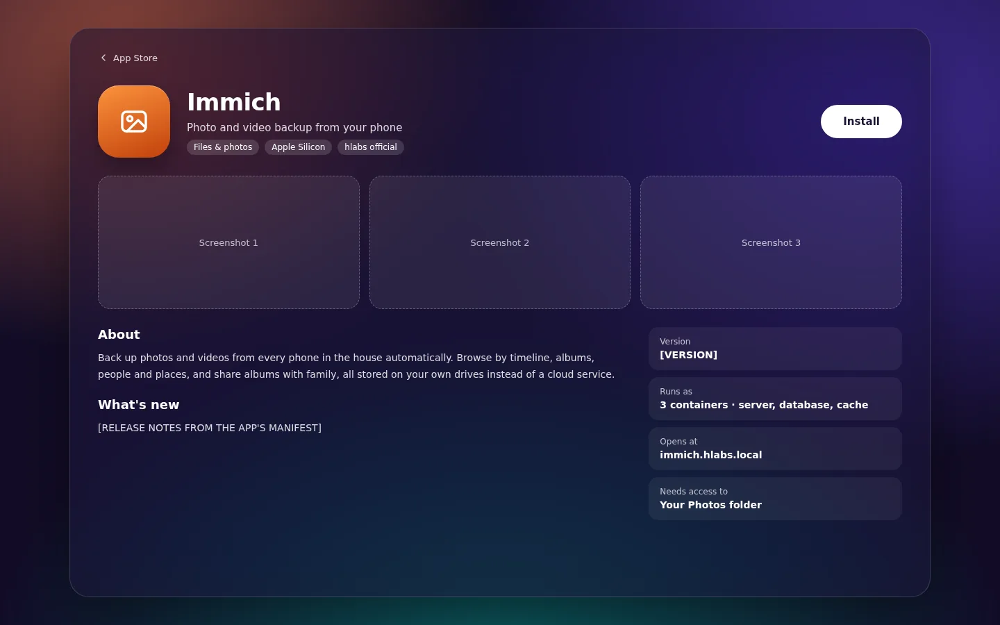

Links to: `AppStore`, `InstallSheet`

Shows: App Store — App details · [App details] · App Store · Immich · Photo and video backup from your phone · Files & photos · Apple Silicon · hlabs official · Install · Screenshot 1 · Screenshot 2 · Screenshot 3 · About · Back up photos and videos from every phone in the house automatically. Browse by timeline, albums, people and places, and share albums with family, all stored on your own drives instead of a cloud service. · What's new · [RELEASE NOTES FROM THE APP'S MANIFEST] · Version · [VERSION] · Runs as · 3 containers · server, database, cache · Opens at · immich.hlabs.local · Needs access to · Your Photos folder

### InstallSheet — Install options

**Priority:** P1 · **Phase:** 2 · **Stories:** US-STORE-08, US-STORE-09, US-STORE-10

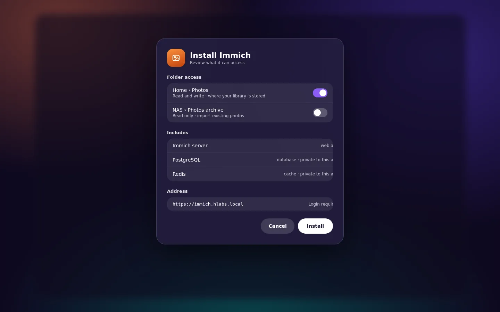

Links to: `AppDetails`, `InstallProgress`

Shows: Install app — options · Install Immich · Review what it can access · Folder access · Home › Photos · Read and write · where your library is stored · NAS › Photos archive · Read only · import existing photos · Includes · Immich server · web app · PostgreSQL · database · private to this app · Redis · cache · private to this app · Address · https://immich.hlabs.local · Login required · Cancel · Install

### InstallProgress — Install progress

**Priority:** P1 · **Phase:** 2 · **Stories:** US-STORE-11, US-STORE-12

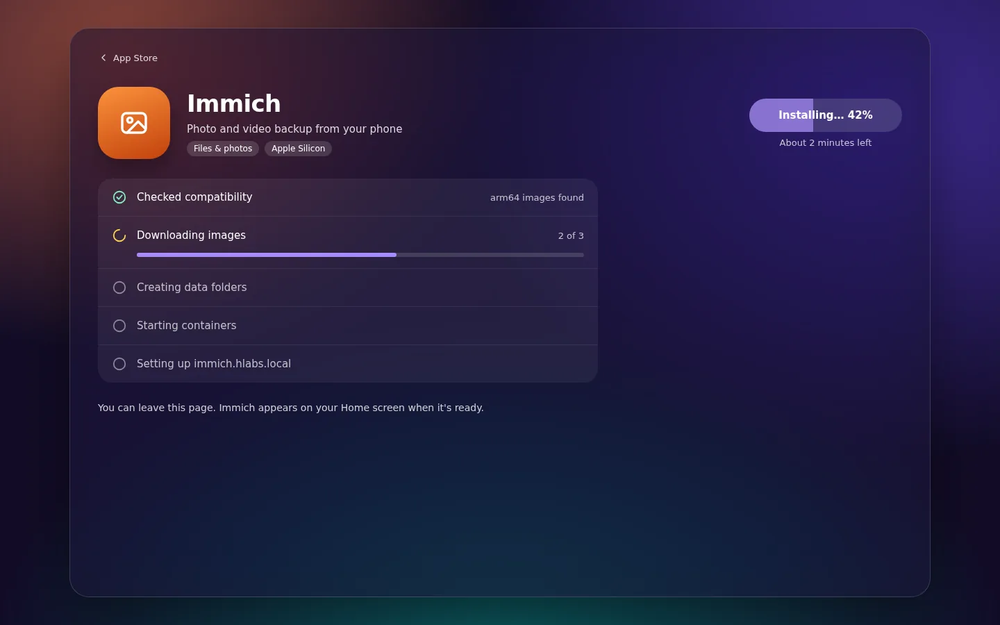

Links to: `AppStore`, `InstallFailed`

Shows: Install app — progress · [Installing Immich] · App Store · Immich · Photo and video backup from your phone · Files & photos · Apple Silicon · Installing… 42% · About 2 minutes left · Checked compatibility · arm64 images found · Downloading images · 2 of 3 · Creating data folders · Starting containers · Setting up immich.hlabs.local · You can leave this page. Immich appears on your Home screen when it's ready.

### InstallFailed — Install failed

**Priority:** P1 · **Phase:** 2 · **Stories:** US-STORE-13, US-STORE-14, US-SITE-10

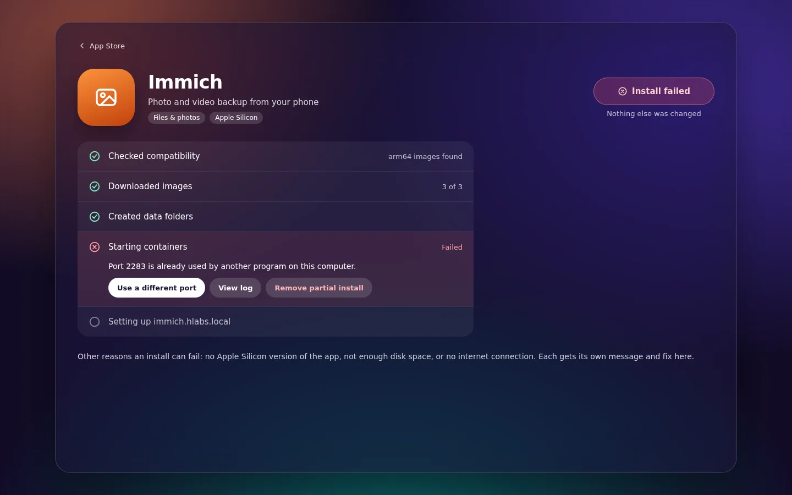

Links to: `AppConfig`, `AppLogs`, `AppStore`

Shows: Install app — failed · [Installing Immich] · App Store · Immich · Photo and video backup from your phone · Files & photos · Apple Silicon · Install failed · Nothing else was changed · Checked compatibility · arm64 images found · Downloaded images · 3 of 3 · Created data folders · Starting containers · Failed · Port 2283 is already used by another program on this computer. · Use a different port · View log · Remove partial install · Setting up immich.hlabs.local · Other reasons an install can fail: no Apple Silicon version of the app, not enough disk space, or no internet connection. Each gets its own message and fix here.

### StoreUpdates — Updates

**Priority:** P2 · **Phase:** 7 · **Stories:** US-STORE-15, US-STORE-16

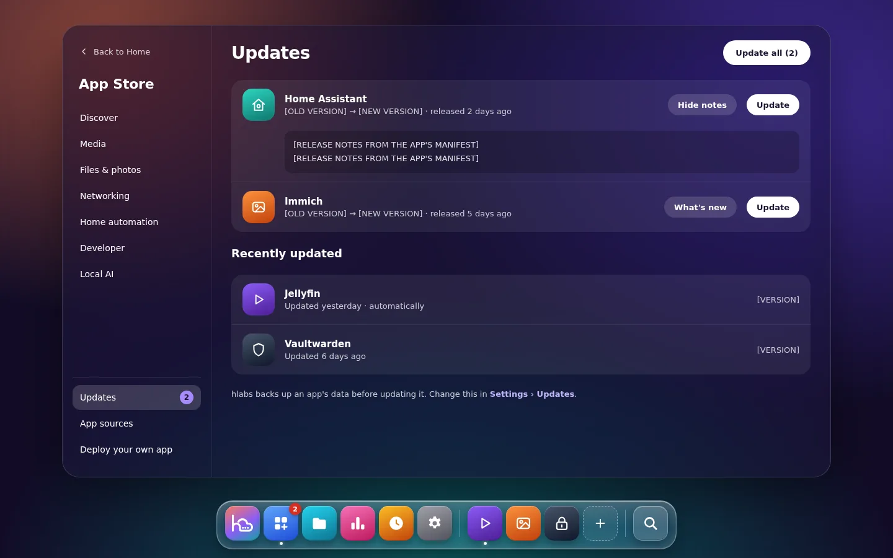

Links to: `AppStore`, `BackupsOverview`, `DeployCustom`, `FilesBrowser`, `LiveUsage`, `Main`, `SettingsAccount`, `SettingsUpdates`, `Spotlight`, `StoreSources`, `UpdateRolledBack`

Shows: hlabs — App Store · Updates · [App Store] · Back to Home · App Store · [Categories] · [Manage apps] · Updates · 2 · App sources · Deploy your own app · Updates · Update all (2) · Home Assistant · [OLD VERSION] → [NEW VERSION] · released 2 days ago · Hide notes · Update · [RELEASE NOTES FROM THE APP'S MANIFEST] · [RELEASE NOTES FROM THE APP'S MANIFEST] · Immich · [OLD VERSION] → [NEW VERSION] · released 5 days ago · What's new · Update · Recently updated · Jellyfin · Updated yesterday · automatically · [VERSION] · Vaultwarden · Updated 6 days ago · [VERSION] · hlabs backs up an app's data before updating it. Change this in · Settings › Updates · . · [Dock] · Home · App Store, 2 updates · Files · Usage · Backups · Settings · Jellyfin, open · Immich · Vaultwarden · Add to Dock · Search

### UpdateRolledBack — Update rolled back

**Priority:** P1 · **Phase:** 2 · **Stories:** US-STORE-17

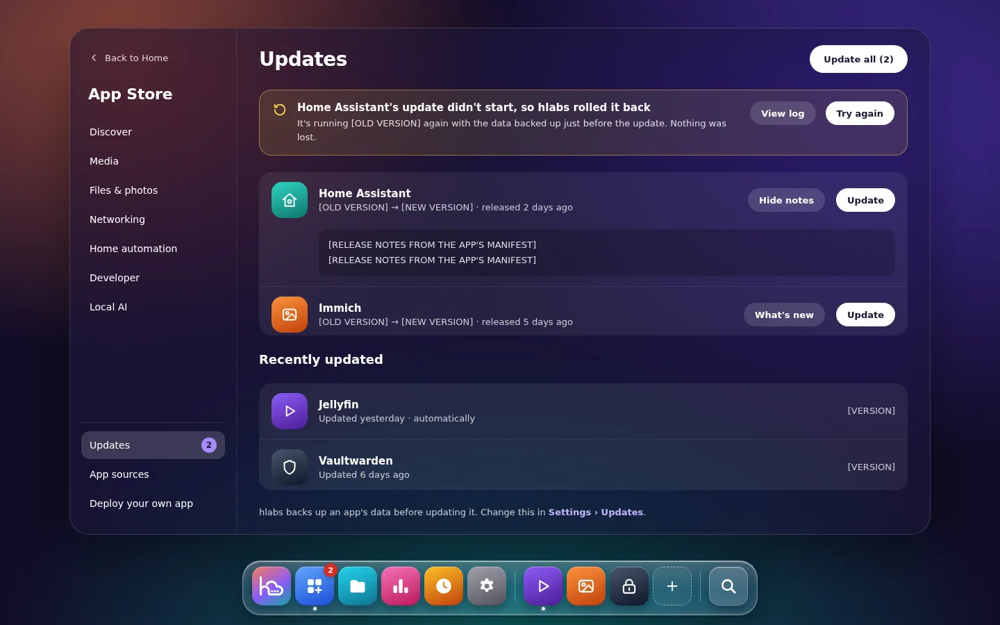

Links to: `AppLogs`, `AppStore`, `BackupsOverview`, `DeployCustom`, `FilesBrowser`, `LiveUsage`, `Main`, `SettingsAccount`, `SettingsUpdates`, `Spotlight`, `StoreSources`, `StoreUpdates`

Shows: hlabs — App Store · update rolled back · [App Store] · Back to Home · App Store · [Categories] · [Manage apps] · Updates · 2 · App sources · Deploy your own app · Updates · Update all (2) · Home Assistant's update didn't start, so hlabs rolled it back · It's running [OLD VERSION] again with the data backed up just before the update. Nothing was lost. · View log · Try again · Home Assistant · [OLD VERSION] → [NEW VERSION] · released 2 days ago · Hide notes · Update · [RELEASE NOTES FROM THE APP'S MANIFEST] · [RELEASE NOTES FROM THE APP'S MANIFEST] · Immich · [OLD VERSION] → [NEW VERSION] · released 5 days ago · What's new · Update · Recently updated · Jellyfin · Updated yesterday · automatically · [VERSION] · Vaultwarden · Updated 6 days ago · [VERSION] · hlabs backs up an app's data before updating it. Change this in · Settings › Updates · . · [Dock] · Home · App Store, 2 updates · Files · Usage · Backups · Settings · Jellyfin, open · Immich · Vaultwarden · Add to Dock · Search

### StoreSources — App sources

**Priority:** P2 · **Phase:** 7 · **Stories:** US-STORE-18, US-STORE-19

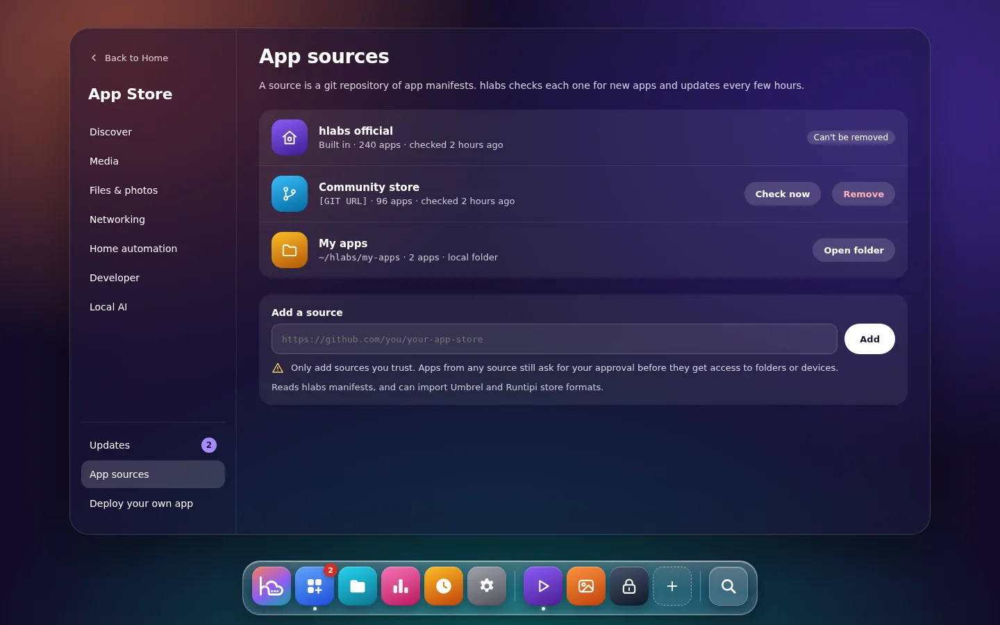

Links to: `AppStore`, `BackupsOverview`, `DeployCustom`, `FilesBrowser`, `LiveUsage`, `Main`, `SettingsAccount`, `Spotlight`, `StoreUpdates`

Shows: hlabs — App Store · App sources · [App Store] · Back to Home · App Store · [Categories] · [Manage apps] · Updates · 2 · App sources · Deploy your own app · App sources · A source is a git repository of app manifests. hlabs checks each one for new apps and updates every few hours. · hlabs official · Built in · 240 apps · checked 2 hours ago · Can't be removed · Community store · [GIT URL] · · 96 apps · checked 2 hours ago · Check now · Remove · My apps · ~/hlabs/my-apps · · 2 apps · local folder · Open folder · Add a source · [https://github.com/you/your-app-store] · Add · Only add sources you trust. Apps from any source still ask for your approval before they get access to folders or devices. · Reads hlabs manifests, and can import Umbrel and Runtipi store formats. · [Dock] · Home · App Store, 2 updates · Files · Usage · Backups · Settings · Jellyfin, open · Immich · Vaultwarden · Add to Dock · Search

### DeployCustom — Deploy your own app

**Priority:** P3 · **Phase:** 8 · **Stories:** US-STORE-20, US-STORE-21

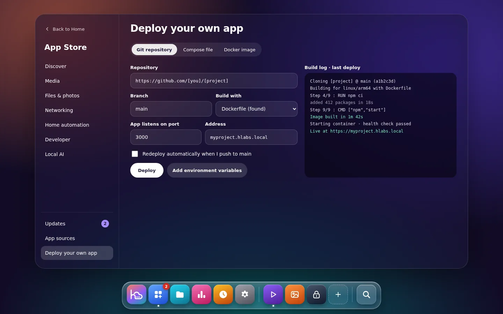

Links to: `AppStore`, `BackupsOverview`, `FilesBrowser`, `LiveUsage`, `Main`, `SettingsAccount`, `Spotlight`, `StoreSources`, `StoreUpdates`

Shows: hlabs — App Store · deploy your own app · [App Store] · Back to Home · App Store · [Categories] · [Manage apps] · Updates · 2 · App sources · Deploy your own app · Deploy your own app · [Source] · Git repository · Compose file · Docker image · Repository · Branch · Build with · Dockerfile (found) · Auto-detect · App listens on port · Address · Redeploy automatically when I push to main · Deploy · Add environment variables · Build log · last deploy · Cloning [project] @ main (a1b2c3d) · Building for linux/arm64 with Dockerfile · Step 4/9 : RUN npm ci · added 412 packages in 18s · Step 9/9 : CMD ["npm","start"] · Image built in 1m 42s · Starting container · health check passed · Live at https://myproject.hlabs.local · [Dock] · Home · App Store, 2 updates · Files · Usage · Backups · Settings · Jellyfin, open · Immich · Vaultwarden · Add to Dock · Search

### StoreLoading — Loading

**Priority:** Nice to have · **Phase:** 9 · **Stories:** US-STORE-22

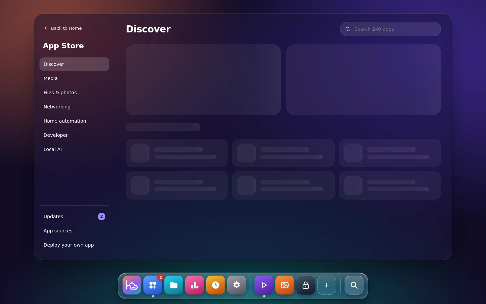

Links to: `AppStore`, `BackupsOverview`, `DeployCustom`, `FilesBrowser`, `LiveUsage`, `Main`, `SettingsAccount`, `Spotlight`, `StoreSources`, `StoreUpdates`

Shows: hlabs — App Store · loading · [App Store] · Back to Home · App Store · [Categories] · [Manage apps] · Updates · 2 · App sources · Deploy your own app · Search apps · [Search 240 apps] · [Loading apps] · [Dock] · Home · App Store, 2 updates · Files · Usage · Backups · Settings · Jellyfin, open · Immich · Vaultwarden · Add to Dock · Search

## Using & managing apps

### AppWindow — App window

**Priority:** P1 · **Phase:** 2 · **Stories:** US-APP-01, US-APP-02, US-APP-03

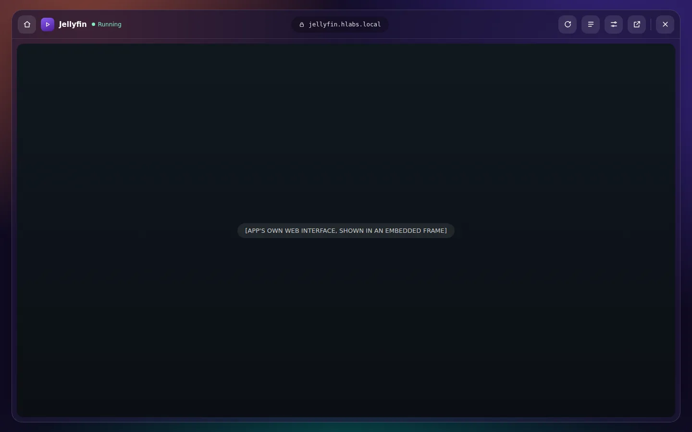

Links to: `AppLogs`, `AppSettings`, `Main`

Shows: hlabs — Jellyfin (app window) · [Jellyfin] · [Back to Home] · Jellyfin · Running · jellyfin.hlabs.local · [Restart app] · [Logs] · [App settings] · [Open in a new tab] · [Close app] · [APP'S OWN WEB INTERFACE, SHOWN IN AN EMBEDDED FRAME]

### AppSettings — App settings · overview

**Priority:** P1 · **Phase:** 2 · **Stories:** US-APP-04, US-APP-05, US-APP-06, US-APP-07, US-APP-19

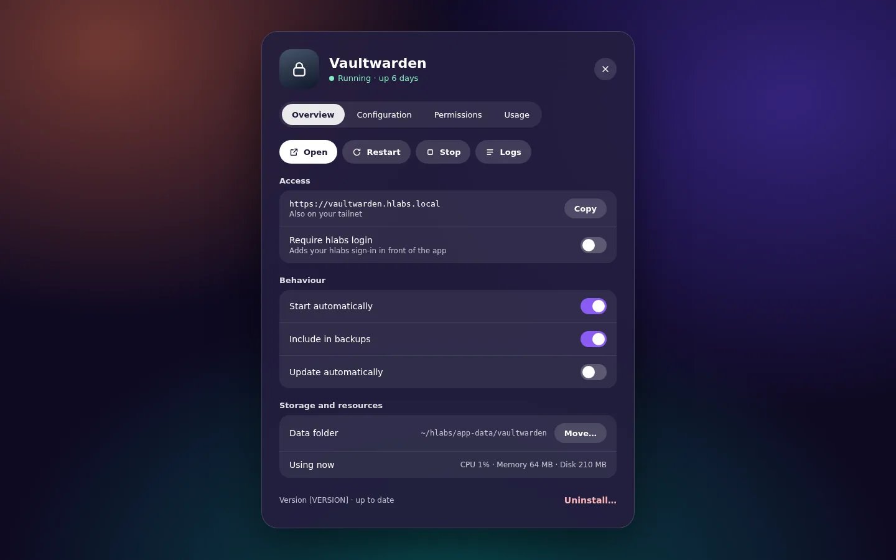

Links to: `AppConfig`, `AppLogs`, `AppMoveData`, `AppPermissions`, `AppUsageDetail`, `AppWindow`, `HomeStates`, `UninstallConfirm`

Shows: App settings · Vaultwarden · Running · up 6 days · [Close] · [App sections] · Overview · Configuration · Permissions · Usage · Open · Restart · Stop · Logs · Access · https://vaultwarden.hlabs.local · Also on your tailnet · Copy · Require hlabs login · Adds your hlabs sign-in in front of the app · Behaviour · Start automatically · Include in backups · Update automatically · Storage and resources · Data folder · ~/hlabs/app-data/vaultwarden · Move… · Using now · CPU 1% · Memory 64 MB · Disk 210 MB · Version [VERSION] · up to date · Uninstall…

### AppConfig — App settings · configuration

**Priority:** P2 · **Phase:** 7 · **Stories:** US-APP-13, US-APP-14, US-APP-15, US-APP-16

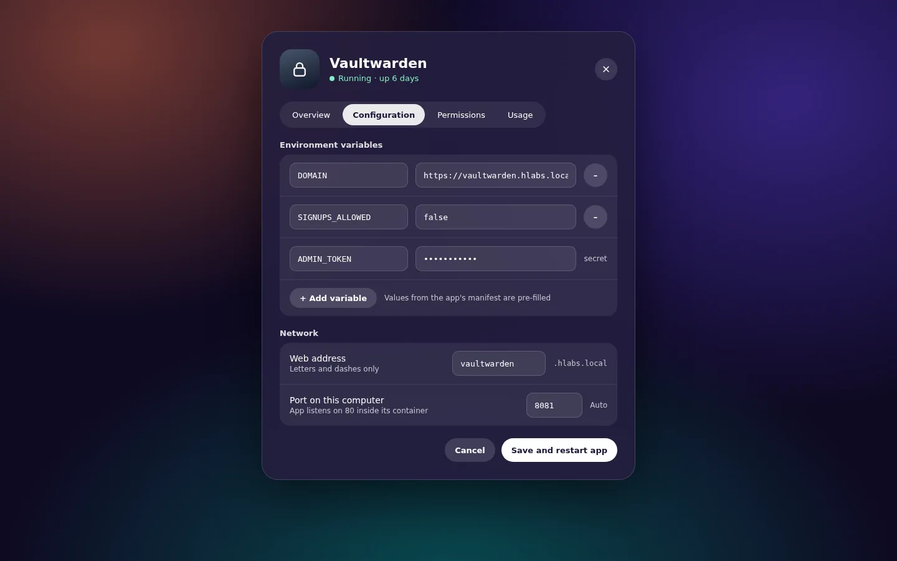

Links to: `AppPermissions`, `AppSettings`, `AppUsageDetail`, `HomeStates`

Shows: App settings — Configuration · Vaultwarden · Running · up 6 days · [Close] · [App sections] · Overview · Configuration · Permissions · Usage · Environment variables · [Name] · [Value] · [Remove variable] · – · [Name] · [Value] · [Remove variable] · – · [Name] · [Value] · secret · + Add variable · Values from the app's manifest are pre-filled · Network · Web address · Letters and dashes only · [Subdomain] · .hlabs.local · Port on this computer · App listens on 80 inside its container · [Host port] · Auto · Cancel · Save and restart app

### AppPermissions — App settings · permissions

**Priority:** P2 · **Phase:** 7 · **Stories:** US-APP-17, US-APP-18, US-APP-19

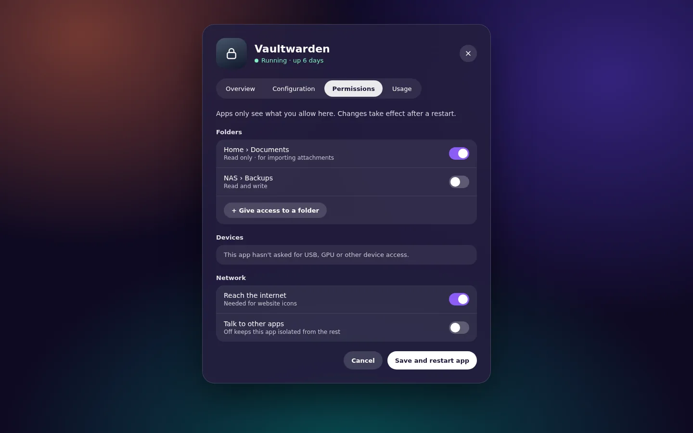

Links to: `AppConfig`, `AppSettings`, `AppUsageDetail`, `HomeStates`

Shows: App settings — Permissions · Vaultwarden · Running · up 6 days · [Close] · [App sections] · Overview · Configuration · Permissions · Usage · Apps only see what you allow here. Changes take effect after a restart. · Folders · Home › Documents · Read only · for importing attachments · NAS › Backups · Read and write · + Give access to a folder · Devices · This app hasn't asked for USB, GPU or other device access. · Network · Reach the internet · Needed for website icons · Talk to other apps · Off keeps this app isolated from the rest · Cancel · Save and restart app

### AppUsageDetail — App settings · usage

**Priority:** P2 · **Phase:** 7 · **Stories:** US-APP-20, US-APP-21

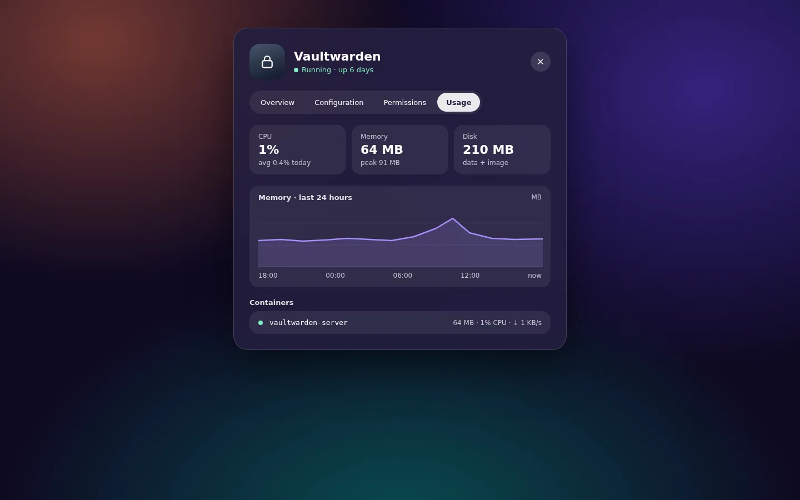

Links to: `AppConfig`, `AppPermissions`, `AppSettings`, `HomeStates`

Shows: App settings — Usage · Vaultwarden · Running · up 6 days · [Close] · [App sections] · Overview · Configuration · Permissions · Usage · CPU · 1% · avg 0.4% today · Memory · 64 MB · peak 91 MB · Disk · 210 MB · data + image · Memory · last 24 hours · MB · 18:00 · 00:00 · 06:00 · 12:00 · now · Containers · vaultwarden-server · 64 MB · 1% CPU · ↓ 1 KB/s

### AppLogs — App logs

**Priority:** P1 · **Phase:** 2 · **Stories:** US-INST-11, US-APP-08, US-APP-09, US-APP-10

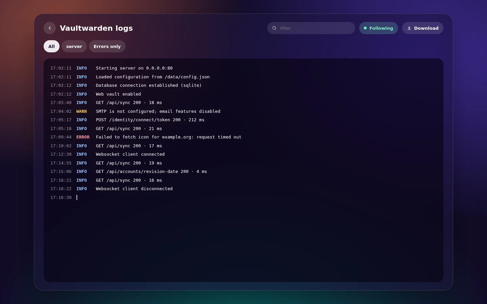

Links to: `AppSettings`

Shows: App logs · [Logs] · [Back to app settings] · Vaultwarden logs · Filter logs · [Filter] · Following · Download · [Container] · All · server · Errors only · 17:02:11 · INFO · Starting server on 0.0.0.0:80 · 17:02:11 · INFO · Loaded configuration from /data/config.json · 17:02:12 · INFO · Database connection established (sqlite) · 17:02:12 · INFO · Web vault enabled · 17:03:40 · INFO · GET /api/sync 200 · 18 ms · 17:04:02 · WARN · SMTP is not configured; email features disabled · 17:05:17 · INFO · POST /identity/connect/token 200 · 212 ms · 17:05:18 · INFO · GET /api/sync 200 · 21 ms · 17:09:44 · ERROR · Failed to fetch icon for example.org: request timed out · 17:10:02 · INFO · GET /api/sync 200 · 17 ms · 17:12:30 · INFO · Websocket client connected · 17:14:55 · INFO · GET /api/sync 200 · 19 ms · 17:15:06 · INFO · GET /api/accounts/revision-date 200 · 4 ms · 17:16:21 · INFO · GET /api/sync 200 · 16 ms · 17:16:22 · INFO · Websocket client disconnected · 17:16:30 · ▍

### AppMoveData — Move app data

**Priority:** P3 · **Phase:** 8 · **Stories:** US-APP-22, US-APP-23

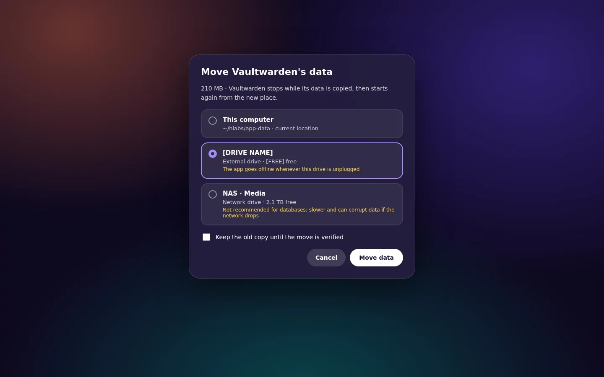

Links to: `AppSettings`

Shows: App settings — Move data · Move Vaultwarden's data · 210 MB · Vaultwarden stops while its data is copied, then starts again from the new place. · [Destination] · This computer · ~/hlabs/app-data · current location · [DRIVE NAME] · External drive · [FREE] free · The app goes offline whenever this drive is unplugged · NAS · Media · Network drive · 2.1 TB free · Not recommended for databases: slower and can corrupt data if the network drops · Keep the old copy until the move is verified · Cancel · Move data

### UninstallConfirm — Uninstall app

**Priority:** P1 · **Phase:** 2 · **Stories:** US-APP-11, US-APP-12

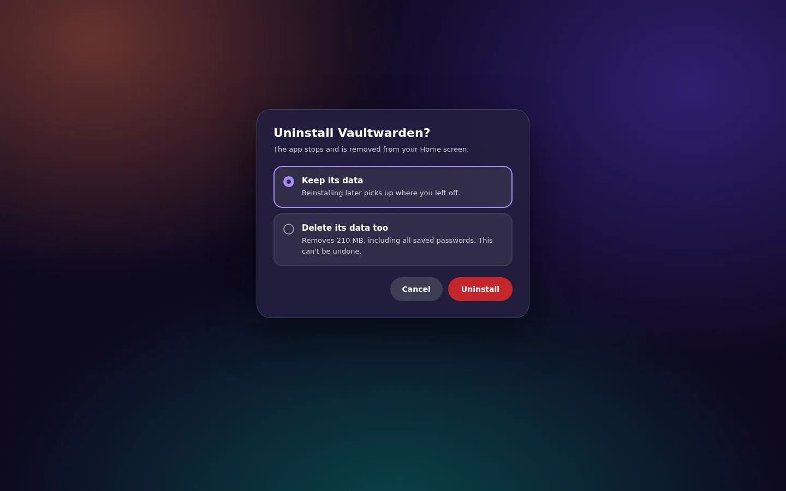

Links to: `AppSettings`, `HomeStates`

Shows: Uninstall app · Uninstall Vaultwarden? · The app stops and is removed from your Home screen. · [What happens to its data] · Keep its data · Reinstalling later picks up where you left off. · Delete its data too · Removes 210 MB, including all saved passwords. This can't be undone. · Cancel

## Files

### FilesBrowser — Files

**Priority:** P2 · **Phase:** 5 · **Stories:** US-FILE-01, US-FILE-02, US-FILE-03, US-FILE-04, US-FILE-05, US-FILE-12, US-FILE-16

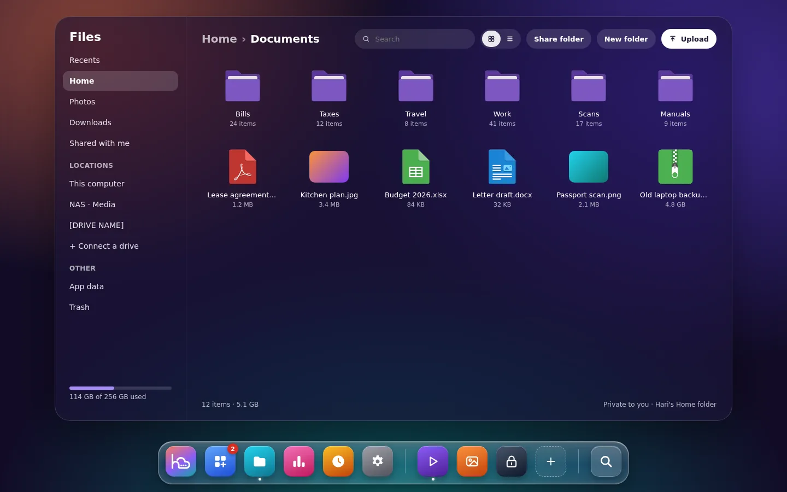

Links to: `AppStore`, `BackupsOverview`, `FilePreview`, `FilesExternal`, `FilesList`, `FilesShare`, `FilesTrash`, `FilesUpload`, `LiveUsage`, `Main`, `NetworkDrives`, `SettingsAccount`, `Spotlight`

Shows: hlabs — Files · [Files] · [Locations] · Files · Recents · Home · Photos · Downloads · Shared with me · Locations · This computer · NAS · Media · [DRIVE NAME] · + Connect a drive · Other · App data · Trash · 114 GB of 256 GB used · [Breadcrumb] · Home · › · Documents · Search files · [Search] · [View] · [Grid view] · [List view] · Share folder · New folder · Upload · Bills · 24 items · Taxes · 12 items · Travel · 8 items · Work · 41 items · Scans · 17 items · Manuals · 9 items · Lease agreement.pdf · 1.2 MB · Kitchen plan.jpg · 3.4 MB · Budget 2026.xlsx · 84 KB · Letter draft.docx · 32 KB · Passport scan.png · 2.1 MB · Old laptop backup.zip · 4.8 GB · 12 items · 5.1 GB · Private to you · Hari's Home folder · [Dock] · Home · App Store, 2 updates · Files · Usage · Backups · Settings · Jellyfin, open · Immich · Vaultwarden · Add to Dock · Search

### FilesList — List view & selection

**Priority:** Nice to have · **Phase:** 9 · **Stories:** US-FILE-19, US-FILE-20

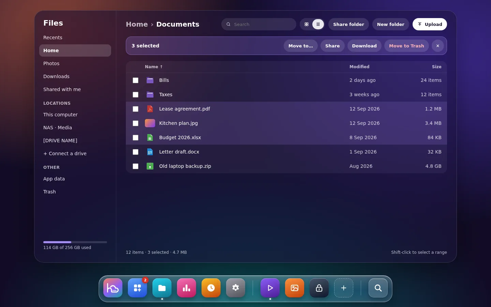

Links to: `AppStore`, `BackupsOverview`, `FilesBrowser`, `FilesExternal`, `FilesMove`, `FilesShare`, `FilesTrash`, `FilesUpload`, `LiveUsage`, `Main`, `NetworkDrives`, `SettingsAccount`, `Spotlight`

Shows: hlabs — Files · list view & selection · [Files] · [Locations] · Files · Recents · Home · Photos · Downloads · Shared with me · Locations · This computer · NAS · Media · [DRIVE NAME] · + Connect a drive · Other · App data · Trash · 114 GB of 256 GB used · [Breadcrumb] · Home · › · Documents · Search files · [Search] · [View] · [Grid view] · [List view] · Share folder · New folder · Upload · [3 items selected] · 3 selected · Move to… · Share · Download · Move to Trash · [Clear selection] · ✕ · [Documents] · Name ↑ · Modified · Size · [Select Bills] · Bills · 2 days ago · 24 items · [Select Taxes] · Taxes · 3 weeks ago · 12 items · [Select Lease agreement.pdf] · Lease agreement.pdf · 12 Sep 2026 · 1.2 MB · [Select Kitchen plan.jpg] · Kitchen plan.jpg · 12 Sep 2026 · 3.4 MB · [Select Budget 2026.xlsx] · Budget 2026.xlsx · 8 Sep 2026 · 84 KB · [Select Letter draft.docx] · Letter draft.docx · 1 Sep 2026 · 32 KB · [Select Old laptop backup.zip] · Old laptop backup.zip · Aug 2026 · 4.8 GB · 12 items · 3 selected · 4.7 MB · Shift-click to select a range · [Dock] · Home · App Store, 2 updates · Files · Usage · Backups · Settings · Jellyfin, open · Immich · Vaultwarden · Add to Dock · Search

### FilesContextMenu — Right-click menu

**Priority:** Nice to have · **Phase:** 9 · **Stories:** US-FILE-21

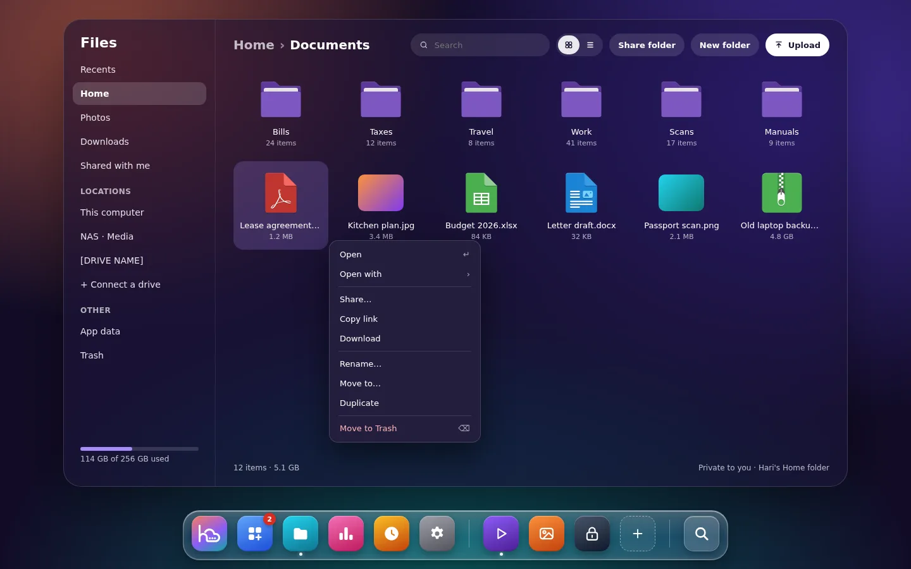

Links to: `AppStore`, `BackupsOverview`, `FilePreview`, `FilesBrowser`, `FilesExternal`, `FilesList`, `FilesMove`, `FilesRename`, `FilesShare`, `FilesTrash`, `FilesUpload`, `LiveUsage`, `Main`, `NetworkDrives`, `SettingsAccount`, `Spotlight`

Shows: hlabs — Files · right-click menu · [Files] · [Locations] · Files · Recents · Home · Photos · Downloads · Shared with me · Locations · This computer · NAS · Media · [DRIVE NAME] · + Connect a drive · Other · App data · Trash · 114 GB of 256 GB used · [Breadcrumb] · Home · › · Documents · Search files · [Search] · [View] · [Grid view] · [List view] · Share folder · New folder · Upload · Bills · 24 items · Taxes · 12 items · Travel · 8 items · Work · 41 items · Scans · 17 items · Manuals · 9 items · Lease agreement.pdf · 1.2 MB · Kitchen plan.jpg · 3.4 MB · Budget 2026.xlsx · 84 KB · Letter draft.docx · 32 KB · Passport scan.png · 2.1 MB · Old laptop backup.zip · 4.8 GB · 12 items · 5.1 GB · Private to you · Hari's Home folder · [Lease agreement.pdf] · Open · ↵ · Open with · › · Share… · Copy link · Download · Rename… · Move to… · Duplicate · Move to Trash · ⌫ · [Dock] · Home · App Store, 2 updates · Files · Usage · Backups · Settings · Jellyfin, open · Immich · Vaultwarden · Add to Dock · Search

### FilePreview — Preview

**Priority:** P2 · **Phase:** 5 · **Stories:** US-FILE-06, US-FILE-07

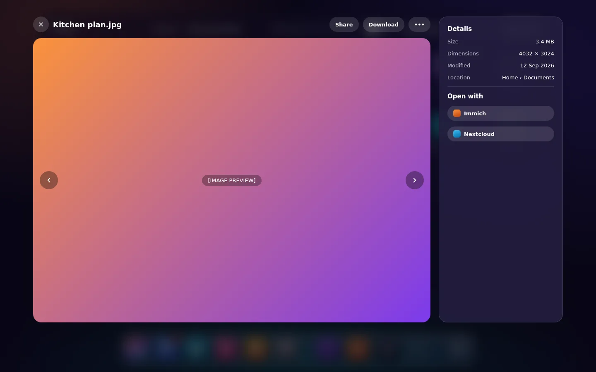

Links to: `AppStore`, `BackupsOverview`, `FilesBrowser`, `FilesExternal`, `FilesShare`, `FilesTrash`, `FilesUpload`, `LiveUsage`, `Main`, `NetworkDrives`, `SettingsAccount`, `Spotlight`

Shows: hlabs — Files · preview · [Files] · [Locations] · Files · Recents · Home · Photos · Downloads · Shared with me · Locations · This computer · NAS · Media · [DRIVE NAME] · + Connect a drive · Other · App data · Trash · 114 GB of 256 GB used · [Breadcrumb] · Home · › · Documents · Search files · [Search] · [View] · [Grid view] · [List view] · Share folder · New folder · Upload · Bills · 24 items · Taxes · 12 items · Travel · 8 items · Work · 41 items · Scans · 17 items · Manuals · 9 items · Lease agreement.pdf · 1.2 MB · Kitchen plan.jpg · 3.4 MB · Budget 2026.xlsx · 84 KB · Letter draft.docx · 32 KB · Passport scan.png · 2.1 MB · Old laptop backup.zip · 4.8 GB · 12 items · 5.1 GB · Private to you · Hari's Home folder · [Close preview] · Kitchen plan.jpg · Share · Download · [More] · ••• · [IMAGE PREVIEW] · [Previous file] · [Next file] · Details · Size · 3.4 MB · Dimensions · 4032 × 3024 · Modified · 12 Sep 2026 · Location · Home › Documents · Open with · Immich · Nextcloud · [Dock] · Home · App Store, 2 updates · Files · Usage · Backups · Settings · Jellyfin, open · Immich · Vaultwarden · Add to Dock · Search

### FilesUpload — Uploading

**Priority:** P2 · **Phase:** 5 · **Stories:** US-FILE-08, US-FILE-09, US-FILE-10

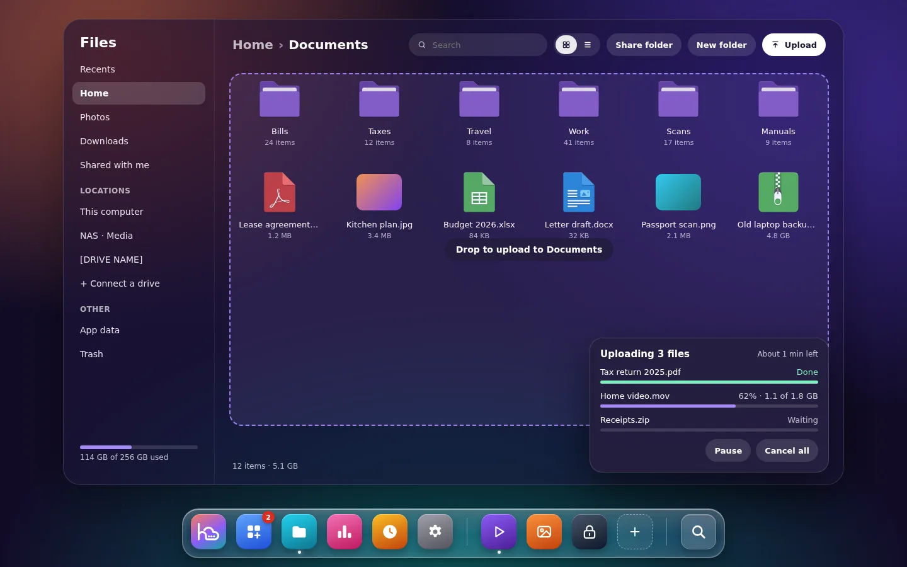

Links to: `AppStore`, `BackupsOverview`, `FilePreview`, `FilesBrowser`, `FilesExternal`, `FilesShare`, `FilesTrash`, `LiveUsage`, `Main`, `NetworkDrives`, `SettingsAccount`, `Spotlight`

Shows: hlabs — Files · uploading · [Files] · [Locations] · Files · Recents · Home · Photos · Downloads · Shared with me · Locations · This computer · NAS · Media · [DRIVE NAME] · + Connect a drive · Other · App data · Trash · 114 GB of 256 GB used · [Breadcrumb] · Home · › · Documents · Search files · [Search] · [View] · [Grid view] · [List view] · Share folder · New folder · Upload · Bills · 24 items · Taxes · 12 items · Travel · 8 items · Work · 41 items · Scans · 17 items · Manuals · 9 items · Lease agreement.pdf · 1.2 MB · Kitchen plan.jpg · 3.4 MB · Budget 2026.xlsx · 84 KB · Letter draft.docx · 32 KB · Passport scan.png · 2.1 MB · Old laptop backup.zip · 4.8 GB · 12 items · 5.1 GB · Private to you · Hari's Home folder · [Uploads] · Uploading 3 files · About 1 min left · Tax return 2025.pdf · Done · Home video.mov · 62% · 1.1 of 1.8 GB · Receipts.zip · Waiting · Pause · Cancel all · Drop to upload to Documents · [Dock] · Home · App Store, 2 updates · Files · Usage · Backups · Settings · Jellyfin, open · Immich · Vaultwarden · Add to Dock · Search

### FilesMove — Move to

**Priority:** Nice to have · **Phase:** 9 · **Stories:** US-FILE-22

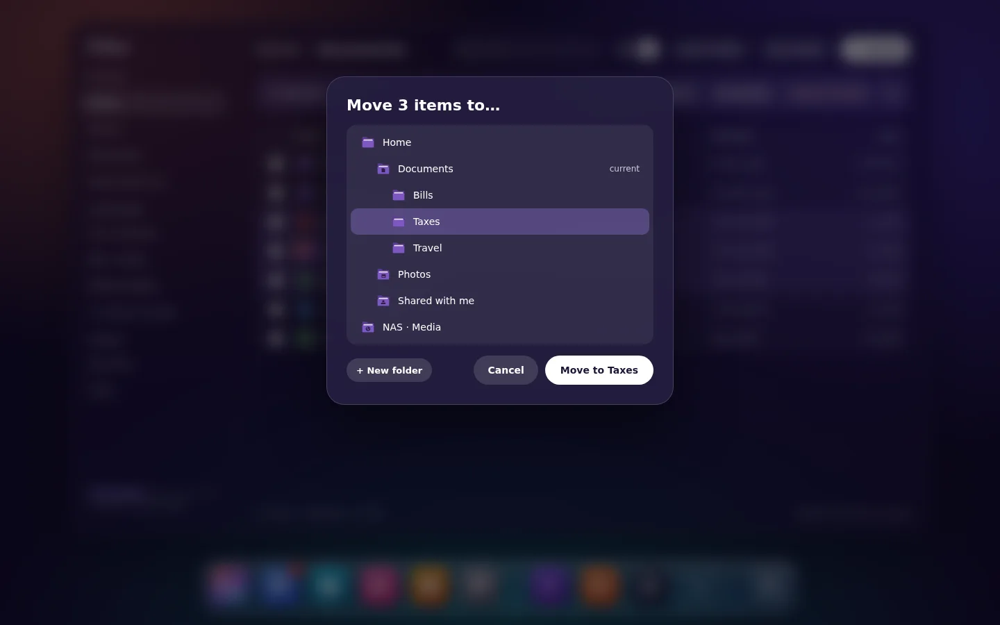

Links to: `AppStore`, `BackupsOverview`, `FilesBrowser`, `FilesExternal`, `FilesList`, `FilesShare`, `FilesTrash`, `FilesUpload`, `LiveUsage`, `Main`, `NetworkDrives`, `SettingsAccount`, `Spotlight`

Shows: hlabs — Files · move to · [Files] · [Locations] · Files · Recents · Home · Photos · Downloads · Shared with me · Locations · This computer · NAS · Media · [DRIVE NAME] · + Connect a drive · Other · App data · Trash · 114 GB of 256 GB used · [Breadcrumb] · Home · › · Documents · Search files · [Search] · [View] · [Grid view] · [List view] · Share folder · New folder · Upload · [3 items selected] · 3 selected · Move to… · Share · Download · Move to Trash · [Clear selection] · ✕ · [Documents] · Name ↑ · Modified · Size · [Select Bills] · Bills · 2 days ago · 24 items · [Select Taxes] · Taxes · 3 weeks ago · 12 items · [Select Lease agreement.pdf] · Lease agreement.pdf · 12 Sep 2026 · 1.2 MB · [Select Kitchen plan.jpg] · Kitchen plan.jpg · 12 Sep 2026 · 3.4 MB · [Select Budget 2026.xlsx] · Budget 2026.xlsx · 8 Sep 2026 · 84 KB · [Select Letter draft.docx] · Letter draft.docx · 1 Sep 2026 · 32 KB · [Select Old laptop backup.zip] · Old laptop backup.zip · Aug 2026 · 4.8 GB · 12 items · 3 selected · 4.7 MB · Shift-click to select a range · [Dock] · Home · App Store, 2 updates · Files · Usage · Backups · Settings · Jellyfin, open · Immich · Vaultwarden · Add to Dock · Search · Move 3 items to… · [Folders] · Home · Documents · current · Bills · Taxes · Travel · Photos · Shared with me · NAS · Media · + New folder · Cancel · Move to Taxes

### FilesRename — Rename

**Priority:** Nice to have · **Phase:** 9 · **Stories:** US-FILE-23

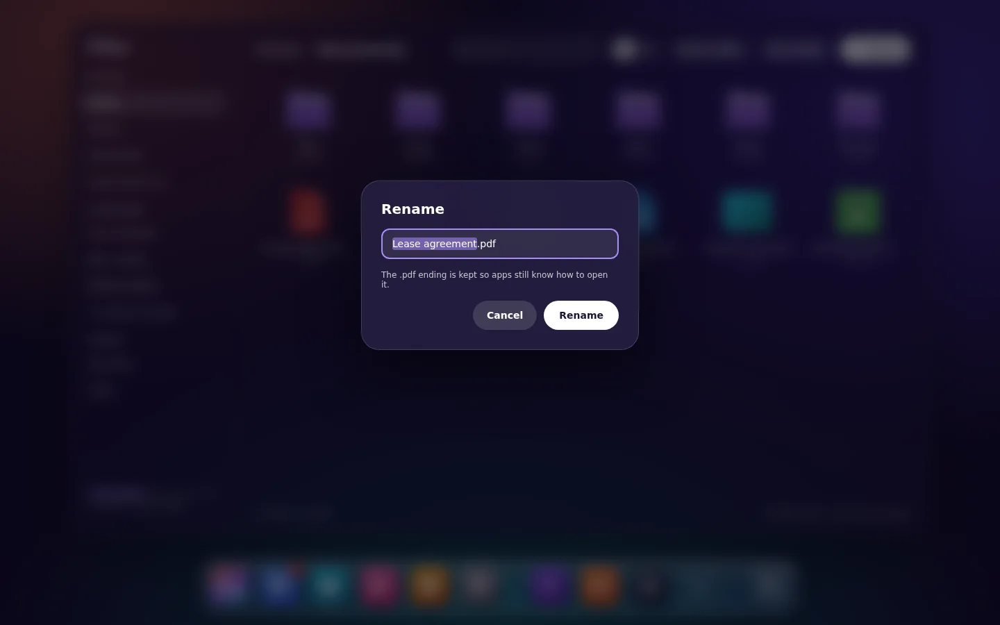

Links to: `AppStore`, `BackupsOverview`, `FilePreview`, `FilesBrowser`, `FilesContextMenu`, `FilesExternal`, `FilesList`, `FilesShare`, `FilesTrash`, `FilesUpload`, `LiveUsage`, `Main`, `NetworkDrives`, `SettingsAccount`, `Spotlight`

Shows: hlabs — Files · rename · [Files] · [Locations] · Files · Recents · Home · Photos · Downloads · Shared with me · Locations · This computer · NAS · Media · [DRIVE NAME] · + Connect a drive · Other · App data · Trash · 114 GB of 256 GB used · [Breadcrumb] · Home · › · Documents · Search files · [Search] · [View] · [Grid view] · [List view] · Share folder · New folder · Upload · Bills · 24 items · Taxes · 12 items · Travel · 8 items · Work · 41 items · Scans · 17 items · Manuals · 9 items · Lease agreement.pdf · 1.2 MB · Kitchen plan.jpg · 3.4 MB · Budget 2026.xlsx · 84 KB · Letter draft.docx · 32 KB · Passport scan.png · 2.1 MB · Old laptop backup.zip · 4.8 GB · 12 items · 5.1 GB · Private to you · Hari's Home folder · [Dock] · Home · App Store, 2 updates · Files · Usage · Backups · Settings · Jellyfin, open · Immich · Vaultwarden · Add to Dock · Search · Rename · New name · Lease agreement · .pdf · The .pdf ending is kept so apps still know how to open it. · Cancel · Rename

### FilesShare — Share on network

**Priority:** P3 · **Phase:** 8 · **Stories:** US-FILE-13

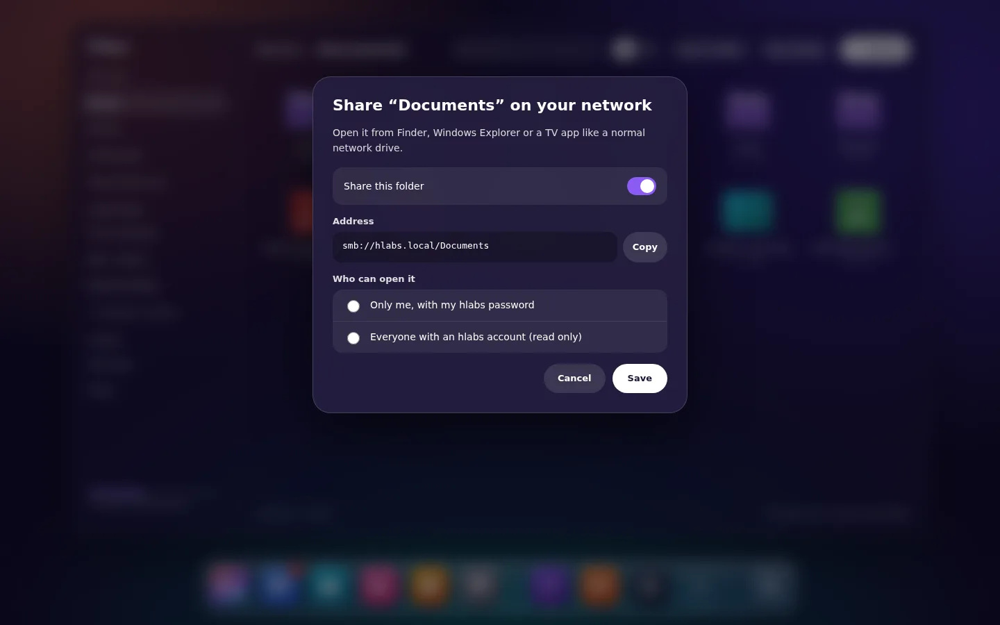

Links to: `AppStore`, `BackupsOverview`, `FilePreview`, `FilesBrowser`, `FilesExternal`, `FilesTrash`, `FilesUpload`, `LiveUsage`, `Main`, `NetworkDrives`, `SettingsAccount`, `Spotlight`

Shows: hlabs — Files · share folder · [Files] · [Locations] · Files · Recents · Home · Photos · Downloads · Shared with me · Locations · This computer · NAS · Media · [DRIVE NAME] · + Connect a drive · Other · App data · Trash · 114 GB of 256 GB used · [Breadcrumb] · Home · › · Documents · Search files · [Search] · [View] · [Grid view] · [List view] · Share folder · New folder · Upload · Bills · 24 items · Taxes · 12 items · Travel · 8 items · Work · 41 items · Scans · 17 items · Manuals · 9 items · Lease agreement.pdf · 1.2 MB · Kitchen plan.jpg · 3.4 MB · Budget 2026.xlsx · 84 KB · Letter draft.docx · 32 KB · Passport scan.png · 2.1 MB · Old laptop backup.zip · 4.8 GB · 12 items · 5.1 GB · Private to you · Hari's Home folder · Share “Documents” on your network · Open it from Finder, Windows Explorer or a TV app like a normal network drive. · Share this folder · Address · smb://hlabs.local/Documents · Copy · Who can open it · Only me, with my hlabs password · Everyone with an hlabs account (read only) · Cancel · Save · [Dock] · Home · App Store, 2 updates · Files · Usage · Backups · Settings · Jellyfin, open · Immich · Vaultwarden · Add to Dock · Search

### NetworkDrives — Connect a network drive

**Priority:** P2 · **Phase:** 5 · **Stories:** US-FILE-11, US-FILE-12

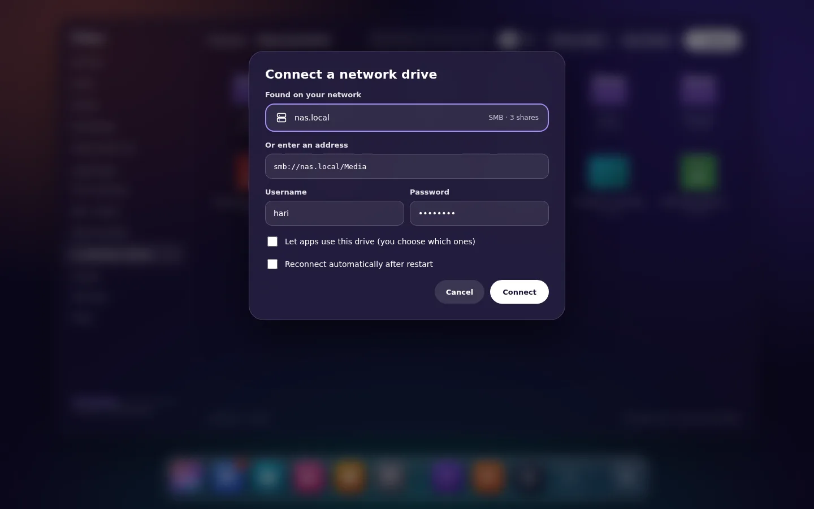

Links to: `AppStore`, `BackupsOverview`, `FilePreview`, `FilesBrowser`, `FilesExternal`, `FilesShare`, `FilesTrash`, `FilesUpload`, `LiveUsage`, `Main`, `SettingsAccount`, `Spotlight`

Shows: hlabs — Files · network drives · [Files] · [Locations] · Files · Recents · Home · Photos · Downloads · Shared with me · Locations · This computer · NAS · Media · [DRIVE NAME] · + Connect a drive · Other · App data · Trash · 114 GB of 256 GB used · [Breadcrumb] · Home · › · Documents · Search files · [Search] · [View] · [Grid view] · [List view] · Share folder · New folder · Upload · Bills · 24 items · Taxes · 12 items · Travel · 8 items · Work · 41 items · Scans · 17 items · Manuals · 9 items · Lease agreement.pdf · 1.2 MB · Kitchen plan.jpg · 3.4 MB · Budget 2026.xlsx · 84 KB · Letter draft.docx · 32 KB · Passport scan.png · 2.1 MB · Old laptop backup.zip · 4.8 GB · 12 items · 5.1 GB · Private to you · Hari's Home folder · Connect a network drive · Found on your network · nas.local · SMB · 3 shares · Or enter an address · Username · Password · Let apps use this drive (you choose which ones) · Reconnect automatically after restart · Cancel · Connect · [Dock] · Home · App Store, 2 updates · Files · Usage · Backups · Settings · Jellyfin, open · Immich · Vaultwarden · Add to Dock · Search

### FilesExternal — External drive

**Priority:** P3 · **Phase:** 8 · **Stories:** US-FILE-14, US-FILE-15

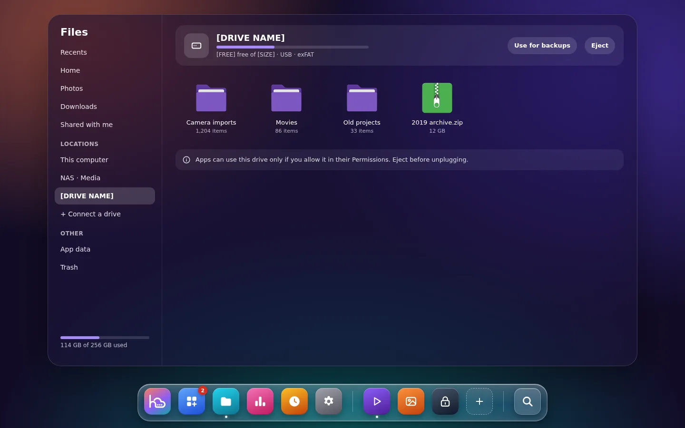

Links to: `AppStore`, `BackupsOverview`, `FilesBrowser`, `FilesTrash`, `LiveUsage`, `Main`, `NetworkDrives`, `SettingsAccount`, `Spotlight`

Shows: hlabs — Files · external drive · [Files] · [Locations] · Files · Recents · Home · Photos · Downloads · Shared with me · Locations · This computer · NAS · Media · [DRIVE NAME] · + Connect a drive · Other · App data · Trash · 114 GB of 256 GB used · [DRIVE NAME] · [FREE] free of [SIZE] · USB · exFAT · Use for backups · Eject · Camera imports · 1,204 items · Movies · 86 items · Old projects · 33 items · 2019 archive.zip · 12 GB · Apps can use this drive only if you allow it in their Permissions. Eject before unplugging. · [Dock] · Home · App Store, 2 updates · Files · Usage · Backups · Settings · Jellyfin, open · Immich · Vaultwarden · Add to Dock · Search

### FilesTrash — Trash

**Priority:** P3 · **Phase:** 8 · **Stories:** US-FILE-16, US-FILE-17, US-FILE-18

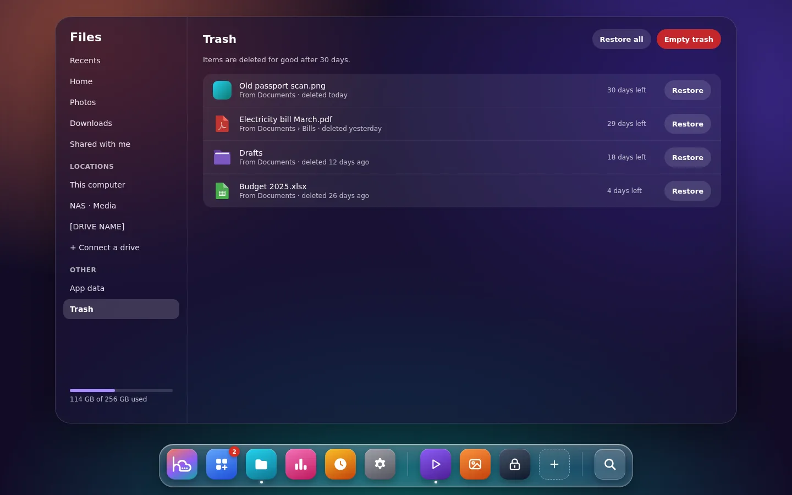

Links to: `AppStore`, `BackupsOverview`, `FilesBrowser`, `FilesExternal`, `LiveUsage`, `Main`, `NetworkDrives`, `SettingsAccount`, `Spotlight`

Shows: hlabs — Files · Trash · [Files] · [Locations] · Files · Recents · Home · Photos · Downloads · Shared with me · Locations · This computer · NAS · Media · [DRIVE NAME] · + Connect a drive · Other · App data · Trash · 114 GB of 256 GB used · Trash · Restore all · Empty trash · Items are deleted for good after 30 days. · Old passport scan.png · From Documents · deleted today · 30 days left · Restore · Electricity bill March.pdf · From Documents › Bills · deleted yesterday · 29 days left · Restore · Drafts · From Documents · deleted 12 days ago · 18 days left · Restore · Budget 2025.xlsx · From Documents · deleted 26 days ago · 4 days left · Restore · [Dock] · Home · App Store, 2 updates · Files · Usage · Backups · Settings · Jellyfin, open · Immich · Vaultwarden · Add to Dock · Search

### FilesLoading — Loading

**Priority:** Nice to have · **Phase:** 9 · **Stories:** US-FILE-24

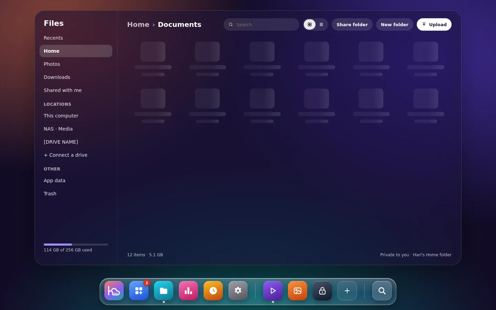

Links to: `AppStore`, `BackupsOverview`, `FilesBrowser`, `FilesExternal`, `FilesList`, `FilesShare`, `FilesTrash`, `FilesUpload`, `LiveUsage`, `Main`, `NetworkDrives`, `SettingsAccount`, `Spotlight`

Shows: hlabs — Files · loading · [Files] · [Locations] · Files · Recents · Home · Photos · Downloads · Shared with me · Locations · This computer · NAS · Media · [DRIVE NAME] · + Connect a drive · Other · App data · Trash · 114 GB of 256 GB used · [Breadcrumb] · Home · › · Documents · Search files · [Search] · [View] · [Grid view] · [List view] · Share folder · New folder · Upload · [Loading files] · 12 items · 5.1 GB · Private to you · Hari's Home folder · [Dock] · Home · App Store, 2 updates · Files · Usage · Backups · Settings · Jellyfin, open · Immich · Vaultwarden · Add to Dock · Search

## Live usage & backups

### LiveUsage — Live usage

**Priority:** P1 · **Phase:** 4 · **Stories:** US-USE-01, US-USE-02, US-USE-03, US-USE-04, US-USE-05, US-USE-06, US-USE-07, US-USE-08, US-USE-09

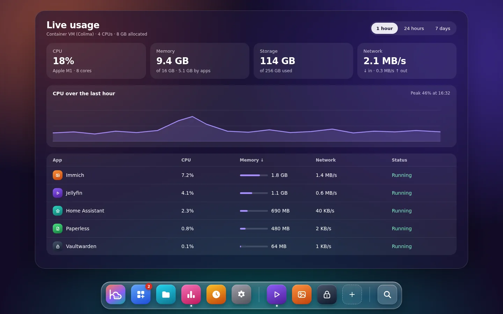

Links to: `AppStore`, `BackupsOverview`, `FilesBrowser`, `Main`, `SettingsAccount`, `Spotlight`

Shows: Live usage · [Live usage] · Live usage · Container VM (Colima) · 4 CPUs · 8 GB allocated · [Time range] · 1 hour · 24 hours · 7 days · CPU · 18% · Apple M1 · 8 cores · Memory · 9.4 GB · of 16 GB · 5.1 GB by apps · Storage · 114 GB · of 256 GB used · Network · 2.1 MB/s · ↓ in · 0.3 MB/s ↑ out · CPU over the last hour · Peak 46% at 16:32 · App · CPU · Memory ↓ · Network · Status · Immich · 7.2% · 1.8 GB · 1.4 MB/s · Running · Jellyfin · 4.1% · 1.1 GB · 0.6 MB/s · Running · Home Assistant · 2.3% · 690 MB · 40 KB/s · Running · Paperless · 0.8% · 480 MB · 2 KB/s · Running · Vaultwarden · 0.1% · 64 MB · 1 KB/s · Running · [Dock] · Home · App Store, 2 updates · Files · Usage · Backups · Settings · Jellyfin, open · Immich · Vaultwarden · Add to Dock · Search

### UsageLoading — Live usage · loading

**Priority:** Nice to have · **Phase:** 9 · **Stories:** US-USE-10, US-USE-11

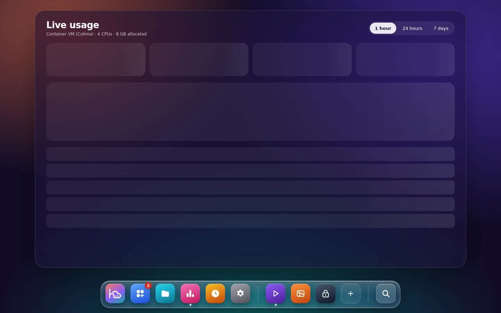

Links to: `AppStore`, `BackupsOverview`, `FilesBrowser`, `LiveUsage`, `Main`, `SettingsAccount`, `Spotlight`

Shows: hlabs — Live usage · loading · [Live usage] · Live usage · Container VM (Colima) · 4 CPUs · 8 GB allocated · [Time range] · 1 hour · 24 hours · 7 days · [Loading usage] · [Dock] · Home · App Store, 2 updates · Files · Usage · Backups · Settings · Jellyfin, open · Immich · Vaultwarden · Add to Dock · Search

### BackupsOverview — Backups

**Priority:** P2 · **Phase:** 5 · **Stories:** US-BKP-01, US-BKP-02, US-BKP-03, US-BKP-04, US-BKP-05, US-BKP-06, US-BKP-07, US-BKP-11, US-BKP-23

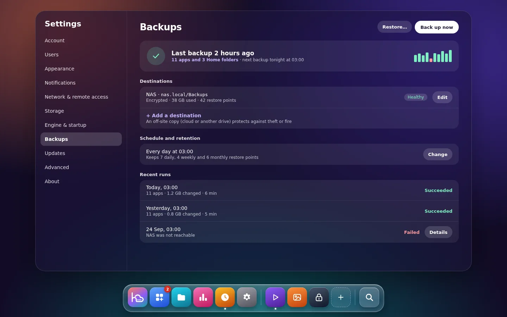

Links to: `AppStore`, `BackupAddDest`, `BackupIncluded`, `BackupRunDetail`, `BackupSchedule`, `FilesBrowser`, `LiveUsage`, `Main`, `RestoreChooseDest`, `SettingsAbout`, `SettingsAccount`, `SettingsAdvanced`, `SettingsAppearance`, `SettingsNetwork`, `SettingsNotifications`, `SettingsRuntime`, `SettingsStorage`, `SettingsUpdates`, `SettingsUsers`, `Spotlight`

Shows: Settings — Backups · [Settings] · [Settings sections] · Settings · Account · Users · Appearance · Notifications · Network & remote access · Storage · Engine & startup · Backups · Updates · Advanced · About · Backups · Restore… · Back up now · Last backup 2 hours ago · 11 apps and 3 Home folders · · next backup tonight at 03:00 · Destinations · NAS · · nas.local/Backups · Encrypted · 38 GB used · 42 restore points · Healthy · Edit · + Add a destination · An off-site copy (cloud or another drive) protects against theft or fire · Schedule and retention · Every day at 03:00 · Keeps 7 daily, 4 weekly and 6 monthly restore points · Change · Recent runs · Today, 03:00 · 11 apps · 1.2 GB changed · 6 min · Succeeded · Yesterday, 03:00 · 11 apps · 0.8 GB changed · 5 min · Succeeded · 24 Sep, 03:00 · NAS was not reachable · Failed · Details · [Dock] · Home · App Store, 2 updates · Files · Usage · Backups · Settings · Jellyfin, open · Immich · Vaultwarden · Add to Dock · Search

### BackupSchedule — Backup schedule

**Priority:** Nice to have · **Phase:** 9 · **Stories:** US-BKP-12, US-BKP-13, US-BKP-14

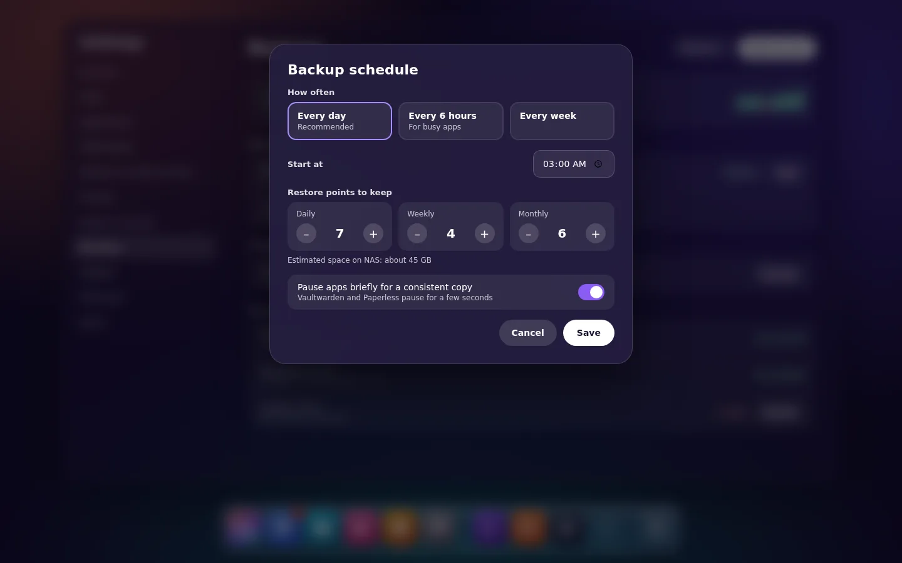

Links to: `AppStore`, `BackupAddDest`, `BackupRunDetail`, `BackupsOverview`, `FilesBrowser`, `LiveUsage`, `Main`, `RestoreFlow`, `SettingsAbout`, `SettingsAccount`, `SettingsAdvanced`, `SettingsAppearance`, `SettingsNetwork`, `SettingsNotifications`, `SettingsRuntime`, `SettingsStorage`, `SettingsUpdates`, `SettingsUsers`, `Spotlight`

Shows: Settings — Backups · schedule · [Settings] · [Settings sections] · Settings · Account · Users · Appearance · Notifications · Network & remote access · Storage · Engine & startup · Backups · Updates · Advanced · About · Backups · Restore… · Back up now · Last backup 2 hours ago · 11 apps and 3 Home folders · next backup tonight at 03:00 · Destinations · NAS · · nas.local/Backups · Encrypted · 38 GB used · 42 restore points · Healthy · Edit · + Add a destination · An off-site copy (cloud or another drive) protects against theft or fire · Schedule and retention · Every day at 03:00 · Keeps 7 daily, 4 weekly and 6 monthly restore points · Change · Recent runs · Today, 03:00 · 11 apps · 1.2 GB changed · 6 min · Succeeded · Yesterday, 03:00 · 11 apps · 0.8 GB changed · 5 min · Succeeded · 24 Sep, 03:00 · NAS was not reachable · Failed · Details · [Dock] · Home · App Store, 2 updates · Files · Usage · Backups · Settings · Jellyfin, open · Immich · Vaultwarden · Add to Dock · Search · Backup schedule · How often · [How often] · Every day · Recommended · Every 6 hours · For busy apps · Every week · Start at · Restore points to keep · Daily · [Fewer] · – · 7 · [More] · + · Weekly · [Fewer] · – · 4 · [More] · + · Monthly · [Fewer] · – · 6 · [More] · + · Estimated space on NAS: about 45 GB · Pause apps briefly for a consistent copy · Vaultwarden and Paperless pause for a few seconds · Cancel · Save

### BackupAddDest — Add destination

**Priority:** P2 · **Phase:** 5 · **Stories:** US-BKP-08, US-BKP-09, US-BKP-10

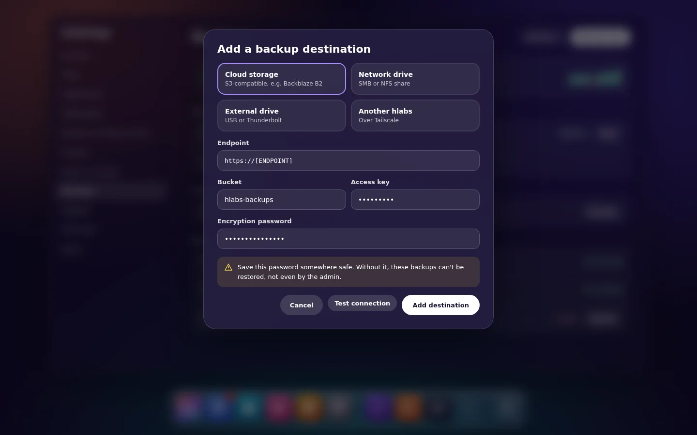

Links to: `AppStore`, `BackupsOverview`, `FilesBrowser`, `LiveUsage`, `Main`, `RestoreFlow`, `SettingsAbout`, `SettingsAccount`, `SettingsAdvanced`, `SettingsAppearance`, `SettingsNetwork`, `SettingsNotifications`, `SettingsRuntime`, `SettingsStorage`, `SettingsUpdates`, `SettingsUsers`, `Spotlight`

Shows: Settings — Backups · add destination · [Settings] · [Settings sections] · Settings · Account · Users · Appearance · Notifications · Network & remote access · Storage · Engine & startup · Backups · Updates · Advanced · About · Backups · Restore… · Back up now · Last backup 2 hours ago · 11 apps and 3 Home folders · next backup tonight at 03:00 · Destinations · NAS · · nas.local/Backups · Encrypted · 38 GB used · 42 restore points · Healthy · Edit · + Add a destination · An off-site copy (cloud or another drive) protects against theft or fire · Schedule and retention · Every day at 03:00 · Keeps 7 daily, 4 weekly and 6 monthly restore points · Change · Recent runs · Today, 03:00 · 11 apps · 1.2 GB changed · 6 min · Succeeded · Yesterday, 03:00 · 11 apps · 0.8 GB changed · 5 min · Succeeded · 24 Sep, 03:00 · NAS was not reachable · Failed · Details · [Dock] · Home · App Store, 2 updates · Files · Usage · Backups · Settings · Jellyfin, open · Immich · Vaultwarden · Add to Dock · Search · Add a backup destination · [Destination type] · Cloud storage · S3-compatible, e.g. Backblaze B2 · Network drive · SMB or NFS share · External drive · USB or Thunderbolt · Another hlabs · Over Tailscale · Endpoint · Bucket · Access key · Encryption password · Save this password somewhere safe. Without it, these backups can't be restored, not even by the admin. · Cancel · Test connection · Add destination

### BackupRunDetail — Failed backup details

**Priority:** P3 · **Phase:** 8 · **Stories:** US-BKP-15, US-BKP-16

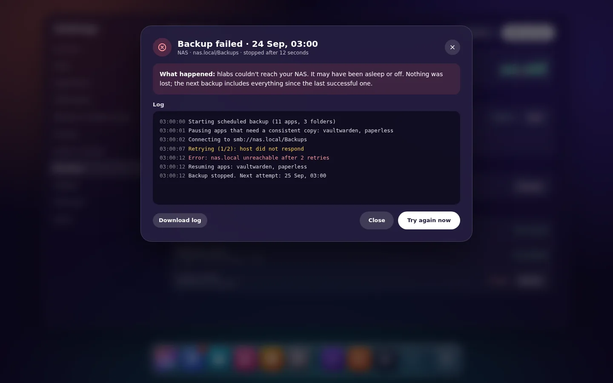

Links to: `AppStore`, `BackupAddDest`, `BackupsOverview`, `FilesBrowser`, `LiveUsage`, `Main`, `RestoreFlow`, `SettingsAbout`, `SettingsAccount`, `SettingsAdvanced`, `SettingsAppearance`, `SettingsNetwork`, `SettingsNotifications`, `SettingsRuntime`, `SettingsStorage`, `SettingsUpdates`, `SettingsUsers`, `Spotlight`

Shows: Settings — Backups · run details · [Settings] · [Settings sections] · Settings · Account · Users · Appearance · Notifications · Network & remote access · Storage · Engine & startup · Backups · Updates · Advanced · About · Backups · Restore… · Back up now · Last backup 2 hours ago · 11 apps and 3 Home folders · next backup tonight at 03:00 · Destinations · NAS · · nas.local/Backups · Encrypted · 38 GB used · 42 restore points · Healthy · Edit · + Add a destination · An off-site copy (cloud or another drive) protects against theft or fire · Schedule and retention · Every day at 03:00 · Keeps 7 daily, 4 weekly and 6 monthly restore points · Change · Recent runs · Today, 03:00 · 11 apps · 1.2 GB changed · 6 min · Succeeded · Yesterday, 03:00 · 11 apps · 0.8 GB changed · 5 min · Succeeded · 24 Sep, 03:00 · NAS was not reachable · Failed · Details · [Dock] · Home · App Store, 2 updates · Files · Usage · Backups · Settings · Jellyfin, open · Immich · Vaultwarden · Add to Dock · Search · Backup failed · 24 Sep, 03:00 · NAS · nas.local/Backups · stopped after 12 seconds · [Close] · What happened: · hlabs couldn't reach your NAS. It may have been asleep or off. Nothing was lost; the next backup includes everything since the last successful one. · Log · 03:00:00 · Starting scheduled backup (11 apps, 3 folders) · 03:00:01 · Pausing apps that need a consistent copy: vaultwarden, paperless · 03:00:02 · Connecting to …

### RestoreFlow — Restore · choose

**Priority:** P2 · **Phase:** 5 · **Stories:** US-BKP-17, US-BKP-18, US-BKP-19

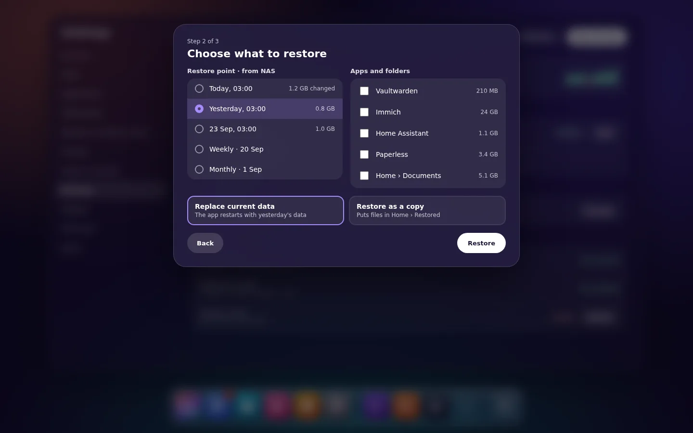

Links to: `AppStore`, `BackupAddDest`, `BackupsOverview`, `FilesBrowser`, `LiveUsage`, `Main`, `RestoreChooseDest`, `RestoreProgress`, `SettingsAbout`, `SettingsAccount`, `SettingsAdvanced`, `SettingsAppearance`, `SettingsNetwork`, `SettingsNotifications`, `SettingsRuntime`, `SettingsStorage`, `SettingsUpdates`, `SettingsUsers`, `Spotlight`

Shows: Settings — Backups · restore · [Settings] · [Settings sections] · Settings · Account · Users · Appearance · Notifications · Network & remote access · Storage · Engine & startup · Backups · Updates · Advanced · About · Backups · Restore… · Back up now · Last backup 2 hours ago · 11 apps and 3 Home folders · next backup tonight at 03:00 · Destinations · NAS · · nas.local/Backups · Encrypted · 38 GB used · 42 restore points · Healthy · Edit · + Add a destination · An off-site copy (cloud or another drive) protects against theft or fire · Schedule and retention · Every day at 03:00 · Keeps 7 daily, 4 weekly and 6 monthly restore points · Change · Recent runs · Today, 03:00 · 11 apps · 1.2 GB changed · 6 min · Succeeded · Yesterday, 03:00 · 11 apps · 0.8 GB changed · 5 min · Succeeded · 24 Sep, 03:00 · NAS was not reachable · Failed · Details · [Dock] · Home · App Store, 2 updates · Files · Usage · Backups · Settings · Jellyfin, open · Immich · Vaultwarden · Add to Dock · Search · Step 2 of 3 · Choose what to restore · Restore point · from NAS · [Restore point] · Today, 03:00 · 1.2 GB changed · Yesterday, 03:00 · 0.8 GB · 23 Sep, 03:00 · 1.0 GB · Weekly · 20 Sep · Monthly · 1 Sep · Apps and folders · Vaultwarden · 210 MB · Immich · 24 GB · Home Assistant · 1.1 GB · Paperless · 3.4 GB · Home › Documents · 5.1 GB · [How to restore] · Replace current data · The app restarts with yesterday's data · Restore as a copy · Puts …

### RestoreProgress — Restore · in progress

**Priority:** P1 · **Phase:** 5 · **Stories:** US-BKP-20, US-BKP-21, US-BKP-22

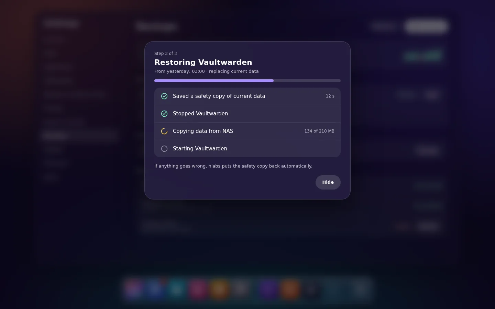

Links to: `AppStore`, `BackupAddDest`, `BackupsOverview`, `FilesBrowser`, `LiveUsage`, `Main`, `RestoreFlow`, `SettingsAbout`, `SettingsAccount`, `SettingsAdvanced`, `SettingsAppearance`, `SettingsNetwork`, `SettingsNotifications`, `SettingsRuntime`, `SettingsStorage`, `SettingsUpdates`, `SettingsUsers`, `Spotlight`

Shows: Settings — Backups · restoring · [Settings] · [Settings sections] · Settings · Account · Users · Appearance · Notifications · Network & remote access · Storage · Engine & startup · Backups · Updates · Advanced · About · Backups · Restore… · Back up now · Last backup 2 hours ago · 11 apps and 3 Home folders · next backup tonight at 03:00 · Destinations · NAS · · nas.local/Backups · Encrypted · 38 GB used · 42 restore points · Healthy · Edit · + Add a destination · An off-site copy (cloud or another drive) protects against theft or fire · Schedule and retention · Every day at 03:00 · Keeps 7 daily, 4 weekly and 6 monthly restore points · Change · Recent runs · Today, 03:00 · 11 apps · 1.2 GB changed · 6 min · Succeeded · Yesterday, 03:00 · 11 apps · 0.8 GB changed · 5 min · Succeeded · 24 Sep, 03:00 · NAS was not reachable · Failed · Details · [Dock] · Home · App Store, 2 updates · Files · Usage · Backups · Settings · Jellyfin, open · Immich · Vaultwarden · Add to Dock · Search · Step 3 of 3 · Restoring Vaultwarden · From yesterday, 03:00 · replacing current data · Saved a safety copy of current data · 12 s · Stopped Vaultwarden · Copying data from NAS · 134 of 210 MB · Starting Vaultwarden · If anything goes wrong, hlabs puts the safety copy back automatically. · Hide

### RestoreChooseDest — Restore · choose destination

**Priority:** P2 · **Phase:** 5 · **Stories:** US-BKP-17

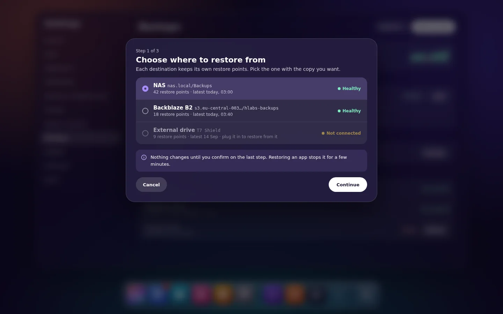

Links to: `AppStore`, `BackupAddDest`, `BackupsOverview`, `FilesBrowser`, `LiveUsage`, `Main`, `RestoreFlow`, `SettingsAbout`, `SettingsAccount`, `SettingsAdvanced`, `SettingsAppearance`, `SettingsNetwork`, `SettingsNotifications`, `SettingsRuntime`, `SettingsStorage`, `SettingsUpdates`, `SettingsUsers`, `Spotlight`

Shows: Settings — Backups · restore · choose destination · [Settings] · [Settings sections] · Settings · Account · Users · Appearance · Notifications · Network & remote access · Storage · Engine & startup · Backups · Updates · Advanced · About · Backups · Restore… · Back up now · Last backup 2 hours ago · 11 apps and 3 Home folders · next backup tonight at 03:00 · Destinations · NAS · · nas.local/Backups · Encrypted · 38 GB used · 42 restore points · Healthy · Edit · + Add a destination · An off-site copy (cloud or another drive) protects against theft or fire · Schedule and retention · Every day at 03:00 · Keeps 7 daily, 4 weekly and 6 monthly restore points · Change · Recent runs · Today, 03:00 · 11 apps · 1.2 GB changed · 6 min · Succeeded · Yesterday, 03:00 · 11 apps · 0.8 GB changed · 5 min · Succeeded · 24 Sep, 03:00 · NAS was not reachable · Failed · Details · [Dock] · Home · App Store, 2 updates · Files · Usage · Backups · Settings · Jellyfin, open · Immich · Vaultwarden · Add to Dock · Search · Step 1 of 3 · Choose where to restore from · Each destination keeps its own restore points. Pick the one with the copy you want. · [Destination] · NAS · nas.local/Backups · 42 restore points · latest today, 03:00 · Healthy · Backblaze B2 · s3.eu-central-003…/hlabs-backups · 18 restore points · latest today, 03:40 · Healthy · External drive · T7 Shield · 9 restore points · latest 14 Sep · plug it in to restore from it · Not …

### BackupIncluded — Backup · what's included

**Priority:** P2 · **Phase:** 5 · **Stories:** US-BKP-23

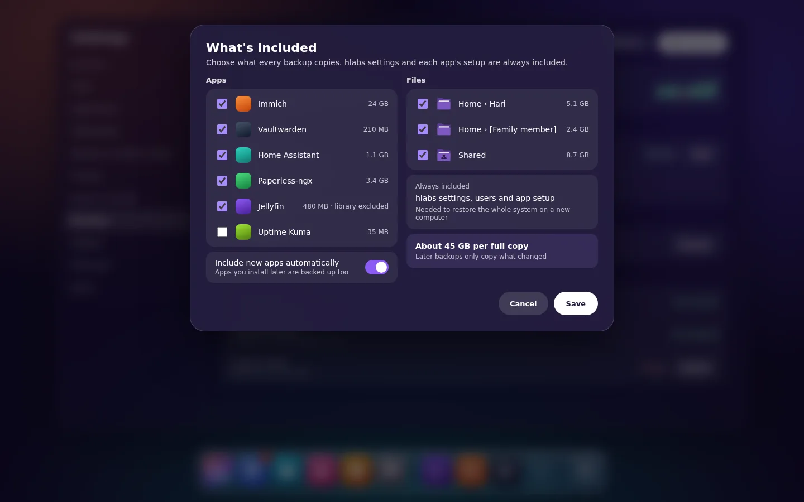

Links to: `AppStore`, `BackupAddDest`, `BackupsOverview`, `FilesBrowser`, `LiveUsage`, `Main`, `RestoreFlow`, `SettingsAbout`, `SettingsAccount`, `SettingsAdvanced`, `SettingsAppearance`, `SettingsNetwork`, `SettingsNotifications`, `SettingsRuntime`, `SettingsStorage`, `SettingsUpdates`, `SettingsUsers`, `Spotlight`

Shows: Settings — Backups · what's included · [Settings] · [Settings sections] · Settings · Account · Users · Appearance · Notifications · Network & remote access · Storage · Engine & startup · Backups · Updates · Advanced · About · Backups · Restore… · Back up now · Last backup 2 hours ago · 11 apps and 3 Home folders · next backup tonight at 03:00 · Destinations · NAS · · nas.local/Backups · Encrypted · 38 GB used · 42 restore points · Healthy · Edit · + Add a destination · An off-site copy (cloud or another drive) protects against theft or fire · Schedule and retention · Every day at 03:00 · Keeps 7 daily, 4 weekly and 6 monthly restore points · Change · Recent runs · Today, 03:00 · 11 apps · 1.2 GB changed · 6 min · Succeeded · Yesterday, 03:00 · 11 apps · 0.8 GB changed · 5 min · Succeeded · 24 Sep, 03:00 · NAS was not reachable · Failed · Details · [Dock] · Home · App Store, 2 updates · Files · Usage · Backups · Settings · Jellyfin, open · Immich · Vaultwarden · Add to Dock · Search · What's included · Choose what every backup copies. hlabs settings and each app's setup are always included. · Apps · Immich · 24 GB · Vaultwarden · 210 MB · Home Assistant · 1.1 GB · Paperless-ngx · 3.4 GB · Jellyfin · 480 MB · library excluded · Uptime Kuma · 35 MB · Include new apps automatically · Apps you install later are backed up too · Files · Home › Hari · 5.1 GB · Home › [Family member] · 2.4 GB · Shared · 8.7 GB · Always …

## Settings · account & people

### SettingsAccount — Account

**Priority:** P1 · **Phase:** 1 · **Stories:** US-ACCT-01, US-ACCT-02, US-ACCT-03, US-ACCT-04, US-ACCT-05, US-ACCT-06, US-ACCT-08, US-ACCT-12

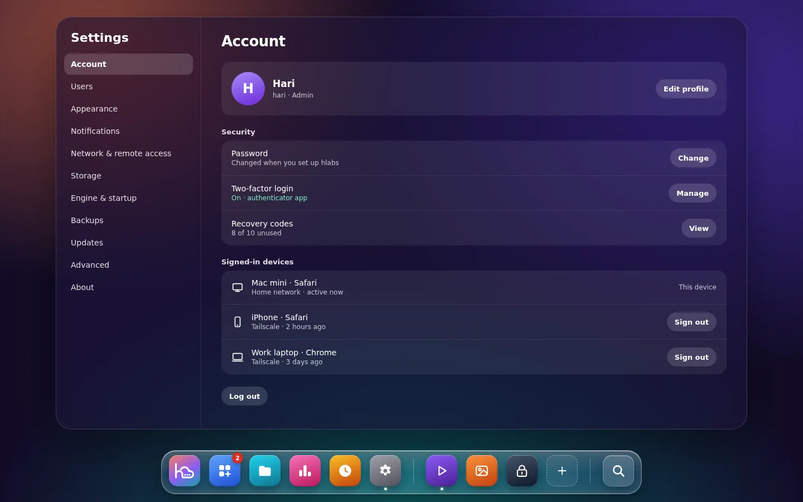

Links to: `AppStore`, `BackupsOverview`, `ChangePassword`, `FilesBrowser`, `LiveUsage`, `Login`, `Main`, `SettingsAbout`, `SettingsAdvanced`, `SettingsAppearance`, `SettingsNetwork`, `SettingsNotifications`, `SettingsRuntime`, `SettingsStorage`, `SettingsUpdates`, `SettingsUsers`, `Spotlight`, `TwoFactorManage`

Shows: Settings — Account · [Settings] · [Settings sections] · Settings · Account · Users · Appearance · Notifications · Network & remote access · Storage · Engine & startup · Backups · Updates · Advanced · About · Account · H · Hari · hari · Admin · Edit profile · Security · Password · Changed when you set up hlabs · Change · Two-factor login · On · authenticator app · Manage · Recovery codes · 8 of 10 unused · View · Signed-in devices · Mac mini · Safari · Home network · active now · This device · iPhone · Safari · Tailscale · 2 hours ago · Sign out · Work laptop · Chrome · Tailscale · 3 days ago · Sign out · Log out · [Dock] · Home · App Store, 2 updates · Files · Usage · Backups · Settings · Jellyfin, open · Immich · Vaultwarden · Add to Dock · Search

### ChangePassword — Change password

**Priority:** P1 · **Phase:** 1 · **Stories:** US-ACCT-06, US-ACCT-07

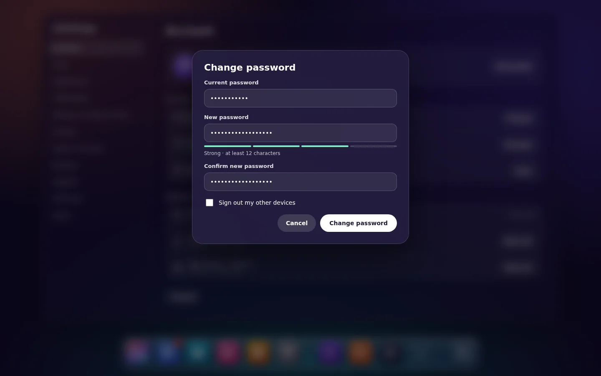

Links to: `AppStore`, `BackupsOverview`, `FilesBrowser`, `LiveUsage`, `Login`, `Main`, `SettingsAbout`, `SettingsAccount`, `SettingsAdvanced`, `SettingsAppearance`, `SettingsNetwork`, `SettingsNotifications`, `SettingsRuntime`, `SettingsStorage`, `SettingsUpdates`, `SettingsUsers`, `Spotlight`, `TwoFactorManage`

Shows: Settings — Account · change password · [Settings] · [Settings sections] · Settings · Account · Users · Appearance · Notifications · Network & remote access · Storage · Engine & startup · Backups · Updates · Advanced · About · Account · H · Hari · hari · Admin · Edit profile · Security · Password · Changed when you set up hlabs · Change · Two-factor login · On · authenticator app · Manage · Recovery codes · 8 of 10 unused · View · Signed-in devices · Mac mini · Safari · Home network · active now · This device · iPhone · Safari · Tailscale · 2 hours ago · Sign out · Work laptop · Chrome · Tailscale · 3 days ago · Sign out · Log out · [Dock] · Home · App Store, 2 updates · Files · Usage · Backups · Settings · Jellyfin, open · Immich · Vaultwarden · Add to Dock · Search · Change password · Current password · New password · Strong · at least 12 characters · Confirm new password · Sign out my other devices · Cancel · Change password

### TwoFactorManage — Two-factor & recovery codes

**Priority:** P1 · **Phase:** 1 · **Stories:** US-ACCT-08, US-ACCT-09, US-ACCT-10, US-ACCT-11, US-ACCT-12

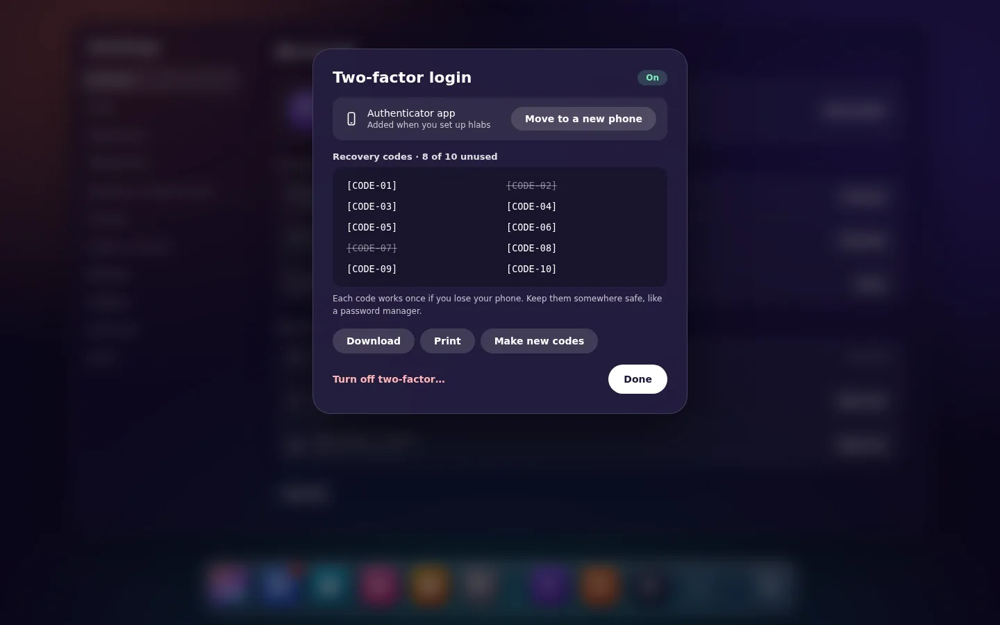

Links to: `AppStore`, `BackupsOverview`, `ChangePassword`, `FilesBrowser`, `LiveUsage`, `Login`, `Main`, `SettingsAbout`, `SettingsAccount`, `SettingsAdvanced`, `SettingsAppearance`, `SettingsNetwork`, `SettingsNotifications`, `SettingsRuntime`, `SettingsStorage`, `SettingsUpdates`, `SettingsUsers`, `Spotlight`

Shows: Settings — Account · two-factor · [Settings] · [Settings sections] · Settings · Account · Users · Appearance · Notifications · Network & remote access · Storage · Engine & startup · Backups · Updates · Advanced · About · Account · H · Hari · hari · Admin · Edit profile · Security · Password · Changed when you set up hlabs · Change · Two-factor login · On · authenticator app · Manage · Recovery codes · 8 of 10 unused · View · Signed-in devices · Mac mini · Safari · Home network · active now · This device · iPhone · Safari · Tailscale · 2 hours ago · Sign out · Work laptop · Chrome · Tailscale · 3 days ago · Sign out · Log out · [Dock] · Home · App Store, 2 updates · Files · Usage · Backups · Settings · Jellyfin, open · Immich · Vaultwarden · Add to Dock · Search · Two-factor login · On · Authenticator app · Added when you set up hlabs · Move to a new phone · Recovery codes · 8 of 10 unused · [CODE-01] · [CODE-02] · [CODE-03] · [CODE-04] · [CODE-05] · [CODE-06] · [CODE-07] · [CODE-08] · [CODE-09] · [CODE-10] · Each code works once if you lose your phone. Keep them somewhere safe, like a password manager. · Download · Print · Make new codes · Turn off two-factor… · Done

### SettingsUsers — Users

**Priority:** P2 · **Phase:** 3 · **Stories:** US-ACCT-13, US-ACCT-14, US-ACCT-15, US-ACCT-16, US-ACCT-17, US-ACCT-18, US-ACCT-19, US-ACCT-20

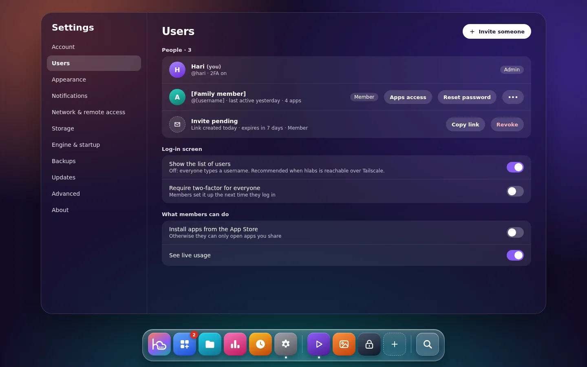

Links to: `AppStore`, `AppsAccess`, `BackupsOverview`, `FilesBrowser`, `InviteDialog`, `LiveUsage`, `Main`, `SettingsAbout`, `SettingsAccount`, `SettingsAdvanced`, `SettingsAppearance`, `SettingsNetwork`, `SettingsNotifications`, `SettingsRuntime`, `SettingsStorage`, `SettingsUpdates`, `Spotlight`

Shows: Settings — Users · [Settings] · [Settings sections] · Settings · Account · Users · Appearance · Notifications · Network & remote access · Storage · Engine & startup · Backups · Updates · Advanced · About · Users · Invite someone · People · 3 · H · Hari · (you) · @hari · 2FA on · Admin · A · [Family member] · @[username] · last active yesterday · 4 apps · Member · Apps access · Reset password · [More options] · ••• · Invite pending · Link created today · expires in 7 days · Member · Copy link · Revoke · Log-in screen · Show the list of users · Off: everyone types a username. Recommended when hlabs is reachable over Tailscale. · Require two-factor for everyone · Members set it up the next time they log in · What members can do · Install apps from the App Store · Otherwise they can only open apps you share · See live usage · [Dock] · Home · App Store, 2 updates · Files · Usage · Backups · Settings · Jellyfin, open · Immich · Vaultwarden · Add to Dock · Search

### InviteDialog — Invite someone

**Priority:** P1 · **Phase:** 3 · **Stories:** US-ACCT-21, US-ACCT-22, US-ACCT-23

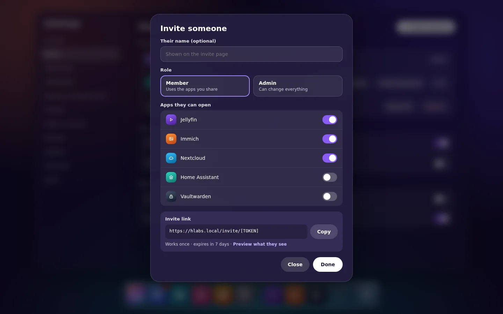

Links to: `AcceptInvite`, `AppStore`, `AppsAccess`, `BackupsOverview`, `FilesBrowser`, `LiveUsage`, `Main`, `SettingsAbout`, `SettingsAccount`, `SettingsAdvanced`, `SettingsAppearance`, `SettingsNetwork`, `SettingsNotifications`, `SettingsRuntime`, `SettingsStorage`, `SettingsUpdates`, `SettingsUsers`, `Spotlight`

Shows: Settings — Users · invite · [Settings] · [Settings sections] · Settings · Account · Users · Appearance · Notifications · Network & remote access · Storage · Engine & startup · Backups · Updates · Advanced · About · Users · Invite someone · People · 3 · H · Hari · (you) · @hari · 2FA on · Admin · A · [Family member] · @[username] · last active yesterday · 4 apps · Member · Apps access · Reset password · [More options] · ••• · Invite pending · Link created today · expires in 7 days · Member · Copy link · Revoke · Log-in screen · Show the list of users · Off: everyone types a username. Recommended when hlabs is reachable over Tailscale. · Require two-factor for everyone · Members set it up the next time they log in · What members can do · Install apps from the App Store · Otherwise they can only open apps you share · See live usage · [Dock] · Home · App Store, 2 updates · Files · Usage · Backups · Settings · Jellyfin, open · Immich · Vaultwarden · Add to Dock · Search · Invite someone · Their name (optional) · [Shown on the invite page] · Role · [Role] · Member · Uses the apps you share · Admin · Can change everything · Apps they can open · Jellyfin · Immich · Nextcloud · Home Assistant · Vaultwarden · Invite link · https://hlabs.local/invite/[TOKEN] · Copy · Works once · expires in 7 days · · Preview what they see · Close · Done

### AppsAccess — Apps access

**Priority:** P1 · **Phase:** 3 · **Stories:** US-ACCT-24, US-ACCT-25, US-ACCT-26

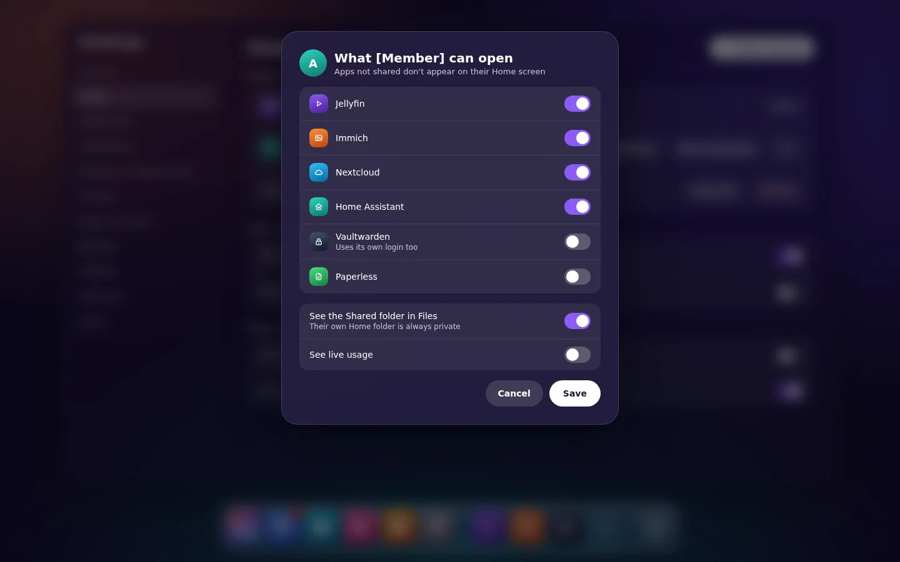

Links to: `AppStore`, `BackupsOverview`, `FilesBrowser`, `InviteDialog`, `LiveUsage`, `Main`, `SettingsAbout`, `SettingsAccount`, `SettingsAdvanced`, `SettingsAppearance`, `SettingsNetwork`, `SettingsNotifications`, `SettingsRuntime`, `SettingsStorage`, `SettingsUpdates`, `SettingsUsers`, `Spotlight`

Shows: Settings — Users · apps access · [Settings] · [Settings sections] · Settings · Account · Users · Appearance · Notifications · Network & remote access · Storage · Engine & startup · Backups · Updates · Advanced · About · Users · Invite someone · People · 3 · H · Hari · (you) · @hari · 2FA on · Admin · A · [Family member] · @[username] · last active yesterday · 4 apps · Member · Apps access · Reset password · [More options] · ••• · Invite pending · Link created today · expires in 7 days · Member · Copy link · Revoke · Log-in screen · Show the list of users · Off: everyone types a username. Recommended when hlabs is reachable over Tailscale. · Require two-factor for everyone · Members set it up the next time they log in · What members can do · Install apps from the App Store · Otherwise they can only open apps you share · See live usage · [Dock] · Home · App Store, 2 updates · Files · Usage · Backups · Settings · Jellyfin, open · Immich · Vaultwarden · Add to Dock · Search · A · What [Member] can open · Apps not shared don't appear on their Home screen · Jellyfin · Immich · Nextcloud · Home Assistant · Vaultwarden · Uses its own login too · Paperless · See the Shared folder in Files · Their own Home folder is always private · See live usage · Cancel · Save

### MemberSettings — Family member's Settings

**Priority:** P1 · **Phase:** 3 · **Stories:** US-ACCT-01, US-ACCT-02, US-ACCT-27, US-ACCT-28

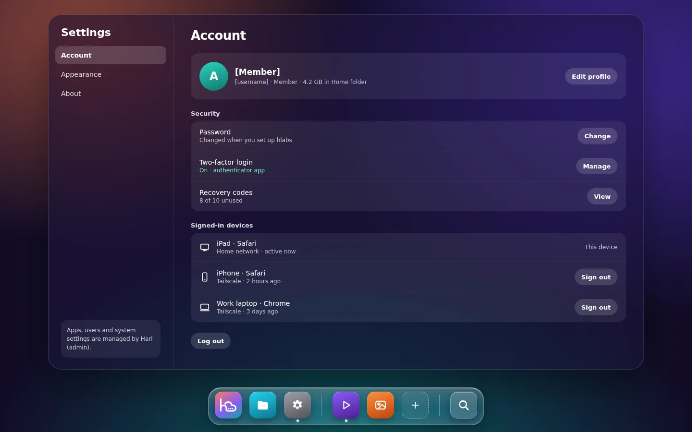

Links to: `FilesBrowser`, `Login`, `MemberHome`, `SettingsAbout`, `SettingsAppearance`, `Spotlight`

Shows: Settings — Account (family member) · [Settings] · [Settings sections] · Settings · Account · Appearance · About · Apps, users and system settings are managed by Hari (admin). · Account · A · [Member] · [username] · Member · 4.2 GB in Home folder · Edit profile · Security · Password · Changed when you set up hlabs · Change · Two-factor login · On · authenticator app · Manage · Recovery codes · 8 of 10 unused · View · Signed-in devices · iPad · Safari · Home network · active now · This device · iPhone · Safari · Tailscale · 2 hours ago · Sign out · Work laptop · Chrome · Tailscale · 3 days ago · Sign out · Log out · [Dock] · Home · Files · Settings · Jellyfin, open · Immich · Add to Dock · Search

### SettingsNotifications — Notifications

**Priority:** Nice to have · **Phase:** 9 · **Stories:** US-ACCT-29, US-ACCT-30, US-ACCT-31

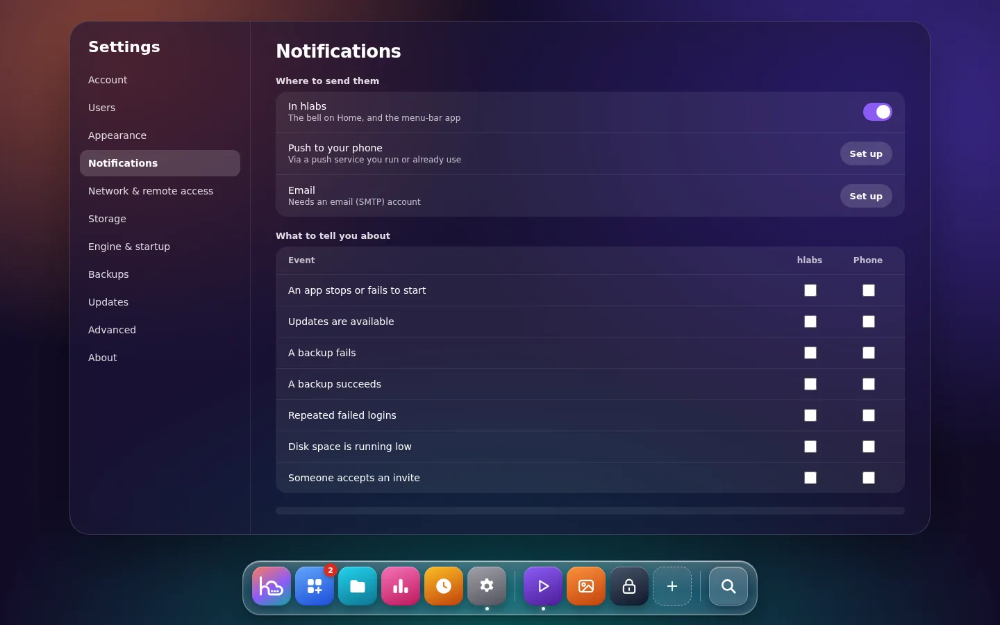

Links to: `AppStore`, `BackupsOverview`, `FilesBrowser`, `LiveUsage`, `Main`, `SettingsAbout`, `SettingsAccount`, `SettingsAdvanced`, `SettingsAppearance`, `SettingsNetwork`, `SettingsRuntime`, `SettingsStorage`, `SettingsUpdates`, `SettingsUsers`, `Spotlight`

Shows: Settings — Notifications · [Settings] · [Settings sections] · Settings · Account · Users · Appearance · Notifications · Network & remote access · Storage · Engine & startup · Backups · Updates · Advanced · About · Notifications · Where to send them · In hlabs · The bell on Home, and the menu-bar app · Push to your phone · Via a push service you run or already use · Set up · Email · Needs an email (SMTP) account · Set up · What to tell you about · [Notification events] · Event · hlabs · Phone · An app stops or fails to start · [An app stops or fails to start in hlabs] · [An app stops or fails to start on phone] · Updates are available · [Updates are available in hlabs] · [Updates are available on phone] · A backup fails · [A backup fails in hlabs] · [A backup fails on phone] · A backup succeeds · [A backup succeeds in hlabs] · [A backup succeeds on phone] · Repeated failed logins · [Repeated failed logins in hlabs] · [Repeated failed logins on phone] · Disk space is running low · [Disk space is running low in hlabs] · [Disk space is running low on phone] · Someone accepts an invite · [Someone accepts an invite in hlabs] · [Someone accepts an invite on phone] · Quiet hours · No phone alerts 22:00–07:00, except failed backups and security · [Dock] · Home · App Store, 2 updates · Files · Usage · Backups · Settings · Jellyfin, open · Immich · Vaultwarden · Add to Dock · Search

### SettingsAppearance — Appearance

**Priority:** P2 · **Phase:** 7 · **Stories:** US-ACCT-32, US-ACCT-33, US-ACCT-34, US-ACCT-35

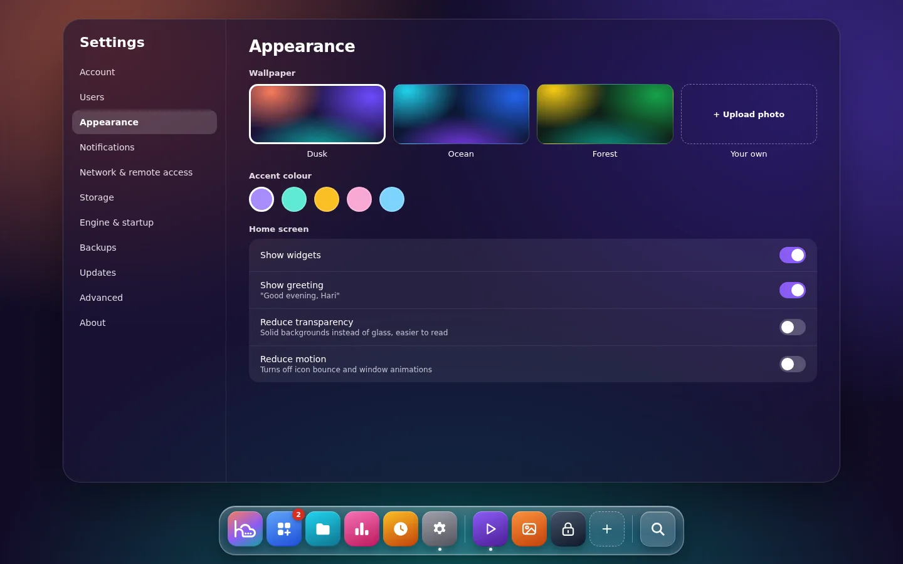

Links to: `AppStore`, `BackupsOverview`, `FilesBrowser`, `LiveUsage`, `Main`, `MainSolid`, `SettingsAbout`, `SettingsAccount`, `SettingsAdvanced`, `SettingsNetwork`, `SettingsNotifications`, `SettingsRuntime`, `SettingsStorage`, `SettingsUpdates`, `SettingsUsers`, `Spotlight`

Shows: Settings — Appearance · [Settings] · [Settings sections] · Settings · Account · Users · Appearance · Notifications · Network & remote access · Storage · Engine & startup · Backups · Updates · Advanced · About · Appearance · Wallpaper · Dusk · Ocean · Forest · + Upload photo · Your own · Accent colour · [Accent colour] · [Lavender] · [Mint] · [Amber] · [Rose] · [Sky] · Home screen · Show widgets · Show greeting · "Good evening, Hari" · Reduce transparency · Solid backgrounds instead of glass, easier to read · [Turn on reduce transparency] · Reduce motion · Turns off icon bounce and window animations · [Dock] · Home · App Store, 2 updates · Files · Usage · Backups · Settings · Jellyfin, open · Immich · Vaultwarden · Add to Dock · Search

## Settings · system

### SettingsNetwork — Network & remote access

**Priority:** P1 · **Phase:** 3 · **Stories:** US-SYS-01, US-SYS-02, US-SYS-03, US-SYS-04, US-SYS-05, US-SYS-06

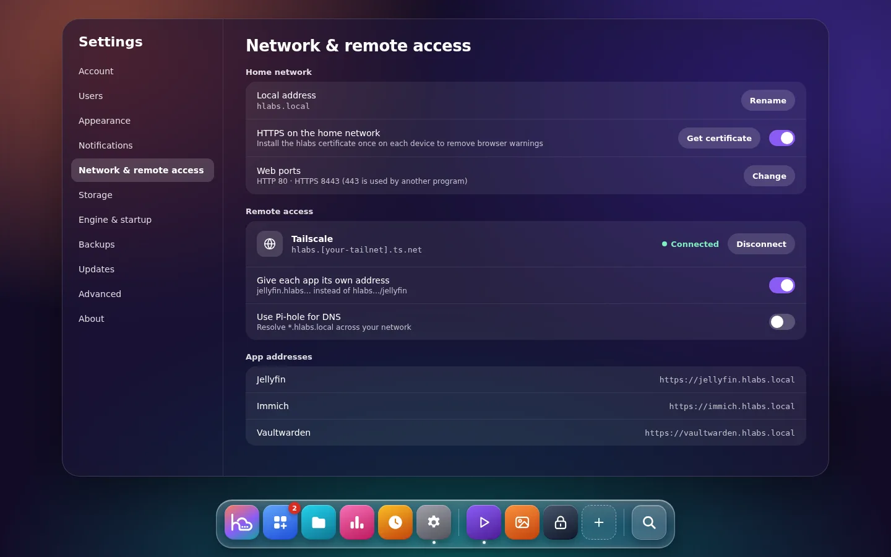

Links to: `AppStore`, `BackupsOverview`, `CertGuide`, `FilesBrowser`, `LiveUsage`, `Main`, `RenameHostname`, `SettingsAbout`, `SettingsAccount`, `SettingsAdvanced`, `SettingsAppearance`, `SettingsNotifications`, `SettingsRuntime`, `SettingsStorage`, `SettingsUpdates`, `SettingsUsers`, `Spotlight`

Shows: Settings — Network and remote access · [Settings] · [Settings sections] · Settings · Account · Users · Appearance · Notifications · Network & remote access · Storage · Engine & startup · Backups · Updates · Advanced · About · Network & remote access · Home network · Local address · hlabs.local · Rename · HTTPS on the home network · Install the hlabs certificate once on each device to remove browser warnings · Get certificate · Web ports · HTTP 80 · HTTPS 8443 (443 is used by another program) · Change · Remote access · Tailscale · hlabs.[your-tailnet].ts.net · Connected · Disconnect · Give each app its own address · jellyfin.hlabs… instead of hlabs…/jellyfin · Use Pi-hole for DNS · Resolve *.hlabs.local across your network · App addresses · Jellyfin · https://jellyfin.hlabs.local · Immich · https://immich.hlabs.local · Vaultwarden · https://vaultwarden.hlabs.local · [Dock] · Home · App Store, 2 updates · Files · Usage · Backups · Settings · Jellyfin, open · Immich · Vaultwarden · Add to Dock · Search

### RenameHostname — Rename server

**Priority:** Nice to have · **Phase:** 9 · **Stories:** US-SYS-07, US-SYS-08

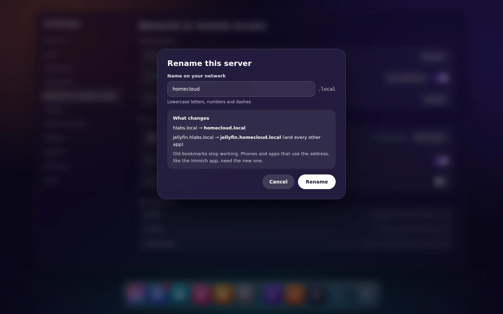

Links to: `AppStore`, `BackupsOverview`, `CertGuide`, `FilesBrowser`, `LiveUsage`, `Main`, `SettingsAbout`, `SettingsAccount`, `SettingsAdvanced`, `SettingsAppearance`, `SettingsNetwork`, `SettingsNotifications`, `SettingsRuntime`, `SettingsStorage`, `SettingsUpdates`, `SettingsUsers`, `Spotlight`

Shows: Settings — Network · rename · [Settings] · [Settings sections] · Settings · Account · Users · Appearance · Notifications · Network & remote access · Storage · Engine & startup · Backups · Updates · Advanced · About · Network & remote access · Home network · Local address · hlabs.local · Rename · HTTPS on the home network · Install the hlabs certificate once on each device to remove browser warnings · Get certificate · Web ports · HTTP 80 · HTTPS 8443 (443 is used by another program) · Change · Remote access · Tailscale · hlabs.[your-tailnet].ts.net · Connected · Disconnect · Give each app its own address · jellyfin.hlabs… instead of hlabs…/jellyfin · Use Pi-hole for DNS · Resolve *.hlabs.local across your network · App addresses · Jellyfin · https://jellyfin.hlabs.local · Immich · https://immich.hlabs.local · Vaultwarden · https://vaultwarden.hlabs.local · [Dock] · Home · App Store, 2 updates · Files · Usage · Backups · Settings · Jellyfin, open · Immich · Vaultwarden · Add to Dock · Search · Rename this server · Name on your network · .local · Lowercase letters, numbers and dashes · What changes · hlabs.local → · homecloud.local · jellyfin.hlabs.local → · jellyfin.homecloud.local · (and every other app) · Old bookmarks stop working. Phones and apps that use the address, like the Immich app, need the new one. · Cancel · Rename

### CertGuide — Certificate guide

**Priority:** Nice to have · **Phase:** 9 · **Stories:** US-SYS-09, US-SYS-10, US-SITE-10

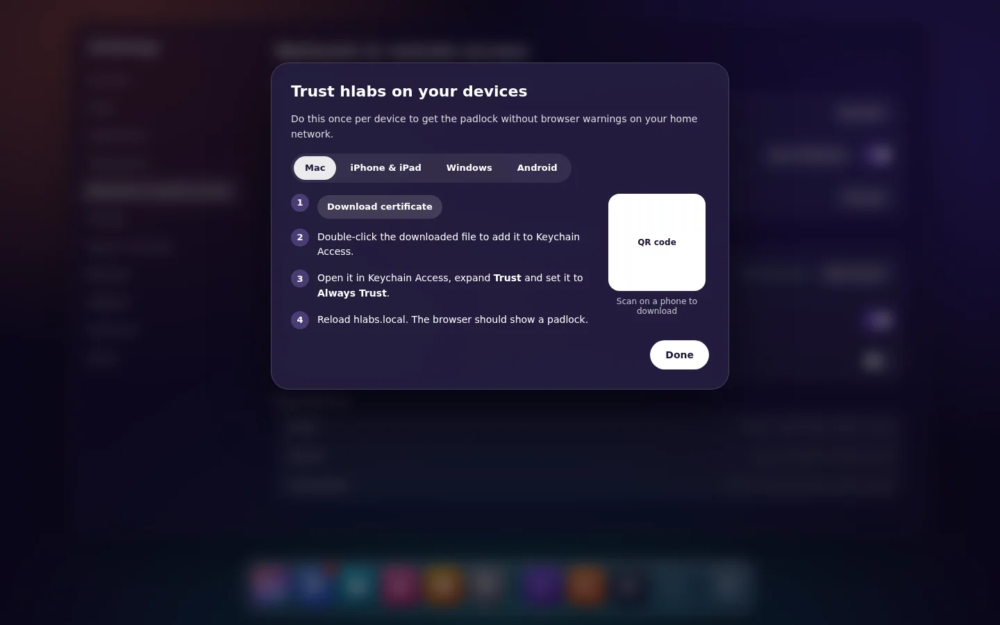

Links to: `AppStore`, `BackupsOverview`, `FilesBrowser`, `LiveUsage`, `Main`, `RenameHostname`, `SettingsAbout`, `SettingsAccount`, `SettingsAdvanced`, `SettingsAppearance`, `SettingsNetwork`, `SettingsNotifications`, `SettingsRuntime`, `SettingsStorage`, `SettingsUpdates`, `SettingsUsers`, `Spotlight`

Shows: Settings — Network · certificate guide · [Settings] · [Settings sections] · Settings · Account · Users · Appearance · Notifications · Network & remote access · Storage · Engine & startup · Backups · Updates · Advanced · About · Network & remote access · Home network · Local address · hlabs.local · Rename · HTTPS on the home network · Install the hlabs certificate once on each device to remove browser warnings · Get certificate · Web ports · HTTP 80 · HTTPS 8443 (443 is used by another program) · Change · Remote access · Tailscale · hlabs.[your-tailnet].ts.net · Connected · Disconnect · Give each app its own address · jellyfin.hlabs… instead of hlabs…/jellyfin · Use Pi-hole for DNS · Resolve *.hlabs.local across your network · App addresses · Jellyfin · https://jellyfin.hlabs.local · Immich · https://immich.hlabs.local · Vaultwarden · https://vaultwarden.hlabs.local · [Dock] · Home · App Store, 2 updates · Files · Usage · Backups · Settings · Jellyfin, open · Immich · Vaultwarden · Add to Dock · Search · Trust hlabs on your devices · Do this once per device to get the padlock without browser warnings on your home network. · [Device] · Mac · iPhone & iPad · Windows · Android · 1 · Download certificate · 2 · Double-click the downloaded file to add it to Keychain Access. · 3 · Open it in Keychain Access, expand · Trust · and set it to · Always Trust · . · 4 · Reload hlabs.local. The browser should show a padlock. · QR …

### SettingsStorage — Storage

**Priority:** P2 · **Phase:** 7 · **Stories:** US-SYS-11, US-SYS-12, US-SYS-13, US-SYS-14

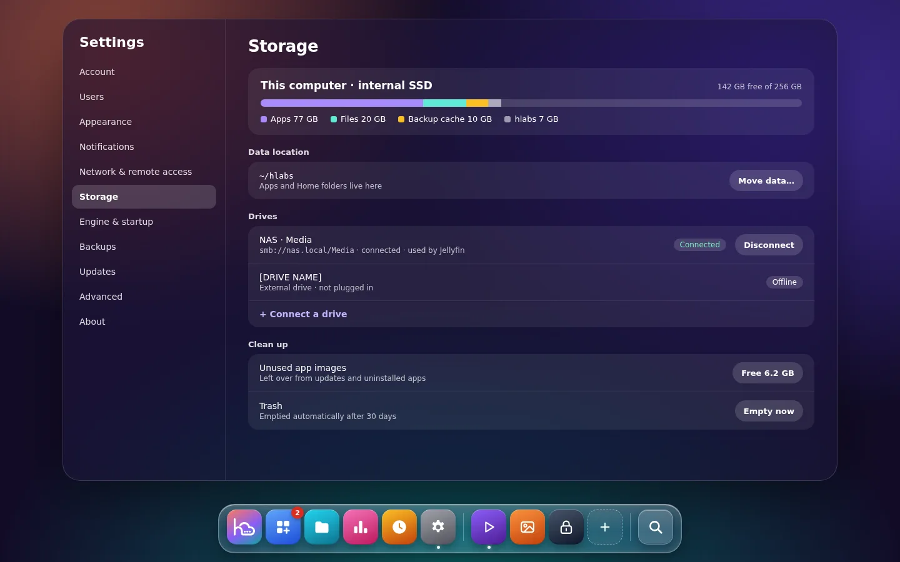

Links to: `AppStore`, `BackupsOverview`, `FilesBrowser`, `LiveUsage`, `Main`, `MoveAllData`, `NetworkDrives`, `SettingsAbout`, `SettingsAccount`, `SettingsAdvanced`, `SettingsAppearance`, `SettingsNetwork`, `SettingsNotifications`, `SettingsRuntime`, `SettingsUpdates`, `SettingsUsers`, `Spotlight`

Shows: Settings — Storage · [Settings] · [Settings sections] · Settings · Account · Users · Appearance · Notifications · Network & remote access · Storage · Engine & startup · Backups · Updates · Advanced · About · Storage · This computer · internal SSD · 142 GB free of 256 GB · Apps 77 GB · Files 20 GB · Backup cache 10 GB · hlabs 7 GB · Data location · ~/hlabs · Apps and Home folders live here · Move data… · Drives · NAS · Media · smb://nas.local/Media · · connected · used by Jellyfin · Connected · Disconnect · [DRIVE NAME] · External drive · not plugged in · Offline · + Connect a drive · Clean up · Unused app images · Left over from updates and uninstalled apps · Free 6.2 GB · Trash · Emptied automatically after 30 days · Empty now · [Dock] · Home · App Store, 2 updates · Files · Usage · Backups · Settings · Jellyfin, open · Immich · Vaultwarden · Add to Dock · Search

### MoveAllData — Move all data

**Priority:** Nice to have · **Phase:** 9 · **Stories:** US-SYS-15, US-SYS-16

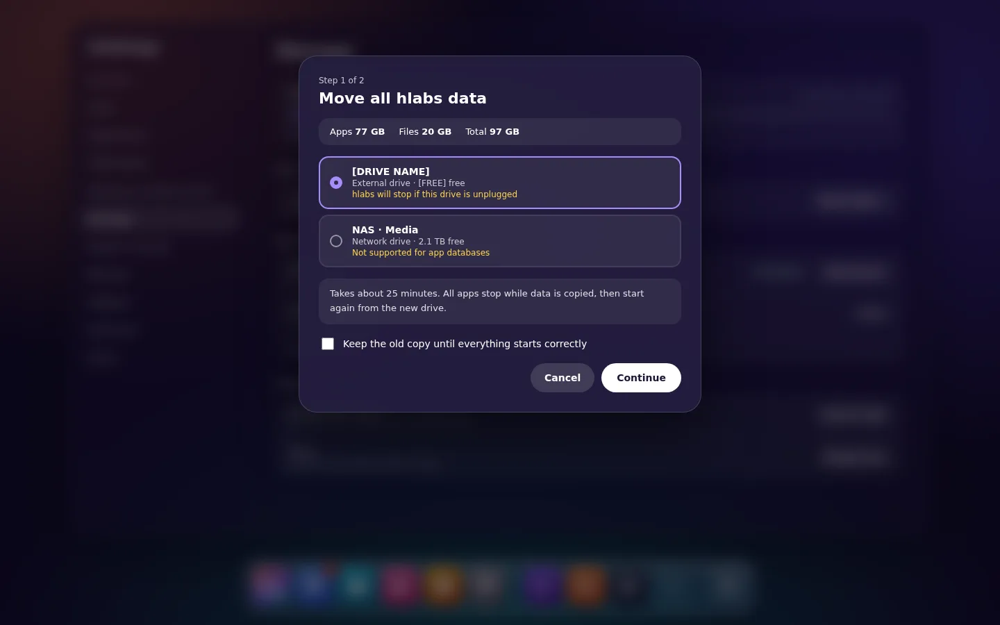

Links to: `AppStore`, `BackupsOverview`, `FilesBrowser`, `LiveUsage`, `Main`, `NetworkDrives`, `SettingsAbout`, `SettingsAccount`, `SettingsAdvanced`, `SettingsAppearance`, `SettingsNetwork`, `SettingsNotifications`, `SettingsRuntime`, `SettingsStorage`, `SettingsUpdates`, `SettingsUsers`, `Spotlight`

Shows: Settings — Storage · move all data · [Settings] · [Settings sections] · Settings · Account · Users · Appearance · Notifications · Network & remote access · Storage · Engine & startup · Backups · Updates · Advanced · About · Storage · This computer · internal SSD · 142 GB free of 256 GB · Apps 77 GB · Files 20 GB · Backup cache 10 GB · hlabs 7 GB · Data location · ~/hlabs · Apps and Home folders live here · Move data… · Drives · NAS · Media · smb://nas.local/Media · · connected · used by Jellyfin · Connected · Disconnect · [DRIVE NAME] · External drive · not plugged in · Offline · + Connect a drive · Clean up · Unused app images · Left over from updates and uninstalled apps · Free 6.2 GB · Trash · Emptied automatically after 30 days · Empty now · [Dock] · Home · App Store, 2 updates · Files · Usage · Backups · Settings · Jellyfin, open · Immich · Vaultwarden · Add to Dock · Search · Step 1 of 2 · Move all hlabs data · Apps · 77 GB · Files · 20 GB · Total · 97 GB · [Destination] · [DRIVE NAME] · External drive · [FREE] free · hlabs will stop if this drive is unplugged · NAS · Media · Network drive · 2.1 TB free · Not supported for app databases · Takes about 25 minutes. All apps stop while data is copied, then start again from the new drive. · Keep the old copy until everything starts correctly · Cancel · Continue

### SettingsRuntime — Engine & startup

**Priority:** P1 · **Phase:** 1 · **Stories:** US-SYS-17, US-SYS-18, US-SYS-19, US-SYS-20

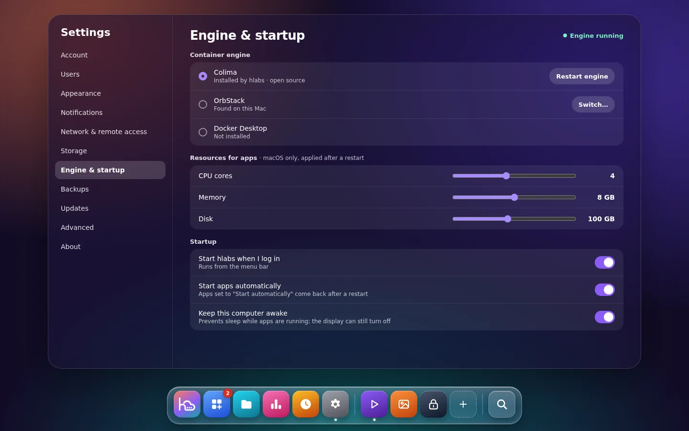

Links to: `AppStore`, `BackupsOverview`, `EngineSwitch`, `FilesBrowser`, `LiveUsage`, `Main`, `SettingsAbout`, `SettingsAccount`, `SettingsAdvanced`, `SettingsAppearance`, `SettingsNetwork`, `SettingsNotifications`, `SettingsStorage`, `SettingsUpdates`, `SettingsUsers`, `Spotlight`

Shows: Settings — Engine and startup · [Settings] · [Settings sections] · Settings · Account · Users · Appearance · Notifications · Network & remote access · Storage · Engine & startup · Backups · Updates · Advanced · About · Engine & startup · Engine running · Container engine · [Container engine] · Colima · Installed by hlabs · open source · Restart engine · OrbStack · Found on this Mac · Switch… · Docker Desktop · Not installed · Resources for apps · · macOS only, applied after a restart · CPU cores · 4 · Memory · 8 GB · Disk · 100 GB · Startup · Start hlabs when I log in · Runs from the menu bar · Start apps automatically · Apps set to "Start automatically" come back after a restart · Keep this computer awake · Prevents sleep while apps are running; the display can still turn off · [Dock] · Home · App Store, 2 updates · Files · Usage · Backups · Settings · Jellyfin, open · Immich · Vaultwarden · Add to Dock · Search

### EngineSwitch — Switch engine

**Priority:** Nice to have · **Phase:** 9 · **Stories:** US-SYS-21, US-SYS-22

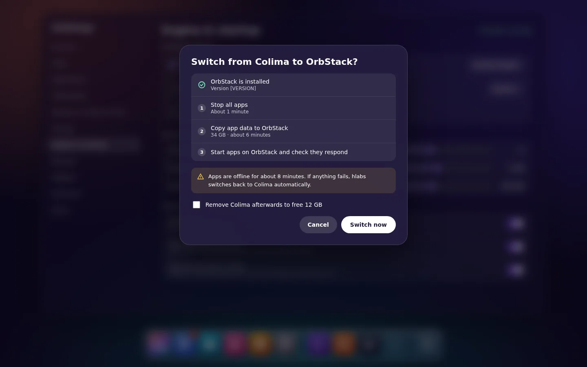

Links to: `AppStore`, `BackupsOverview`, `FilesBrowser`, `LiveUsage`, `Main`, `SettingsAbout`, `SettingsAccount`, `SettingsAdvanced`, `SettingsAppearance`, `SettingsNetwork`, `SettingsNotifications`, `SettingsRuntime`, `SettingsStorage`, `SettingsUpdates`, `SettingsUsers`, `Spotlight`

Shows: Settings — Engine · switch · [Settings] · [Settings sections] · Settings · Account · Users · Appearance · Notifications · Network & remote access · Storage · Engine & startup · Backups · Updates · Advanced · About · Engine & startup · Engine running · Container engine · [Container engine] · Colima · Installed by hlabs · open source · Restart engine · OrbStack · Found on this Mac · Switch… · Docker Desktop · Not installed · Resources for apps · · macOS only, applied after a restart · CPU cores · 4 · Memory · 8 GB · Disk · 100 GB · Startup · Start hlabs when I log in · Runs from the menu bar · Start apps automatically · Apps set to "Start automatically" come back after a restart · Keep this computer awake · Prevents sleep while apps are running; the display can still turn off · [Dock] · Home · App Store, 2 updates · Files · Usage · Backups · Settings · Jellyfin, open · Immich · Vaultwarden · Add to Dock · Search · Switch from Colima to OrbStack? · OrbStack is installed · Version [VERSION] · 1 · Stop all apps · About 1 minute · 2 · Copy app data to OrbStack · 34 GB · about 6 minutes · 3 · Start apps on OrbStack and check they respond · Apps are offline for about 8 minutes. If anything fails, hlabs switches back to Colima automatically. · Remove Colima afterwards to free 12 GB · Cancel · Switch now

### SettingsUpdates — Updates

**Priority:** P1 · **Phase:** 4 · **Stories:** US-SYS-23, US-SYS-24, US-SYS-25, US-SYS-26, US-SITE-13

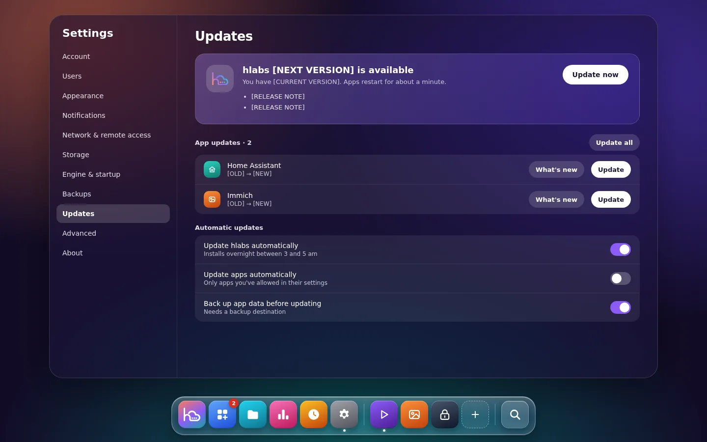

Links to: `AppStore`, `BackupsOverview`, `FilesBrowser`, `LiveUsage`, `Main`, `SettingsAbout`, `SettingsAccount`, `SettingsAdvanced`, `SettingsAppearance`, `SettingsNetwork`, `SettingsNotifications`, `SettingsRuntime`, `SettingsStorage`, `SettingsUsers`, `Spotlight`, `SysUpdating`

Shows: Settings — Updates · [Settings] · [Settings sections] · Settings · Account · Users · Appearance · Notifications · Network & remote access · Storage · Engine & startup · Backups · Updates · Advanced · About · Updates · hlabs [NEXT VERSION] is available · You have [CURRENT VERSION]. Apps restart for about a minute. · [RELEASE NOTE] · [RELEASE NOTE] · Update now · App updates · 2 · Update all · Home Assistant · [OLD] → [NEW] · What's new · Update · Immich · [OLD] → [NEW] · What's new · Update · Automatic updates · Update hlabs automatically · Installs overnight between 3 and 5 am · Update apps automatically · Only apps you've allowed in their settings · Back up app data before updating · Needs a backup destination · [Dock] · Home · App Store, 2 updates · Files · Usage · Backups · Settings · Jellyfin, open · Immich · Vaultwarden · Add to Dock · Search

### SettingsAdvanced — Advanced

**Priority:** P2 · **Phase:** 7 · **Stories:** US-SYS-27, US-SYS-28, US-SYS-29, US-SYS-30, US-SYS-31

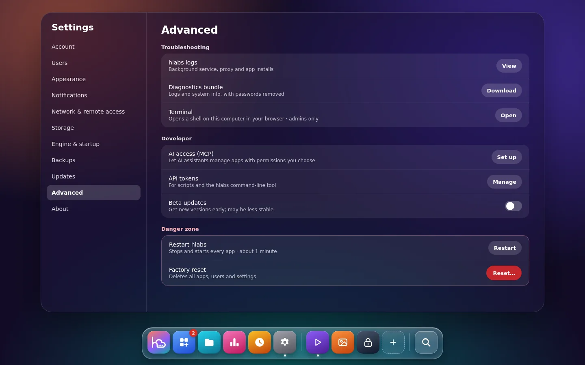

Links to: `AppStore`, `BackupsOverview`, `FactoryReset`, `FilesBrowser`, `LiveUsage`, `Main`, `SettingsAI`, `SettingsAbout`, `SettingsAccount`, `SettingsAppearance`, `SettingsNetwork`, `SettingsNotifications`, `SettingsRuntime`, `SettingsStorage`, `SettingsUpdates`, `SettingsUsers`, `Spotlight`, `SysDialogs`

Shows: Settings — Advanced · [Settings] · [Settings sections] · Settings · Account · Users · Appearance · Notifications · Network & remote access · Storage · Engine & startup · Backups · Updates · Advanced · About · Advanced · Troubleshooting · hlabs logs · Background service, proxy and app installs · View · Diagnostics bundle · Logs and system info, with passwords removed · Download · Terminal · Opens a shell on this computer in your browser · admins only · Open · Developer · AI access (MCP) · Let AI assistants manage apps with permissions you choose · Set up · API tokens · For scripts and the hlabs command-line tool · Manage · Beta updates · Get new versions early; may be less stable · Danger zone · Restart hlabs · Stops and starts every app · about 1 minute · Restart · Factory reset · Deletes all apps, users and settings · Reset… · [Dock] · Home · App Store, 2 updates · Files · Usage · Backups · Settings · Jellyfin, open · Immich · Vaultwarden · Add to Dock · Search

### SettingsAI — AI access (MCP)

**Priority:** P3 · **Phase:** 8 · **Stories:** US-SYS-32, US-SYS-33, US-SYS-34, US-SYS-35, US-SYS-36

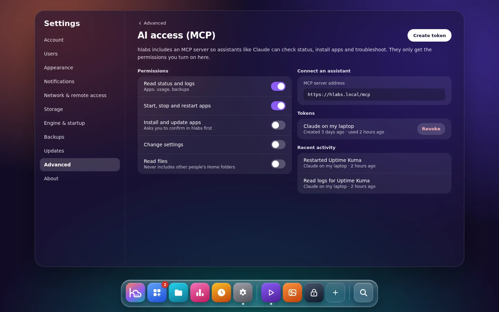

Links to: `AppStore`, `BackupsOverview`, `FilesBrowser`, `LiveUsage`, `Main`, `SettingsAbout`, `SettingsAccount`, `SettingsAdvanced`, `SettingsAppearance`, `SettingsNetwork`, `SettingsNotifications`, `SettingsRuntime`, `SettingsStorage`, `SettingsUpdates`, `SettingsUsers`, `Spotlight`

Shows: Settings — AI access · [Settings] · [Settings sections] · Settings · Account · Users · Appearance · Notifications · Network & remote access · Storage · Engine & startup · Backups · Updates · Advanced · About · Advanced · AI access (MCP) · Create token · hlabs includes an MCP server so assistants like Claude can check status, install apps and troubleshoot. They only get the permissions you turn on here. · Permissions · Read status and logs · Apps, usage, backups · Start, stop and restart apps · Install and update apps · Asks you to confirm in hlabs first · Change settings · Read files · Never includes other people's Home folders · Connect an assistant · MCP server address · https://hlabs.local/mcp · Tokens · Claude on my laptop · Created 3 days ago · used 2 hours ago · Revoke · Recent activity · Restarted Uptime Kuma · Claude on my laptop · 2 hours ago · Read logs for Uptime Kuma · Claude on my laptop · 2 hours ago · [Dock] · Home · App Store, 2 updates · Files · Usage · Backups · Settings · Jellyfin, open · Immich · Vaultwarden · Add to Dock · Search

### FactoryReset — Factory reset

**Priority:** P2 · **Phase:** 7 · **Stories:** US-SYS-37, US-SYS-38

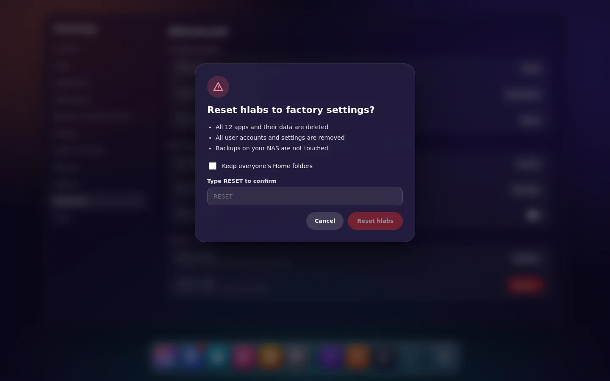

Links to: `AppStore`, `BackupsOverview`, `FilesBrowser`, `LiveUsage`, `Main`, `SettingsAI`, `SettingsAbout`, `SettingsAccount`, `SettingsAdvanced`, `SettingsAppearance`, `SettingsNetwork`, `SettingsNotifications`, `SettingsRuntime`, `SettingsStorage`, `SettingsUpdates`, `SettingsUsers`, `Spotlight`

Shows: Settings — Factory reset · [Settings] · [Settings sections] · Settings · Account · Users · Appearance · Notifications · Network & remote access · Storage · Engine & startup · Backups · Updates · Advanced · About · Advanced · Troubleshooting · hlabs logs · Background service, proxy and app installs · View · Diagnostics bundle · Logs and system info, with passwords removed · Download · Terminal · Opens a shell on this computer in your browser · admins only · Open · Developer · AI access (MCP) · Let AI assistants manage apps with permissions you choose · Set up · API tokens · For scripts and the hlabs command-line tool · Manage · Beta updates · Get new versions early; may be less stable · Danger zone · Restart hlabs · Stops and starts every app · about 1 minute · Restart · Factory reset · Deletes all apps, users and settings · Reset… · [Dock] · Home · App Store, 2 updates · Files · Usage · Backups · Settings · Jellyfin, open · Immich · Vaultwarden · Add to Dock · Search · Reset hlabs to factory settings? · All 12 apps and their data are deleted · All user accounts and settings are removed · Backups on your NAS are not touched · Keep everyone's Home folders · Type RESET to confirm · [RESET] · Cancel · Reset hlabs

### SettingsAbout — About

**Priority:** P3 · **Phase:** 8 · **Stories:** US-SYS-39, US-SYS-40

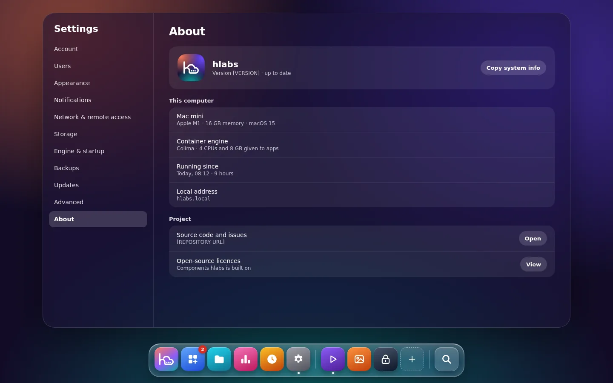

Links to: `AppStore`, `BackupsOverview`, `FilesBrowser`, `LiveUsage`, `Main`, `SettingsAccount`, `SettingsAdvanced`, `SettingsAppearance`, `SettingsNetwork`, `SettingsNotifications`, `SettingsRuntime`, `SettingsStorage`, `SettingsUpdates`, `SettingsUsers`, `Spotlight`

Shows: Settings — About · [Settings] · [Settings sections] · Settings · Account · Users · Appearance · Notifications · Network & remote access · Storage · Engine & startup · Backups · Updates · Advanced · About · About · hlabs · Version [VERSION] · up to date · Copy system info · This computer · Mac mini · Apple M1 · 16 GB memory · macOS 15 · Container engine · Colima · 4 CPUs and 8 GB given to apps · Running since · Today, 08:12 · 9 hours · Local address · hlabs.local · Project · Source code and issues · [REPOSITORY URL] · Open · Open-source licences · Components hlabs is built on · View · [Dock] · Home · App Store, 2 updates · Files · Usage · Backups · Settings · Jellyfin, open · Immich · Vaultwarden · Add to Dock · Search

## System states

### SysUpdating — Updating

**Priority:** P1 · **Phase:** 4 · **Stories:** US-INST-20, US-STATE-01, US-STATE-02, US-STATE-03

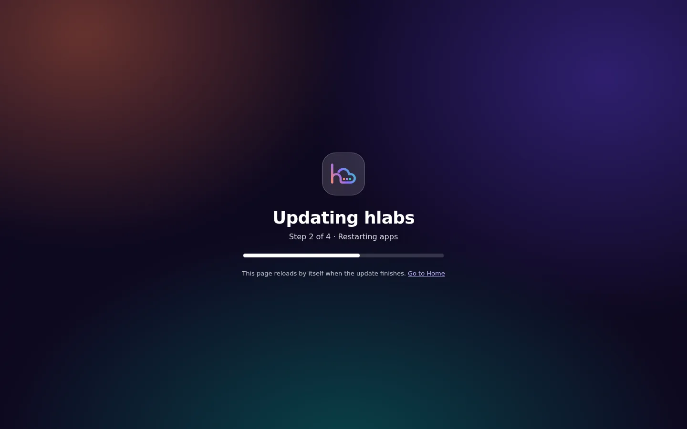

Links to: `Main`

Shows: Updating hlabs · Updating hlabs · Step 2 of 4 · Restarting apps · This page reloads by itself when the update finishes. · Go to Home

### SysDaemonDown — Can't reach hlabs

**Priority:** P1 · **Phase:** 1 · **Stories:** US-INST-13, US-STATE-03, US-STATE-04, US-STATE-05, US-STATE-06, US-STATE-07, US-STATE-18, US-STATE-19

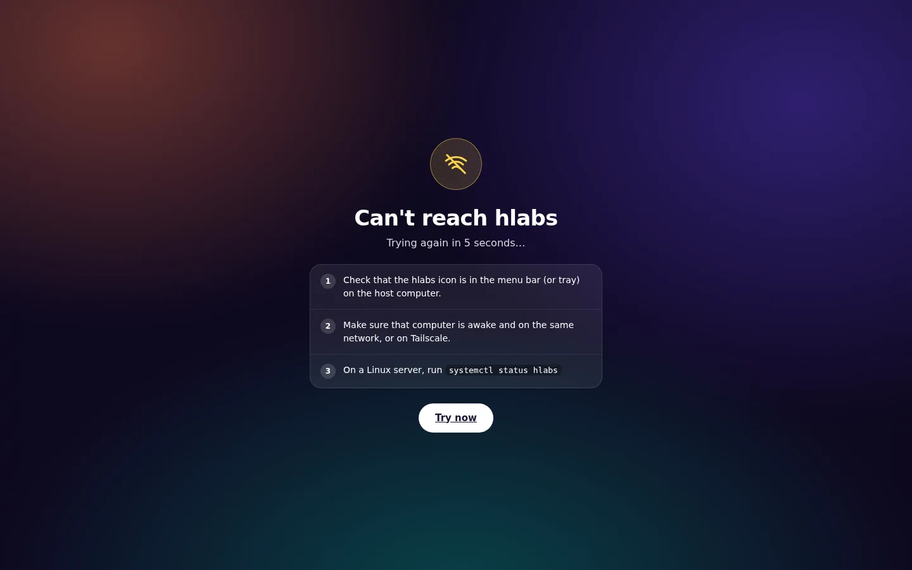

Links to: `Main`

Shows: Can't reach hlabs · Can't reach hlabs · Trying again in 5 seconds… · 1 · Check that the hlabs icon is in the menu bar (or tray) on the host computer. · 2 · Make sure that computer is awake and on the same network, or on Tailscale. · 3 · On a Linux server, run · systemctl status hlabs · Try now

### SysEngineStopped — Engine stopped

**Priority:** P1 · **Phase:** 2 · **Stories:** US-STATE-08, US-STATE-09, US-STATE-10, US-SITE-10

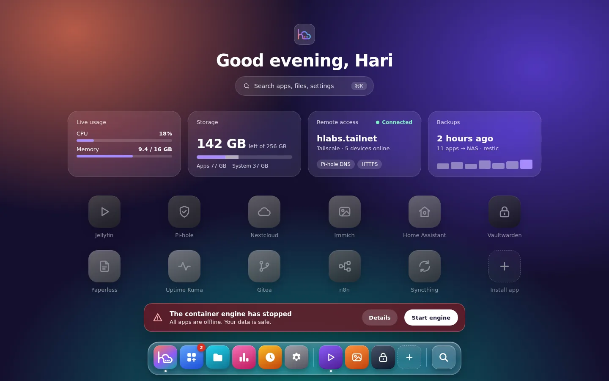

Links to: `AppStore`, `BackupsOverview`, `FilesBrowser`, `LiveUsage`, `Main`, `SettingsAccount`, `SettingsRuntime`, `Spotlight`

Shows: hlabs — Home · engine stopped · Good evening, Hari · Search apps, files, settings · ⌘K · Live usage · CPU · 18% · Memory · 9.4 / 16 GB · Storage · 142 GB · left of 256 GB · Apps 77 GB · System 37 GB · Remote access · Connected · hlabs.tailnet · Tailscale · 5 devices online · Pi-hole DNS · HTTPS · Backups · 2 hours ago · 11 apps → NAS · restic · Jellyfin · Pi-hole · Nextcloud · Immich · Home Assistant · Vaultwarden · Paperless · Uptime Kuma · Gitea · n8n · Syncthing · Install app · The container engine has stopped · All apps are offline. Your data is safe. · Details · Start engine · [Dock] · Home · App Store, 2 updates · Files · Usage · Backups · Settings · Jellyfin, open · Immich · Vaultwarden · Add to Dock · Search

### SysDialogs — Confirm dialog & notifications

**Priority:** P1 · **Phase:** 1 · **Stories:** US-STATE-11, US-STATE-12, US-STATE-13, US-STATE-14, US-STATE-15, US-STATE-16, US-STATE-17, US-STATE-20

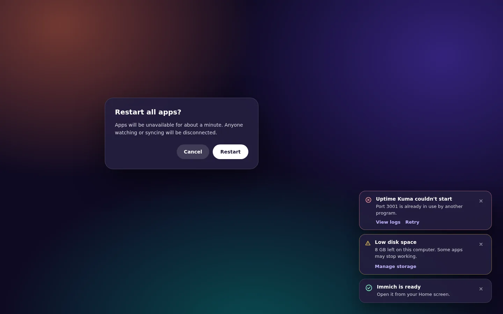

Links to: `AppLogs`, `SettingsAdvanced`, `SettingsStorage`, `SysUpdating`

Shows: Dialogs and notifications · Restart all apps? · Apps will be unavailable for about a minute. Anyone watching or syncing will be disconnected. · Cancel · Restart · [Notifications] · Uptime Kuma couldn't start · Port 3001 is already in use by another program. · View logs · Retry · [Dismiss] · Low disk space · 8 GB left on this computer. Some apps may stop working. · Manage storage · [Dismiss] · Immich is ready · Open it from your Home screen. · [Dismiss]

### NotFound404 — 404

**Priority:** P3 · **Phase:** 8 · **Stories:** US-STATE-21, US-STATE-22

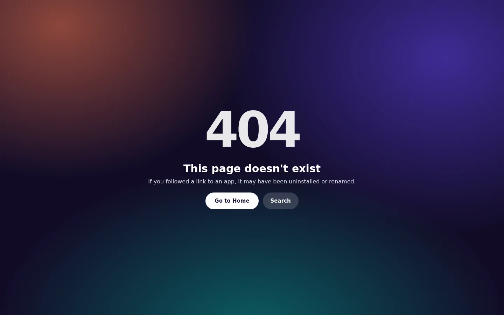

Links to: `Main`, `Spotlight`

Shows: Page not found · 404 · This page doesn't exist · If you followed a link to an app, it may have been uninstalled or renamed. · Go to Home · Search

### NoAccess — You don't have access

**Priority:** P1 · **Phase:** 1 · **Stories:** US-STATE-20, US-SITE-10

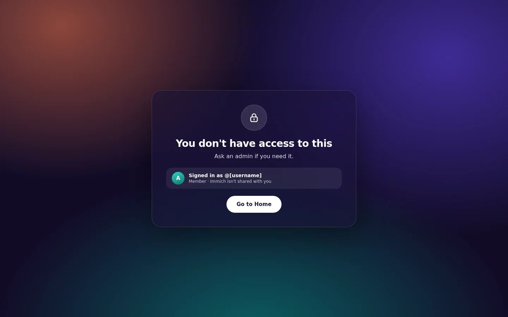

Links to: `Main`

Shows: You don't have access to this · You don't have access to this · Ask an admin if you need it. · A · Signed in as @[username] · Member · Immich isn't shared with you · Go to Home

## Phone

### PhoneLogin — Log in

**Priority:** P2 · **Phase:** 7 · **Stories:** US-PHONE-05, US-PHONE-06, US-PHONE-23, US-PHONE-24

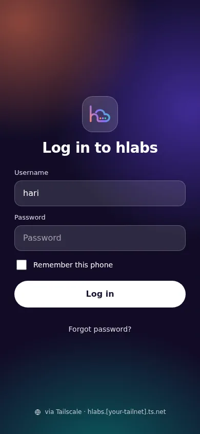

Links to: `ForgotPassword`, `PhoneHome`

Shows: Phone — Log in · Log in to hlabs · Username · Password · [Password] · Remember this phone · Log in · Forgot password? · via Tailscale · hlabs.[your-tailnet].ts.net

### PhoneHome — Home

**Priority:** P2 · **Phase:** 7 · **Stories:** US-PHONE-01, US-PHONE-02, US-PHONE-03, US-PHONE-04, US-PHONE-07, US-PHONE-08, US-PHONE-09, US-PHONE-23, US-PHONE-24

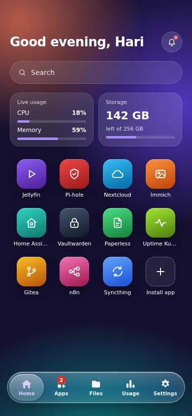

Links to: `HomeNotifications`, `LiveUsage`, `PhoneAppSettings`, `PhoneFiles`, `PhoneSettings`, `PhoneStore`, `Spotlight`

Shows: Phone — Home · Good evening, Hari · [Notifications, 3 new] · Search · Live usage · CPU · 18% · Memory · 59% · Storage · 142 GB · left of 256 GB · Jellyfin · Pi-hole · Nextcloud · Immich · Home Assistant · Vaultwarden · Paperless · Uptime Kuma · Gitea · n8n · Syncthing · Install app · [Tab bar] · Home · Apps · [2 updates] · 2 · Files · Usage · Settings

### PhoneAppSettings — App settings sheet

**Priority:** Polish · **Phase:** 9 · **Stories:** US-PHONE-13, US-PHONE-14, US-PHONE-15

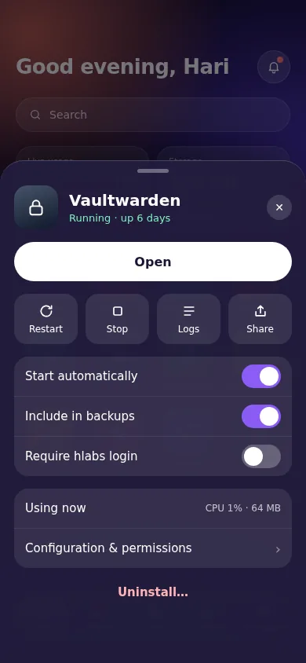

Links to: `AppConfig`, `AppWindow`, `HomeNotifications`, `LiveUsage`, `PhoneFiles`, `PhoneHome`, `PhoneSettings`, `PhoneStore`, `UninstallConfirm`

Shows: Phone — app settings sheet · Good evening, Hari · [Notifications, 3 new] · Search · Live usage · CPU · 18% · Memory · 59% · Storage · 142 GB · left of 256 GB · Jellyfin · Pi-hole · Nextcloud · Immich · Home Assistant · Vaultwarden · Paperless · Uptime Kuma · Gitea · n8n · Syncthing · Install app · [Tab bar] · Home · Apps · [2 updates] · 2 · Files · Usage · Settings · Vaultwarden · Running · up 6 days · [Close] · ✕ · Open · Restart · Stop · Logs · Share · Start automatically · Include in backups · Require hlabs login · Using now · CPU 1% · 64 MB · Configuration & permissions · › · Uninstall…

### PhoneStore — App Store

**Priority:** P2 · **Phase:** 7 · **Stories:** US-PHONE-01, US-PHONE-02, US-PHONE-03, US-PHONE-04, US-PHONE-10, US-PHONE-12

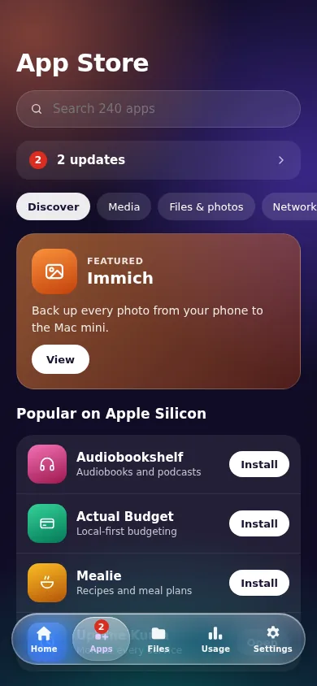

Links to: `LiveUsage`, `PhoneAppDetails`, `PhoneFiles`, `PhoneHome`, `PhoneSettings`, `PhoneUpdates`

Shows: Phone — App Store · App Store · Search apps · 2 · 2 updates · Discover · Media · Files & photos · Networking · Featured · Immich · Back up every photo from your phone to the Mac mini. · View · Popular on Apple Silicon · Audiobookshelf · Audiobooks and podcasts · Install · Actual Budget · Local-first budgeting · Install · Mealie · Recipes and meal plans · Install · Uptime Kuma · Monitor every service · Open · [Tab bar] · Home · Apps · [2 updates] · 2 · Files · Usage · Settings

### PhoneAppDetails — App details

**Priority:** P2 · **Phase:** 7 · **Stories:** US-PHONE-11, US-PHONE-12

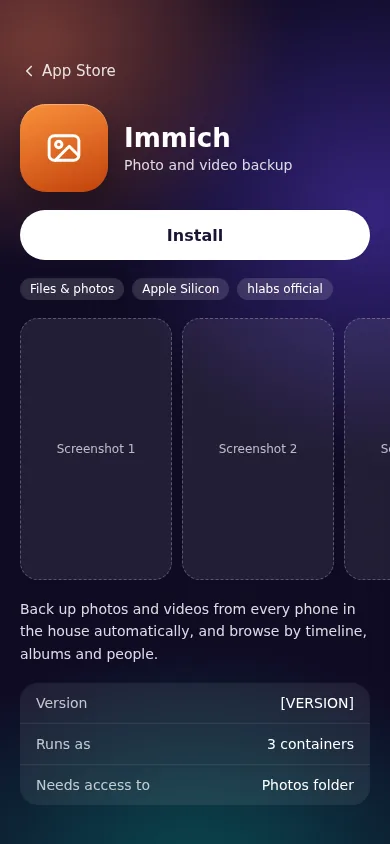

Links to: `InstallSheet`, `PhoneStore`

Shows: Phone — App details · App Store · Immich · Photo and video backup · Install · Files & photos · Apple Silicon · hlabs official · Screenshot 1 · Screenshot 2 · Screenshot 3 · Back up photos and videos from every phone in the house automatically, and browse by timeline, albums and people. · Version · [VERSION] · Runs as · 3 containers · Needs access to · Photos folder

### PhoneFiles — Files

**Priority:** Polish · **Phase:** 9 · **Stories:** US-PHONE-01, US-PHONE-02, US-PHONE-03, US-PHONE-04, US-PHONE-16, US-PHONE-17, US-PHONE-18

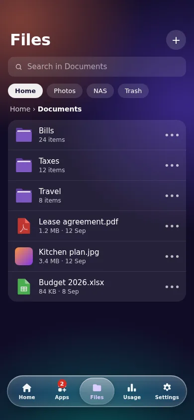

Links to: `LiveUsage`, `PhoneHome`, `PhoneSettings`, `PhoneStore`

Shows: Phone — Files · Files · [Upload] · + · Search files · [Search in Documents] · Home · Photos · NAS · Trash · Home › · Documents · Bills · 24 items · [More for Bills] · ••• · Taxes · 12 items · [More for Taxes] · ••• · Travel · 8 items · [More for Travel] · ••• · Lease agreement.pdf · 1.2 MB · 12 Sep · [More for Lease agreement.pdf] · ••• · Kitchen plan.jpg · 3.4 MB · 12 Sep · [More for Kitchen plan.jpg] · ••• · Budget 2026.xlsx · 84 KB · 8 Sep · [More for Budget 2026.xlsx] · ••• · [Tab bar] · Home · Apps · [2 updates] · 2 · Files · Usage · Settings

### PhoneSettings — Settings

**Priority:** Polish · **Phase:** 9 · **Stories:** US-PHONE-01, US-PHONE-02, US-PHONE-03, US-PHONE-04, US-PHONE-19, US-PHONE-20

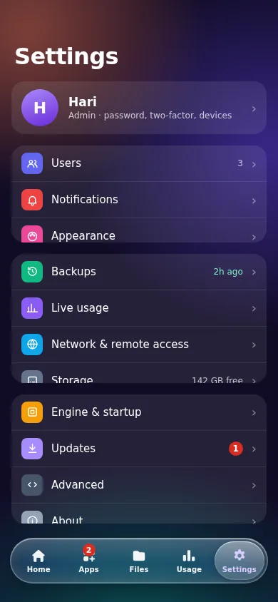

Links to: `LiveUsage`, `PhoneBackups`, `PhoneFiles`, `PhoneHome`, `PhoneStore`, `SettingsAbout`, `SettingsAccount`, `SettingsAdvanced`, `SettingsAppearance`, `SettingsNetwork`, `SettingsNotifications`, `SettingsRuntime`, `SettingsStorage`, `SettingsUpdates`, `SettingsUsers`

Shows: Phone — Settings · Settings · H · Hari · Admin · password, two-factor, devices · › · Users · 3 · › · Notifications · › · Appearance · › · Backups · 2h ago · › · Live usage · › · Network & remote access · › · Storage · 142 GB free · › · Engine & startup · › · Updates · 1 · › · Advanced · › · About · › · [Tab bar] · Home · Apps · [2 updates] · 2 · Files · Usage · Settings

### PhoneBackups — Backups

**Priority:** Polish · **Phase:** 9 · **Stories:** US-PHONE-21, US-PHONE-22

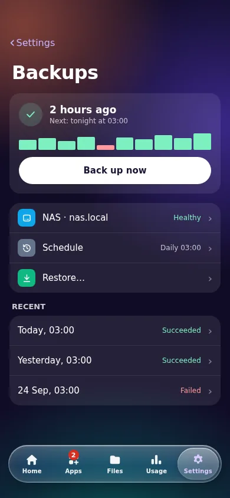

Links to: `BackupRunDetail`, `BackupSchedule`, `BackupsOverview`, `LiveUsage`, `PhoneFiles`, `PhoneHome`, `PhoneSettings`, `PhoneStore`, `RestoreFlow`

Shows: Phone — Backups · ‹ · Settings · Backups · 2 hours ago · Next: tonight at 03:00 · Back up now · NAS · nas.local · Healthy · › · Schedule · Daily 03:00 · › · Restore… · › · RECENT · Today, 03:00 · Succeeded · › · Yesterday, 03:00 · Succeeded · › · 24 Sep, 03:00 · Failed · › · [Tab bar] · Home · Apps · [2 updates] · 2 · Files · Usage · Settings

### PhoneUpdates — Updates

**Priority:** P2 · **Phase:** 7 · **Stories:** US-PHONE-10

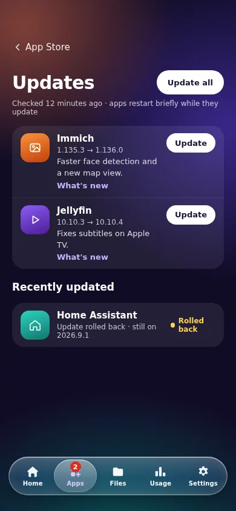

Links to: `LiveUsage`, `PhoneAppDetails`, `PhoneFiles`, `PhoneHome`, `PhoneSettings`, `PhoneStore`

Shows: Phone — Updates · App Store · Updates · Update all · Checked 12 minutes ago · apps restart briefly while they update · Immich · 1.135.3 → 1.136.0 · Faster face detection and a new map view. · What's new · Update · Jellyfin · 10.10.3 → 10.10.4 · Fixes subtitles on Apple TV. · What's new · Update · Recently updated · Home Assistant · Update rolled back · still on 2026.9.1 · Rolled back · [Tab bar] · Home · Apps · [2 updates] · 2 · Files · Usage · Settings
