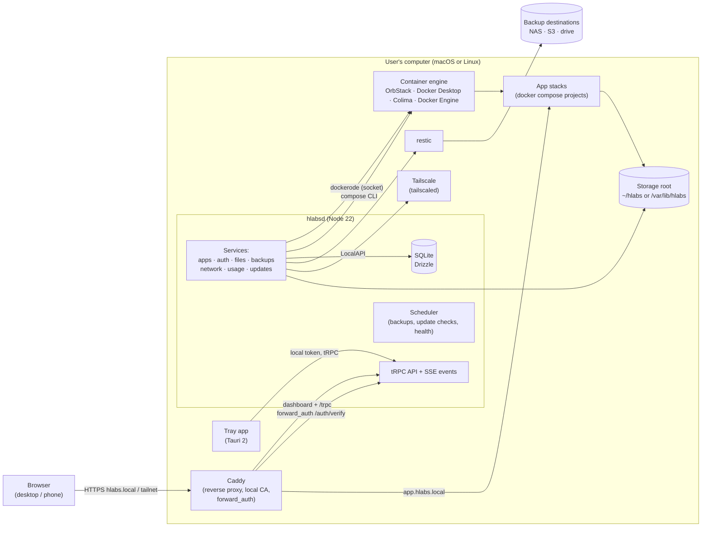
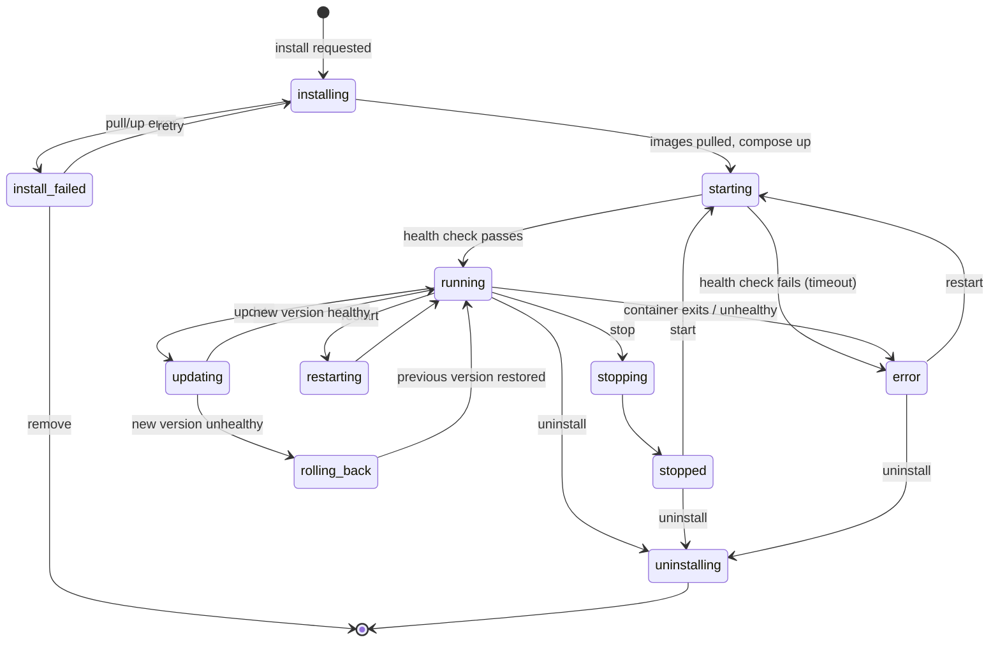
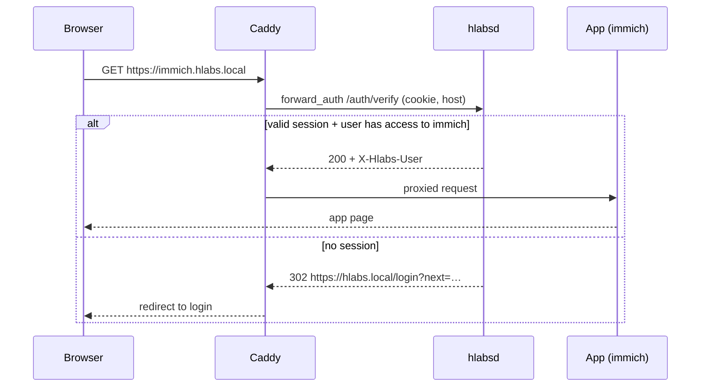

# 02 · Architecture

hlabs is four cooperating pieces on one computer: a **daemon** that owns all state and talks to Docker, a **web dashboard** served by the daemon, a **tray app** that starts everything at login, and a small set of **bundled helper binaries** (Caddy, restic, docker compose, and optionally Colima and Tailscale).

## 2.1 System context

## 2.2 Components

### hlabsd (daemon) — `apps/daemon`
- Node 22 LTS, TypeScript, run as a single bundled file (esbuild) with a bundled Node runtime.
- HTTP server: **Fastify** on `127.0.0.1:7474` only. Never binds to a public interface; everything external arrives through Caddy.
- Serves: `/trpc/*` (tRPC v11 fetch adapter, with SSE subscriptions), `/auth/verify` (Caddy forward_auth), `/api/files/*` (streaming upload/download, the one non-tRPC surface), `/healthz`, and the built web app (`apps/web/dist`) for `/`.
- Owns the SQLite database (`better-sqlite3` + Drizzle) at `<dataDir>/hlabs.db`, WAL mode.
- Structured as **services** (plain classes, constructor-injected) behind **routers**. Routers validate input with Zod and call services; services never import routers.
- Long-running work (installs, updates, backups, restores, moves) runs as **jobs** in an in-process job queue with persisted state (`jobs` table), progress events on the event bus, and resumption or clean failure after a crash.
- Emits typed events on an internal **event bus**, forwarded to clients through the `events.stream` SSE subscription.

### Web dashboard — `apps/web`
- React 19 + Vite + TypeScript, Tailwind CSS 4 with the hlabs preset, shadcn/ui components themed from `packages/ui`, Framer Motion, TanStack Query via `@trpc/tanstack-react-query`, TanStack Router (file routes).
- One SPA for desktop and phone (responsive: ≥ 1024px desktop layout with windows over the wallpaper; < 768px phone layout with sheets). No separate mobile app.
- Never talks to Docker, the filesystem or the network directly; everything goes through tRPC.

### Tray app — `apps/tray`
- Tauri 2 (Rust shell, web UI from `apps/tray/src` using `packages/ui`).
- macOS: menu-bar extra with a glass dropdown window (TrayMenu). Linux desktop: StatusNotifierItem/AppIndicator with a **native** menu (see LinuxTray).
- Responsibilities: first-run bootstrap (install launch agent / service, runtime detection, open onboarding), show status, quick actions, reset a password locally, check for and apply hlabs updates (Tauri updater), uninstall.
- Authenticates to the daemon with a **local tray token** stored in the OS keychain (macOS Keychain / Secret Service); the daemon accepts it only from loopback.

### CLI — `apps/cli`
- A small Node command, `hlabs`, shipped with the daemon bundle and linked into `PATH` on Linux (`/usr/local/bin/hlabs`) and inside the app bundle on macOS.
- Commands: `hlabs status`, `hlabs logs [-f] [--app <id>]`, `hlabs reset-password [username]` (root only on Linux), `hlabs uninstall [--keep-data]` (Linux headless), `hlabs setup-url` (prints the onboarding URL with its setup token).
- Talks to the daemon over loopback with the tray token, read from the keychain on desktops or, on headless Linux, from `/var/lib/hlabs/tray.token` (plain file, mode 0640, owner `hlabs`, group `hlabs`; being in the `hlabs` group or root is the local-access proof). `hlabs reset-password` additionally requires root (D-035).

### Bundled binaries (`<appResources>/bin`)
| Binary | Why bundled | Used for |
| --- | --- | --- |
| `node` | Consistent runtime | Runs hlabsd |
| `caddy` | Stable ports, local CA, dynamic config via admin API | Dashboard + app routing, HTTPS, forward auth |
| `restic` | Encrypted, deduplicated backups | Backups and restore |
| `docker-compose` (CLI plugin) | App stacks are compose projects | `up`, `down`, `pull` of app stacks |
| `colima`, `lima`, `docker` CLI (macOS, optional download) | Only when no engine is found | Provides the Docker engine on macOS |
| Tailscale | **Not bundled.** Use the installed Tailscale app/daemon; onboarding guides install | Remote access |

## 2.3 Process model and startup

| Platform | Daemon runs as | Starts when | Data dir | Storage root default |
| --- | --- | --- | --- | --- |
| macOS | `launchd` **LaunchAgent** `dev.hlabs.daemon` (user) | User logs in (installed by tray on first run) | `~/Library/Application Support/hlabs` | `~/hlabs` |
| Linux desktop | `systemd --user` unit `hlabsd.service` | User logs in | `~/.local/share/hlabs` | `~/hlabs` |
| Linux headless | system unit `hlabsd.service`, user `hlabs` | Boot | `/var/lib/hlabs` | `/var/lib/hlabs/storage` |

The dashboard name defaults to `hlabs` (`hlabs.local`) on every platform, including headless servers; it can be renamed later (D-017). Quitting the tray app only closes the tray; the daemon and apps keep running (D-015).

Startup sequence (daemon):
1. Load config, open DB, run pending migrations (in a transaction; on failure, refuse to start and report `SysDaemonDown` reason).
2. Detect the container engine (2.4). If missing or stopped, start in **engine-stopped** mode (UI shows `SysEngineStopped`), retry every 10 s.
3. Start Caddy with the base config; register mDNS names.
4. Reconcile installed apps: compare DB desired state with `docker compose ps`; restart apps marked `autostart` that should be running.
5. Start scheduler (backups, update checks, health probes, usage sampling).
6. Mark ready; `/healthz` returns 200.

The tray polls `/healthz` and subscribes to events; if unreachable for 10 s it shows the "Can't reach hlabs" state and offers Restart.

## 2.4 Container engine detection

Order of preference (first working socket wins; user can override in Settings › Engine & startup):

1. **OrbStack** — `~/.orbstack/run/docker.sock`
2. **Docker Desktop** — `~/.docker/run/docker.sock`
3. **Colima** (hlabs-managed or user's) — `~/.colima/<profile>/docker.sock`
4. `DOCKER_HOST` env, then `/var/run/docker.sock` (Linux Docker Engine / rootful)

If none: macOS offers to install Colima (downloads signed Colima + Lima into `<dataDir>/engine`, profile `hlabs`, default 4 CPU / 8 GB / 100 GB disk, VZ + virtiofs); Linux shows the one-line Docker Engine install instructions (headless script installs it).

Engine health = `docker.ping()` + `docker.info()`; the engine's CPU/memory limits are shown on the Engine page and in onboarding's system check.

## 2.5 Apps: lifecycle and state machine

Every installed app is a **compose project** named `hlabs-<appId>` in `<dataDir>/apps/<appId>/` containing the rendered `docker-compose.yml`, an `.env`, and a copy of the manifest. Volumes live under `<appDataDir>/<appId>/` (always local, see 2.8).

Rules:
- State lives in `apps.state`; transitions happen only in `AppService` and each emits `app.stateChanged`.
- **Install:** validate manifest → render compose (inject hlabs network, labels, volume paths, env) → `docker compose pull` (progress from `docker.pull` stream per image, aggregated to %) → `compose up -d` → wait for health (manifest `health` or container healthcheck, default timeout 120 s) → register Caddy route → create per-app hostname (mDNS) → `running`.
- **Update:** snapshot previous `compose.yml`, `.env` and image digests; for apps with `backup.beforeUpdate: true` take a restic snapshot of the app's data first; pull, up, health-check; on failure within the timeout, restore the snapshot of config (and data if the manifest marks migrations irreversible) and set state back to running on the old version with an `UpdateRolledBack` notification.
- **Uninstall:** `compose down`, remove route and hostname, then either keep or delete `<appDataDir>/<appId>` as the user chose.
- All apps join the `hlabs` bridge network; they are not published on host ports unless the manifest requests a raw port (for protocols Caddy can't proxy, e.g. DNS for Pi-hole, SMB).

## 2.6 Networking

- **Hostnames:** the dashboard is `https://hlabs.local` (renamable, see RenameHostname). Each app gets `https://<appId>.hlabs.local`. Names are published with mDNS: macOS via `dns-sd -P` registrations held by the daemon; Linux via `avahi-publish` (D-074). If a name can't be published, fall back to `https://hlabs.local:<port>` (one port per app from range 12000–12999).
- **TLS:** Caddy's internal CA issues certs for `*.hlabs.local`. The CA root is offered for install in CertGuide. On the tailnet, certificates come from Tailscale (`tailscale cert`) for `hlabs.<tailnet>.ts.net`.
- **Ports:** Caddy listens on 443 and 80 (80 redirects). On macOS a non-root process can bind these on the user's interfaces; on Linux headless the service gets `CAP_NET_BIND_SERVICE`. If 443 or 80 is already taken (another web server), hlabs falls back to 8443 and 8080, shows this in the system check (`OnbSystemFail`), and includes the port in every address it shows (D-016).
- **Remote access:** Tailscale. hlabs checks the Tailscale LocalAPI; if Tailscale isn't installed it links to the installer, if logged out it starts the login flow and shows the auth URL. hlabs then uses **Tailscale Serve** to expose the dashboard on the tailnet name (`https://hlabs.<tailnet>.ts.net`) and each app on its own port of that name (`https://hlabs.<tailnet>.ts.net:<port>`, ports 12000–12999, the same port as the LAN fallback) (D-012). Paths are not used because many apps break under a sub-path. Funnel (public internet) is never enabled by hlabs.
- **How Caddy reaches apps (D-049):** every app's web service is published on `127.0.0.1:<port>` (its port from 12000–12999) and Caddy proxies to that loopback port on all engines. Nothing is published on LAN interfaces except manifest raw `ports`.
- **Caddy config** is owned by `NetworkService`, applied through the Caddy admin API (on an owner-only unix socket, D-073), and rebuilt from DB on startup. Every app route uses `forward_auth` to `/auth/verify` unless the manifest sets `auth: none` (apps that have their own login, like Vaultwarden, still get forward auth by default; the manifest can opt out).

## 2.7 Authentication flow (summary; details in 07-security)

The session cookie is set on `.hlabs.local` (and on the tailnet host) so one login covers every app.

## 2.8 Storage and files
- **App data** (`<appDataDir>/<appId>`; `appDataDir` is `~/hlabs/app-data` on desktops and `/var/lib/hlabs/app-data` on headless Linux) always stays on this computer's disk, because app databases need a fast, always-present disk (D-011).
- The **storage root** (chosen in onboarding: this computer, an external drive or a NAS) holds `users/<username>/` (Home folders), `shared/` and `.trash/`. Media folders for apps can also point to other **storage locations** (NAS, external drives).
- **Network drives:** SMB/NFS mounted by the daemon (macOS: SMB with the NetFS helper `hlabs-netmount` into `/Volumes/<share>`, D-060, and NFS with `mount_nfs` into `<dataDir>/mounts/<id>`, D-062; Linux: `mount.cifs` / NFS into `<dataDir>/mounts/<id>` via the privileged helper `hlabs-priv`, D-061) and exposed in Files and as app folder options. Credentials in the OS keychain.
- **Files API** is streaming HTTP under `/api/files` (upload with resumable chunks, download with range support) plus tRPC for listing, metadata, move, rename, trash.
- **Moving data** (AppMoveData, MoveAllData) runs as a job: stop affected apps → rsync-style copy with verification → update paths → start apps → delete source only after success.

## 2.9 Backups
- restic repository per destination. Password: generated per destination, shown once, and stored in the OS keychain (user can also export it). Destinations: local/external drive path, SMB/NFS mount, S3-compatible, SFTP, another hlabs (over Tailscale, via restic REST server running inside the target hlabs as an app).
- Every run also backs up a **system part** tagged `system`: an online copy of `hlabs.db` (SQLite backup API), `<dataDir>/apps/*` (compose files, `.env`, manifests) and a **secrets bundle** (keychain items the system needs: TOTP secrets, app secrets, NAS/S3 credentials) encrypted with the destination's repo password. This is what makes "whole system" restore possible.
- A backup run: for each app with `backup.pause: true`, stop or pause its containers (or run the manifest's `backup.preHook`, e.g. `pg_dump`) → `restic backup` of `<appDataDir>/<appId>` and selected Home folders with tags `app:<id>` and `run:<id>` → resume apps → `restic forget --prune` according to retention (default 7 daily, 4 weekly, 6 monthly).
- Restore: pick a snapshot → choose whole system, one app, or files → stop affected apps → safety copy of current data → `restic restore` into a staging dir **beside the target** (`<appDataDir>/.restore/<id>` for app data, `<storageRoot>/.restore/<id>` for Home folders, `<dataDir>/.restore/<id>` for the system part) so the swap is a same-filesystem rename → swap in → start apps (D-024). Whole-system restore also restores the database and secrets bundle, then restarts the daemon.

## 2.10 Updates
- **hlabs itself — who applies it (D-034):**
  - *macOS and Linux desktop:* the **tray** owns updates, using the Tauri updater (signed manifest on GitHub Releases, channels `stable` / `beta`). The dashboard's "Update now" (`settings.updates.install`) creates a `system_update` job and emits `update.applyRequested`; the tray picks it up, downloads, verifies and installs (tray + daemon bundle + helper binaries), then restarts the daemon.
  - *Linux headless:* the **daemon** applies it: downloads the signed tarball, verifies checksum and signature, unpacks beside the current install (`/opt/hlabs/<version>`), switches the `current` symlink and asks systemd to restart `hlabsd`; if `/healthz` isn't ready within 3 minutes, systemd's `ExecStartPre` check switches the symlink back.
  - Migrations run on start; the UI shows `SysUpdating` until `/healthz` is back.
- **Automatic update window:** one window, **03:00–05:00 local time**, for both hlabs and app auto-updates; it starts only after any running backup finishes (D-026). hlabs updates first, then apps.
- **Apps:** the store index is refreshed every 6 h. Updates are offered per app (StoreUpdates); optional auto-update per app, inside the window above, with the rollback rule from 2.5.

## 2.11 Usage monitoring
- The daemon samples host CPU, memory, disk and network (Node `os` + `systeminformation`) and per-container stats (`docker.getContainer().stats({stream:false})`) every 5 s into an in-memory ring buffer (1 h at 5 s) and downsamples to SQLite (`usage_samples`, 1-minute points kept 7 days, 1-hour points kept 90 days).
- `usage.live` streams the latest sample over SSE; charts query history ranges.

## 2.12 Event bus

Typed events (see `packages/api/src/events.ts`), fanned out to SSE subscribers filtered by the user's permissions:

`system.status`, `engine.status`, `access.changed`, `storage.locationChanged`, `update.applyRequested` (tray-scoped), `startup.changeRequested` (tray-scoped), `app.stateChanged`, `app.installProgress`, `app.log` (only when a log view is open), `job.progress`, `job.finished`, `backup.run`, `notification.created`, `usage.sample`, `update.available`, `session.revoked`. `session.revoked` reaches only the device whose session ended (audience `session`).

## 2.13 AI access (MCP) — P3
The daemon can expose an **MCP server** (streamable HTTP at `/mcp`, token-authenticated, off by default) with scoped tools: list apps, app status, start/stop/restart, read logs, usage summary, list backups. Destructive tools (uninstall, restore, factory reset) are never exposed. See SettingsAI.
